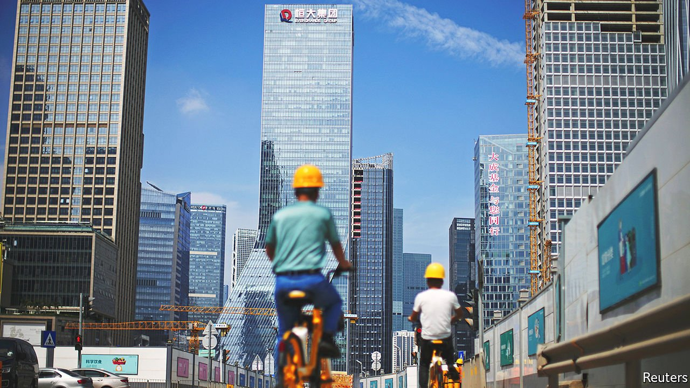

###### Evergrande plans

# Time for orderly resolution for Evergrande is running out 

##### If the state has a grand plan, it will need to make it known soon 

 

> Oct 23rd 2021 

HOMEBUYERS, investors and analysts have been waiting for months for a peep from China’s regulators on a plan for Evergrande, a massive homebuilder on the brink of collapse. But when the central bank at last chimed in on October 15th to say that the risks were controllable, few took comfort.

The situation in recent weeks has become only more unwieldy. Evergrande has already missed several offshore-bond payments and could, after a 30-day grace period, officially default on October 23rd. A plan to raise $2.6bn by selling a stake in its property-services arm has fallen through. Confidence in China’s housing market has been jolted. A handful of other developers have either missed or say they plan to miss offshore-bond payments. Sinic became the latest to default on October 19th.


Many investors fear that the authorities are running out of time to avert greater turmoil in the housing market. The main concern is that Evergrande and other troubled developers will not be able to complete the homes they have already sold to ordinary Chinese people. (Evergrande alone owes an estimated 1.4m pre-sold units to buyers.) That would further drain confidence from the housing market and deliver a devastating shock to already weak economic growth.

Averting broader fallout will depend on two things. The first is opening the channels of finance, in order to keep building sites buzzing with workers and suppliers. Here things do not look good. Many industry-watchers had expected the central government to capitulate to the crisis and command banks to lend more to developers. But that has not happened so far. The situation in the bond market is worse. The distress at Evergrande has helped fuel a cash crunch for other high-yield-bond issuers, shutting even non-property firms out of the market for desperately needed dollars.

Developers were once able to bring in lots of liquidity by pre-selling homes. But now activity is slowing down. Developers’ spending on capital expenditure and land purchases fell by 3.5% in September, compared with a year earlier. Home starts and sales by value have continued to slide. House prices fell in September, the first monthly decline since 2015.

Help could also come in a second form: a grand restructuring plan. But that would take time. Evergrande alone has more than 1,000 projects across China; other developers will only add more to the count. If the projects are to be kept running, local governments will probably need to take over their operation, requiring complex negotiations in hundreds of cities. Whether all this can be pulled off is far from clear. Yet failing to deliver on projects that have already been purchased would be catastrophic for the government, given that Xi Jinping, the president, has promised a new era of social equality. If the state has a plan, it will need to make it known soon.


