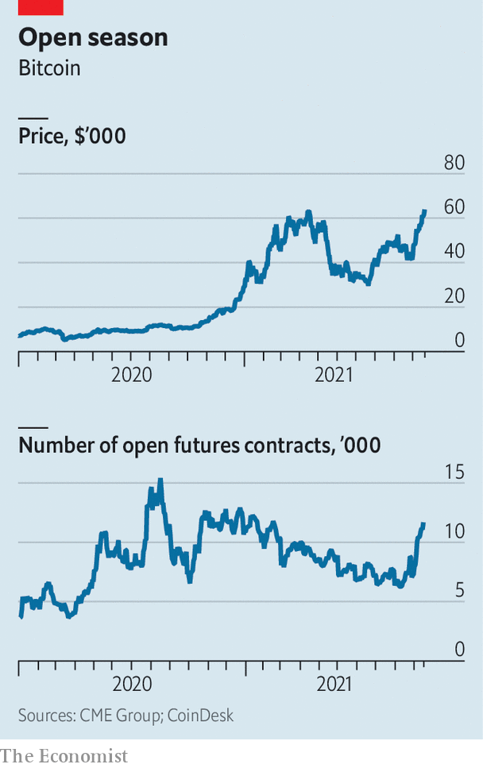

###### Go with the float

# What to make of the new bitcoin-linked exchange-traded fund 

##### Depending on whom you ask it is either a breakthrough or a disappointment 

 

> Oct 21st 2021 

CRYPTO SEASONS are not what they used to be. In 2017, just as bitcoin was nearing $20,000 for the first time, a regulatory crackdown triggered a crypto “winter”—a period of depressed prices—that lasted nearly three years. In May this year frost set in after China clamped down on crypto transactions, bringing bitcoin down by half from its peak of $64,900. But after just a few icy months, things are warming up again. On October 20th bitcoin briefly crossed $67,000—a new record.

The latest heat reflects a much-awaited event: the listing of America’s first bitcoin-linked exchange-traded fund (ETF) on the New York Stock Exchange. Run by ProShares, a maker of specialist investment products, it got a green light of sorts after the Securities and Exchange Commission (SEC), America’s main markets watchdog, let a deadline to approve or reject it lapse without objection. The listed fund offers investors exposure not to the cryptocurrency itself but to bitcoin futures, and specifically to contracts traded on the Chicago Mercantile Exchange (CME). Depending on whom you ask, the launch is either a landmark, a way for regulators to retain control, or a disappointment.


For crypto entrepreneurs and conventional financiers, the launch is a breakthrough. Over the past decade many sought approval for all manner of bitcoin ETFs, only to be denied or fobbed off. But in August Gary Gensler, the SEC‘s boss, signalled that he would favour funds that tracked futures, which led to a wave of filings. Two could start trading later this month. Others, including ones run by giant asset managers, could follow.

 


In expectation of all this, existing crypto investors have poured into derivatives markets (see chart). “Open interest”—the capital tied up in futures contracts—is at an all-time high. The bet is that ETFs will lure retail investors, who are numerous, and institutions, which have big money. The former, long put off by the hassle of opening an account at crypto-exchanges, now only need one with an ordinary broker. The latter, nervous about the custody of digital assets, no longer have to own any in order to sell exposure to their clients. There was certainly early enthusiasm: the price of shares in the ETF rose by 4% on its debut.

Still, new investors may not come in the droves that bulls expect. For years now individuals have been able to buy bitcoin through mobile wallets, such as PayPal, or brokers, such as Robinhood. Institutions can gain exposure through vehicles like the Grayscale Bitcoin Trust, a private fund that allows investors to trade shares in trusts that own bitcoin, and which manages $40bn. A growing cast of firms, including Wall Street stalwarts such as BNY Mellon and State Street, are lining up to offer institutional-grade bitcoin custody.

Purists, meanwhile, would have preferred an ETF that holds bitcoin directly. A futures-linked fund needs to roll forward futures contracts as existing ones expire, which is costly; so is the requirement to park hefty collateral at the CME. Both will eat into returns. A straight bitcoin ETF, however, is some way off. Permitting futures funds allows the SEC to direct investors to regulated exchanges like the CME, which enables the watchdog to intervene to prevent wrongdoing. By contrast, bitcoin trades in a variety of venues, many of which are out of the SEC’s reach, and is notoriously volatile. Crypto spring it may be, but the weather can always turn. ■

For more expert analysis of the biggest stories in economics, business and markets, , our weekly newsletter.

An early version of this article was published online on October 20th 2021

