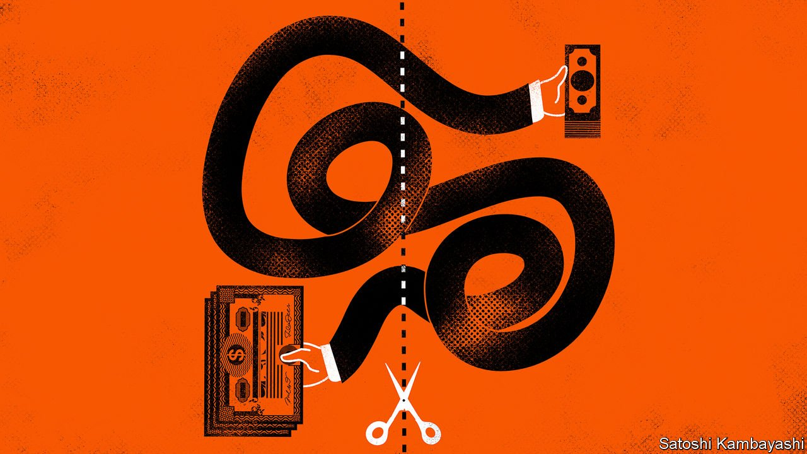

###### Buttonwood

# Why it matters when trades settle 

##### There is a case for redundancy in the settlement process 

 

> Oct 23rd 2021 

THE PAEANS that followed the recent retirement of KKR founders Henry Kravis and George Roberts, formerly private equity’s barbarians-in-chief, are a reminder that the story of Wall Street is one of big deals, bold trades and the people behind them. Those further behind them, in the “back offices” of banks, brokers and buy-out firms, barely get a look in. Understandably so: their world is colourless compliance and “post-trade” processes, like clearing and settlement. They are the plumbers of finance, toiling behind the scenes to ensure that the pipework, well, works. Every so often, however, there’s a gurgling noise loud enough to unsettle even those cocksure colleagues out front.

The system for settling stock trades—ensuring the buyer gets her security and the seller his cash—came under strain during the covid-induced volatility of March 2020. It creaked again early this year amid the meme-trading frenzy in GameStop shares. A report by regulators into that episode, published on October 18th, noted drily that post-trade processes, “normally in the background, entered the public debate”. It was thanks to spiking margin calls and volatility-induced settlement risks that Robinhood, a retail broker, restricted trading in GameStop stock, causing uproar.


Risk is a function of time. The longer between trade execution and completion, the bigger the “counterparty” risk, or the chance that one side or the other fails to pony up—as anyone caught mid-trade when Lehman Brothers or Archegos Capital collapsed can attest. And, therefore, the heftier the margin payments that brokers and investors have to post with clearing-houses.

Hence the long-running push to bring down trade-processing times—from 14 days (“T+14” in the parlance) in the 18th century, when certificates were carried on horseback and ship; to under a week following reforms in the wake of the 1968 Wall Street paperwork crunch, when a trading boom forced exchanges to close one day a week for months to allow the backroom boys to catch up; to T+5, then T+3, and, four years ago, T+2.

Still, a lot can happen in two days on Wall Street, so why stop there? Spurred by the market gyrations of last year, a group representing banks, investors and clearers has been studying a move to T+1 and is expected within weeks to unveil a plan for how to get there. The signs are that the Securities and Exchange Commission will bless it. If so, the halving of settlement time could kick in as early as 2023. Europe, for one, would probably follow suit.

Lest anyone think the titans of finance are going soft, it should be pointed out that they are not pushing this solely for the greater good. They are as interested in cutting their own costs as systemic risks. During last year’s market turmoil, overall margin demanded by the DTCC, America’s clearing agency for stocks, jumped five-fold, to more than $30bn daily. Hundreds of billions more a year are tied up by “fails-to-deliver”, delays owing to settlement failures (the causes of which range from mistyping errors to more sinister practices such as failing deliberately in order to manipulate the price of a stock). Freeing up this capital would leave financial firms with a lot more to invest profitably.

Why then stop at one-day settlement? Evangelists for so-called distributed-ledger technology are touting the possibility of going to T+0, known as “atomic” settlement. This looks technically feasible; indeed, some broker-to-broker trades at the DTCC are already settled on a near-instantaneous basis.

But is it desirable? There is a big difference between reducing settlement time and eliminating it. In the latter, the buyer would have to be pre-funded and the seller immediately ready to swap. Every bit of a complex process would need to be synchronised, with no room for error. It may also require a wrenching restructuring of the giant securities-lending market, which is designed to fit with settlement with a time lag.

Cue cries of “Luddite!” But Buttonwood is in good company in advocating keeping some redundancy in the process. Ken Griffin, boss of Citadel, one of America’s largest marketmakers, and thus no techno-slouch, has described real-time settlement as “a bridge too far” because it requires “everything [to] work perfectly in a world where there’s still people involved”. The message is clear: pushing things too far could replace one set of risks with another, scarier one, in which a small number of failed trades set off a chain-reaction across back offices worldwide. Atomic indeed.


