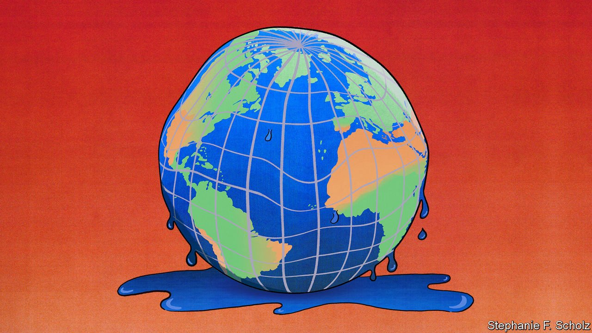
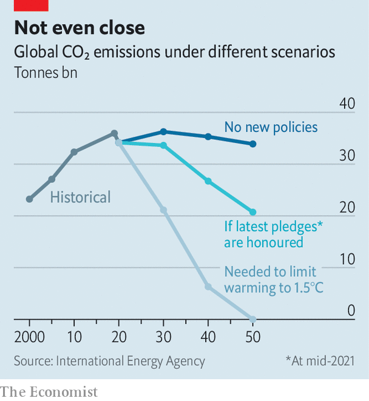
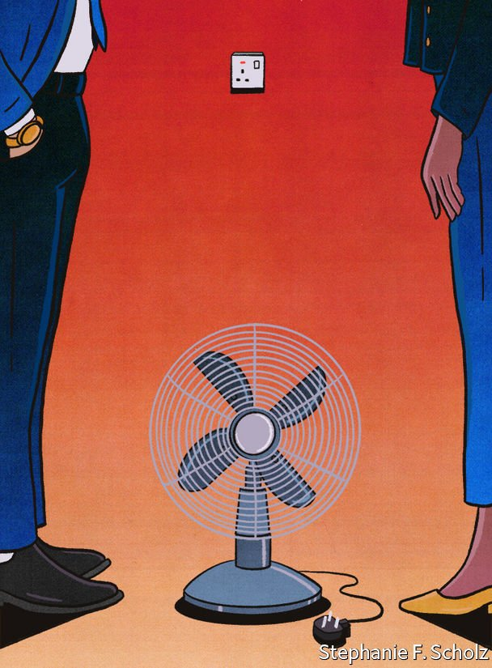

###### A reckoning in Glasgow

# Broken promises, energy shortages and covid-19 will hamper COP26 

##### It is the most important climate conference in years 

 

> Oct 23rd 2021 

LAST-MINUTE APPEALS are common in the weeks preceding the COP, the UN’s annual climate summit. Green groups urge world leaders to promise bold action. Poor countries ask rich ones for money. Ahead of this year’s event, which starts in Glasgow on October 31st, a group representing indigenous people is asking for donations of jackets, wellies and waterproofs. It notes that Amazonian indigenous folk who plan to attend “have not experienced a climate like a Scottish winter”.

This year’s summit is COP26—the 26th Conference of the Parties to the UN Framework Convention on Climate Change. It marks the most important climate talks since 2015, when the Paris agreement was signed. That is largely because of what countries promised they would do by this point. All countries are supposed to have announced tough new targets for reducing emissions. Rich countries are supposed to be helping poor ones finance green schemes. On both fronts, the world is coming up short. The proceedings in Glasgow may be chilly indeed.


The Paris agreement was adopted by the vast majority of countries. They promised to try to keep the increase in the Earth’s mean surface temperature to “well below” 2°C compared with pre-industrial levels, and ideally to no more than 1.5°C. In terms of the detrimental impact of global warming, the gap between those two targets is large. But temperatures have already risen by 1.1-1.3°C since the invention of the steam engine. So limiting heating to 1.5°C is a colossal task. To have a good chance of achieving it, the world must make net emissions of carbon dioxide 45% lower in 2030 than they were in 2010, and reduce them to zero by the middle of this century.

The Paris agreement did not demand such cuts—nor could it have done so. Instead countries pledged themselves to emission-reduction strategies known as Nationally Determined Contributions (NDCs). The NDCs brought to the table in Paris did not match the agreement’s lofty aims. They put the world on track to be around 3°C hotter than the pre-industrial baseline by 2100. But the treaty required that every five years all parties should up their game with new, more ambitious NDCs. The Glasgow conference (which is taking place a year later than planned, because of covid-19) is the due date for the first round of beefed-up pledges.

Governments began announcing new pledges last year. Rich countries have been more ambitious than poor ones. The European Union (EU) promises that by the end of the decade it will have cut emissions by 55% compared with 1990 levels. It had previously promised only a 40% decline. America says that by 2030 it will have cut emissions by 50-52% from 2005 levels. It had previously proposed only a 26-28% cut by 2025. These two parties account for 23% of the world’s carbon-dioxide emissions.

A lot of hot air

Australia is an outlier among rich countries. Its original NDC was not particularly ambitious. Nor is its new one. Meanwhile many emerging economies have set lax targets. Russia and Indonesia are promising no new effort. By employing some creative carbon accounting, Mexico and Brazil have produced new strategies that are less ambitious than their original plans.

India, which is responsible for 7% of carbon-dioxide emissions, has not yet published a fresh climate strategy. Nor has China, which accounts for 28%. Last year it said that it planned to make its emissions peak “before” 2030, having previously said only that it would reach this milestone “around” that time. Many would like it to bring this date forward, but Li Shuo of Greenpeace thinks that is unlikely to happen soon. He says there is more chance China might strengthen its pledge by declaring an absolute figure above which its annual emissions will not rise.

 


Taken together, the new targets underwhelm. Promises made by the middle of this year givea 50% chance of keeping warming below 2.1°C but only a 5% chance of keeping it under 1.5°C, according to the International Energy Agency (IEA), a forecaster (see chart). And this assumes that all the pledges are honoured, which is far from guaranteed.

On the tail of these lacklustre announcements is a failure relating to funding for developing countries. In 2009 rich countries vowed that by 2020 they would be providing poor ones with $100bn in climate finance each year. Roughly equal amounts were to go towards adaptation and to reducing emissions. The figure is a fraction of the $2trn annual investment that the IEA believes developing countries need. But the promise is supposed to signal the willingness of richer countries to make sacrifices for the good of the planet.

In 2019 only $80bn was provided, according to the OECD, a club of rich countries. This year a last-minute whip-round could perhaps see the total rise above $100bn before the conference. But poor countries are miffed. The original deadline was 2020—when, because of the pandemic, the total was probably lower even than in 2019. And only about 25% of the cash is financing ways of adapting to climate change, instead of the 50% promised.

All these disappointments will cause hand-wringing at the summit. Rich countries may re-emphasise their willingness to lend. They may offer an aggregate figure over several years, such as $500bn between 2020 and 2025. But no country is likely to swiftly adjust its new NDC. Designing them takes months of work and co-ordination across government departments.

Instead, progress in Glasgow will probably have to come from agreements struck in narrower debates, the outcomes of which will help countries implement their existing climate strategies, and make them more likely to increase their ambitions in the future. One job is to agree on rules for international carbon markets, such as what double-counting means when it comes to carbon credits.

A second debate is about “loss and damage”, meaning how far countries that will suffer most from climate change should receive compensation. The topic is taboo among rich countries. In Paris they eventually allowed the concept to be mentioned in the agreement, but resisted language that might actually lead to something being done. Poor countries hope to move it up the agenda and to lay the groundwork for more concrete discussions in the future.

Third comes the effort to get governments to sign up to sector-level pledges, such as to stop burning coal, ban the sale of internal-combustion engines and halt deforestation. The Global Methane Pledge, a promising new pact, calls for cutting global methane emissions by at least 30% from 2020 levels by 2030. Its backers include America and the EU. Measured over 20 years, a tonne of methane causes 86 times more warming than a tonne of carbon dioxide but the gas is naturally removed from the atmosphere much faster than CO. The Climate and Clean Air Coalition, made up of governments and lobby groups, says cutting human-made methane emissions in half by 2050 could lower temperatures by about 0.2°C.

The fourth topic is what Helen Mountford of the World Resources Institute, a think-tank, calls “keeping 1.5°C alive”. Green groups and some governments want countries to acknowledge that the world is failing to slow global warming, and to state explicitly that they wish to keep the increase under 1.5°C. China and India refused to back a similar statement at the G20 summit in July. They feel that if the temperature targets are revised the same should happen to the climate-finance goals.

 


A global energy shortage provides an unfortunate backdrop to the discussions. In Asia coal shortages are forcing factories to curb output. European gas and power prices have gone berserk. Governments are watching Joe Biden try to get legislation containing support for clean-energy firms through Congress. The wrangling is a reminder of the difficulties democratic countries face when they seek to enact big climate reforms.

Covid-19 has increased the costs and risks of getting negotiators to the summit. Poor countries, in particular, may send fewer than usual. Even in normal times they are at a disadvantage to rich places, which can send hordes of technocrats. The fact that many rich countries appear to be past the worst of the pandemic, while poor ones are still struggling through it, will only make such inequalities rankle more.

Block parties

All this could deepen the usual factionalism. Delegations attending the COP typically form three blocks. Poor countries ask rich ones for more ambition and more money. Rich countries try to convince emerging ones, which account for the lion’s share of the growth in emissions, to pollute less. And emerging economies try to tell rich countries that they are in fact part of the poor and vulnerable group, while also reminding rich countries that they got where they are today by polluting.

Yet there are some signs that these old alliances are loosening. Emerging economies have less excuse for inaction than they did when Donald Trump was in the White House, says Laurence Tubiana of the European Climate Foundation, a lobby group (Mr Trump pulled America out of the Paris agreement; it rejoined in February). Some, such as South Africa, are becoming more ambitious. In September China said it would no longer finance new coal-fired power stations outside its borders. Natural disasters in rich countries, such as floods in Germany that killed almost 200 people, may bring a new sense of urgency.

Any progress made at COP26 will probably be incremental, not a “big leap” of the sort John Kerry, America’s climate envoy, has promised. That will enrage grassroots activists. And it hardly matches the scale of the challenge. Two years from now a “Global Stocktake” scheduled under the Paris agreement will examine how well governments are implementing their climate plans. If their most recent climate promises are any indication, the stocktake could reveal a rather bare cupboard.■

For more coverage of climate change, register for The Climate Issue, our fortnightly , or visit our 

