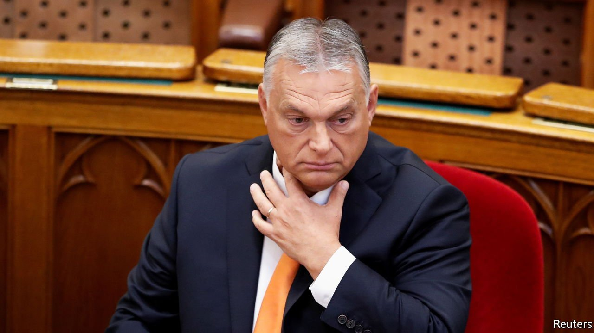

###### An October revolution

# At last, a backlash against bad government in Eastern Europe 

##### The EU’s battles with Poland and an opposition alliance in Hungary are overdue signs of change 

 

> Oct 23rd 2021 

CORRUPTION, AUTOCRACY, overbearing government—these were the perils many hoped eastern Europe was escaping when its fledgling democracies joined the European Union in the early 2000s. Instead, the rest of Europe now worries, the eastern members have simply smuggled these vices into the EU.

One of the biggest offenders is Poland. First the government in Warsaw stacked its constitutional court with pliant judges and then got them to rule that the Polish constitution can override the European treaties—an assault on a basic principle of EU membership. Viktor Orban, Hungary’s long-serving prime minister, has bullied political opponents, critical media outlets and gay Hungarians, among others.


Sleaze, meanwhile, is smothering economies across much of the former Soviet empire. The most motivated citizens vote with their feet and seek a better future in the West, hollowing out the places they leave behind. That can become a self-reinforcing dynamic, giving a boost to conservative, rural, populist outfits, such as Law and Justice, Poland’s ruling party, Mr Orban’s Fidesz or GERB, the Bulgarian group headed by Boyko Borisov, a former prime minister and prime figure in various scandals.

Until this month, there had been only the odd flicker of resistance amid the gloom of bad government. One came in 2019, with the election of Zuzana Caputova, an environmental and anti-corruption campaigner, as president of Slovakia. Last year another activist was elected president of nearby Moldova (which is not a part of the EU). And earlier this year Mr Borisov failed to win a fourth term as Bulgaria’s prime minister—although his opponents have not yet managed to form a government.

October has seen a refreshing change of pace. On the 9th Andrej Babis, the Czech Republic’s plutocratic leader, fared badly at the polls. He now looks set to be ousted as prime minister by a rival coalition (though he may step in as temporary president, since the incumbent is ill). One of the factors that seems to have led to his defeat was his appearance in the Pandora papers, a trove of documents revealing public figures’ use of shell companies, tax havens and other tricks of the footloose rich. Mr Babis, like Mr Borisov, denies any wrongdoing.

The same day, in an unrelated corruption scandal, the chancellor of Austria, Sebastian Kurz, resigned after his coalition partners threatened to bring down the government if he did not. Mr Kurz also insists he has done nothing wrong. Across central and eastern Europe, voters’ tolerance for the alleged shenanigans of their rulers seems to be running out.

Even Mr Orban is . Hungary’s six main opposition parties, generally as much at each other’s throats as at his, have at last managed what they had previously always failed to do: to form a united front. In a process that was admittedly a little fractious, they agreed not to compete against one another in parliamentary elections and selected a joint candidate for prime minister. Fidesz’s fourth electoral triumph in a row no longer seems inevitable.

At the same time, and none too soon, the EU itself is getting tough with Hungary and Poland. The European Commission is sitting on hundreds of billions of euros allocated to help escape the slump brought on by the pandemic. Each member country is entitled to a big dollop, but the commission must approve their spending plans before it disburses the cash. Citing problems with the rule of law, it has so far refused to give Hungary or Poland their share. If the courts are unsound, the thinking runs, then the EU’s cash is unsafe. It may use a similar argument to delay the distribution of other funds.

The row seems arcane, but it may be the first moment the EU has done more than tut-tut about the erosion of democracy in its eastern half. How far it is willing to go remains to be seen. But if its leaders’ constant talk of European values is to have any meaning, it will have to be firm. Glory to October! ■

