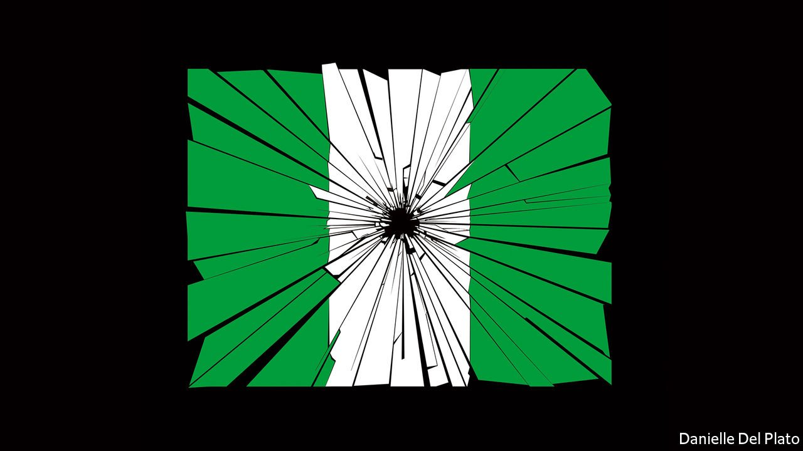

###### The crime scene at the heart of Africa

# Insurgency, secessionism and banditry threaten Nigeria 

##### Africa’s biggest nation faces its biggest test since its civil war 50 years ago 

 

> Oct 23rd 2021 

LITTLE MORE than six decades ago, as Nigeria was nearing independence, even those who were soon to govern Africa’s largest country had their doubts about whether it would hold together. British colonists had drawn a border around land that was home to more than 250 ethnic groups. Obafemi Awolowo, a politician of that era, evoked Metternich, fretting that “Nigeria is not a nation. It is a mere geographical expression.”

The early years of independence seemed to prove him right. Coup followed coup. Ethnic pogroms helped spark a civil war that cost 1m lives, as the south-eastern region calling itself Biafra tried to break away and was ruthlessly crushed. Military rule was the norm until 1999. Despite this inauspicious start, Nigeria is now a powerhouse. Home to one in six sub-Saharan Africans, it is the continent’s most boisterous democracy. Its economy, the largest, generates a quarter of Africa’s GDP. Nollywood makes more titles than any other country’s film industry bar Bollywood. Three of sub-Saharan Africa’s four fintech “unicorns” (startups valued at more than $1bn) are Nigerian.


Why, then, do most young Nigerians want to emigrate? One reason is that they are scared. Jihadists are carving out a caliphate in the north-east; gangs of kidnappers are terrorising the north-west; the fire of Biafran secessionism has been rekindled in the oil-rich south-east. The violence threatens not just Nigeria’s 200m people, but also the stability of the entire region that surrounds them.

Readers who do not follow Nigeria closely may ask: what’s new? Nigeria has been corrupt and turbulent for decades. What has changed of late, though, is that jihadism, organised crime and political violence have grown so intense and widespread that most of the country is . In the first nine months of 2021 almost 8,000 people were directly killed in various conflicts. Hundreds of thousands more have perished because of hunger and disease caused by fighting. More than 2m have fled their homes.

The jihadist threat in the north-east has metastasised. A few years ago, an area the size of Belgium was controlled by Boko Haram, a group of zealots notorious for enslaving young girls. Now, Boko Haram is being supplanted by an affiliate of Islamic State that is equally brutal but more competent, and so a bigger danger to Nigeria. In the south-east, demagogues are stirring up ethnic grievances and feeding the delusion that one group, the Igbos, can walk off with all the country’s oil, the source of about half of government revenues. President Muhammadu Buhari has hinted that Biafran separatism will be dealt with as ruthlessly now as it was half a century ago.

Meanwhile, across wide swathes of Nigeria, a collapse in security and state authority has allowed criminal gangs to run wild. In the first nine months of this year some 2,200 people were kidnapped for ransom, more than double the roughly 1,000 abducted in 2020. Perhaps a million children are missing school for fear that they will be snatched.

Two factors help explain Nigeria’s increasing instability: a sick economy and a bumbling government. Slow growth and two recessions have made Nigerians poorer, on average, each year since oil prices fell in 2015. Before covid-19, fully 40% of them were below Nigeria’s extremely low poverty line of about $1 a day. If Nigeria’s 36 states were stand-alone countries, more than one-third would be categorised by the World Bank as “low-income” (less than $1,045 a head). Poverty combined with stagnation tends to increase the risk of civil conflict.

Economic troubles are compounded by a government that is inept and heavy-handed. Mr Buhari, who was elected in 2015, turned an oil shock into a recession by propping up the naira and barring many imports in the hope this would spur domestic production. Instead he sent annual food inflation soaring above 20%. He has failed to curb corruption, which breeds resentment. Many Nigerians are furious that they see so little benefit from the country’s billions of petrodollars, much of which their rulers have squandered or stolen. Many politicians blame rival ethnic or religious groups, claiming they have taken more than their fair share. This wins votes, but makes Nigeria a tinderbox.

When violence erupts, the government does nothing or cracks heads almost indiscriminately. Nigeria’s army is mighty on paper. But many of its soldiers are “ghosts” who exist only on the payroll, and much of its equipment is stolen and sold to insurgents. The army is also stretched thin, having been deployed to all of Nigeria’s states. The police are understaffed, demoralised and poorly trained. Many supplement their low pay by robbing the public they have sworn to protect.

To stop the slide towards lawlessness, Nigeria’s government should make its own forces obey the law. Soldiers and police who murder or torture should be prosecuted. That no one has been held accountable for the slaughter of perhaps 15 peaceful demonstrators against police abuses in Lagos last year is a scandal. The secret police should stop ignoring court orders to release people who are being held illegally. This would not just be morally right, but also practical: young men who see or experience state brutality are more likely to join extremist groups.

Things don’t have to fall apart

Second, Nigeria needs to beef up its police. Niger state, for instance, has just 4,000 officers to protect 24m people. Local cops would be better at stopping kidnappings and solving crimes than the current federal force, which is often sent charging from one trouble spot to another. Money could come from cutting wasteful spending by the armed forces on jet fighters, which are not much use for guarding schools. Britain and America, which help train Nigeria’s army, could also train detectives. Better policing could let the army withdraw from areas where it is pouring fuel on secessionist fires.

The biggest barrier to restoring security is not a lack of ideas, nor of resources. It is the complacency of Nigeria’s cosseted political elite—safe in their guarded compounds and the well-defended capital. Without urgent action, Nigeria may slip into a downward spiral from which it will struggle to emerge. ■

