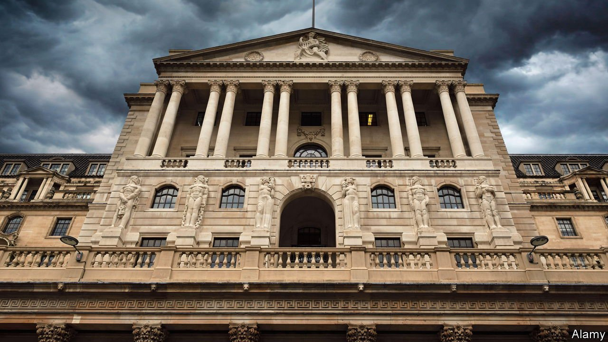
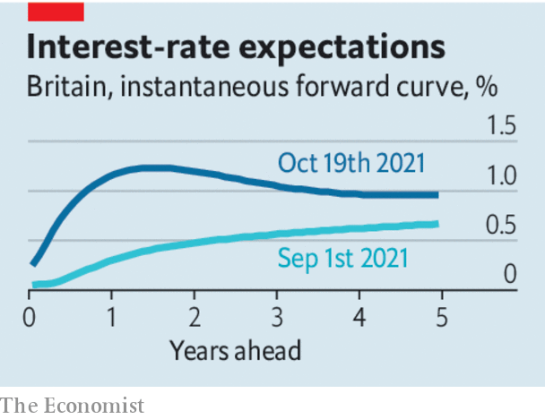

###### Don’t jump the gun

# The Bank of England should not raise interest rates until 2022 

##### But Britain may need tighter money sooner than America 

 

> Oct 23rd 2021 

BRITAIN IS UNIQUELY exposed to the malign forces troubling the world economy. It gets two-fifths of its energy from natural gas, which is in short supply. Trade flows are worth more than half of its GDP, making bunged-up supply chains particularly painful. Brexit has exacerbated its labour shortage and disrupted trade further. It even has a high rate of covid-19 infections, posing a lingering threat to consumer confidence, though more than 90% of the population has antibodies against the disease.

Could a central-bank mistake soon be added to the list of problems? The Bank of England has encouraged markets to expect interest-rate rises sooner than in other big rich countries. In mid-September investors began betting that interest rates would start rising in December. This week comments by Andrew Bailey, the bank’s governor, led traders to place about an 80% chance on a rate increase on November 4th. Our reading of Mr Bailey’s remarks—which, admittedly, were imprecisely worded—suggests that the markets are getting ahead of themselves. The governor has promised . And yet the bank has not disabused bond desks of the notion that a series of rate rises is imminent.


That is worrying. Inflation has risen to over 3% and will probably reach around 5% by the spring. But many of the forces pushing it up, such as energy-price increases, should prove temporary. The normal approach is to disregard inflation when it is caused by supply disruptions rather than by an overheating economy. The bank did this in 2011 when commodity prices rose and inflation reached 5.2%, and did so again after the Brexit referendum sent sterling tumbling in 2016, making imports more expensive. On both occasions high inflation subsided.

 


Those who worry that, in contrast to those episodes, the labour market is running too hot or supply could be permanently impaired should take comfort from the fact that the government is already turning off some stimulus. The furlough scheme, which helped pay the wages of staff who were temporarily laid off, finished at the end of September. A temporary boost to welfare benefits worth an annual £6bn (0.3% of GDP) lapsed at around the same time. The government has announced tax rises worth an annual £12bn, to take effect from April. Tighter fiscal policy gives policymakers time to see how the economy responds. The bank’s November meeting would be a poor time to jump the gun, because data on the jobs market’s response to the end of the furlough scheme will not yet be available.

The bank is troubled by the risk of inflation expectations rising, baking in persistent price increases as workers demand higher wages and firms’ costs rise. It is a reasonable concern. Several measures of inflation expectations have drifted upward and average wage growth is curiously strong. Britain, unlike America and the euro zone, did not have persistently below-target inflation before the pandemic, meaning the public may be more accustomed to price rises.

On present trends, the Old Lady would have to raise rates before other central banks, such as the Federal Reserve, in 2022. But tightening monetary policy to preserve long-term credibility, rather than because it is warranted by underlying economic conditions, is more typical of emerging markets than the rich world. That it may be necessary is a sign of Britain’s fragility.

Whatever policy they follow, rate-setters should communicate their intentions more clearly. One has even suggested that if markets price in higher rates, tightening financial conditions, that might slow the economy sufficiently to avoid monetary policymakers having to follow through—an approach that would create a credibility problem all of its own. ■

