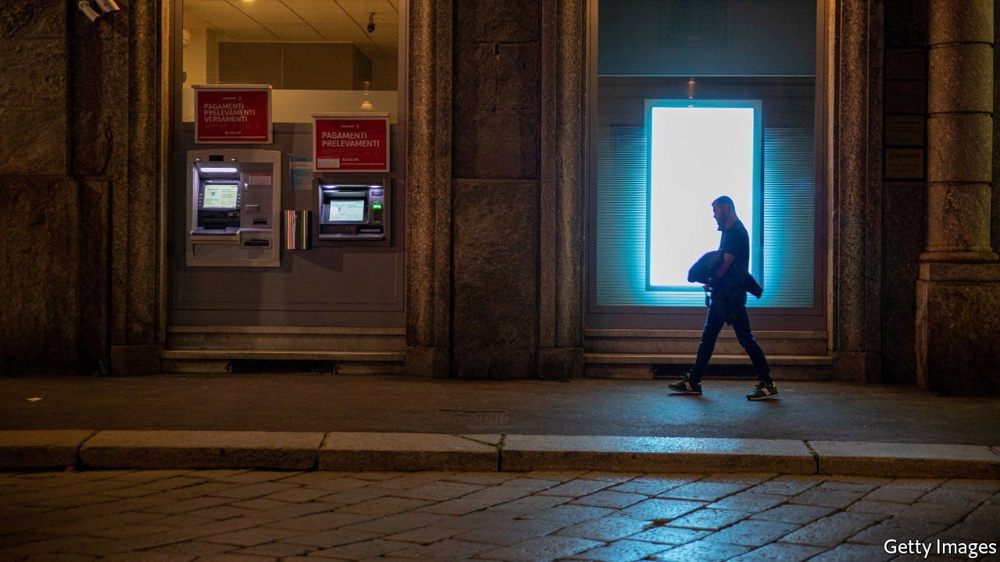
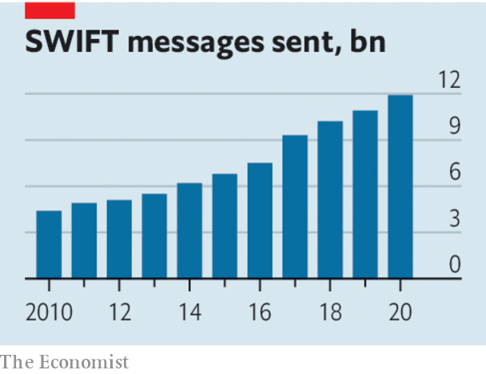

###### Be swift, be bold

# The geopolitics of money is shifting up a gear 

##### If Western countries and firms want to stay in charge of global payments they have to modernise how they happen 

 

> Oct 23rd 2021 

IN THE PAST few years the Western-led infrastructure behind globalisation has fallen into disrepair even as China has been building credible alternatives. The World Trade Organisation is in tatters, the IMF and World Bank are struggling for relevance and tarnished by scandal, and no one can agree on global rules to govern technology.

There is an exception to this dismal picture: the global payments system that underpins the dominance of Western currencies, particularly the dollar. Over the past year one of its main networks, SWIFT, carried $140trn of transactions, a record level and the equivalent of about 150% of global GDP. It is an impressive sum but more must be done to modernise the payments architecture if its pre-eminence is to last.


The way money flows around the world is still overwhelmingly under the control of liberal democracies. Payments typically happen in the dollar and to a lesser extent the euro, pound and yen. This is, on balance, good for the world, providing a reliable system governed by law. It is certainly good for Western countries, bolstering their legal norms, firms and influence.

 


Behind it lie myriad institutions, from banks to New York’s clearing-houses. Despite its importance, SWIFT, owned by global banks and founded in the 1970s, is an obscure part of all this. It connects 11,000 banks in over 200 countries, providing a messaging system for transactions. Although it is based in Europe, it is an accidental linchpin of American influence, with JPMorgan Chase alone accounting for 24% of SWIFT dollar volumes.

The threat to SWIFT comes from . Its own record is patchy. In 2016 North Korean hackers used stolen SWIFT credentials to steal $81m from the Bangladeshi central bank. America is complacent about the dollar system. It has used SWIFT to pursue politicised sanctions, giving countries an incentive to develop alternatives. In addition, America has been slow to upgrade payments systems at home or to develop a central-bank digital currency, and Congress is critical of the Federal Reserve’s stabilising global role.

Meanwhile big tech firms, credit-card networks and banks are keen to create alternatives. On October 19th Facebook launched its digital wallet. Innovation is welcome, but if only a few firms dominate, fees will rise and poorer countries suffer. And China is trying its own payments system, called CIPS, and a central-bank digital currency. It has just asked McDonald’s to adopt the e-yuan in its Chinese branches.

Rather than assume that the dominance of payments is their birthright, democracies should ensure their systems are faster, cheaper and safer so that they remain firms’ first choice on merit. SWIFT has upgraded its network and says that 92% of large transfers on its high-speed pipes happen within a day. Not all kinds of financial-market transactions  but SWIFT should aim for its payments to be instantaneous. Another goal should be to connect to more real-time domestic payments networks, which are live in 65 countries. This may cost money, but SWIFT’s capital expenditure in 2020 was $56m, less than a fifth of the budget of payments giants such as Ant Group and Visa.

The hardest task will be to reform SWIFT’s governance. Its board is packed with European banks, which was justifiable in the 1970s when they dominated cross-border finance, but now looks anachronistic. The board’s 25 seats include just two American firms and a single Chinese one. India and Brazil have none. America and Asia should be better represented, even as liberal democratic countries remain in control. When a house needs renovating a good place to start is the plumbing. ■


