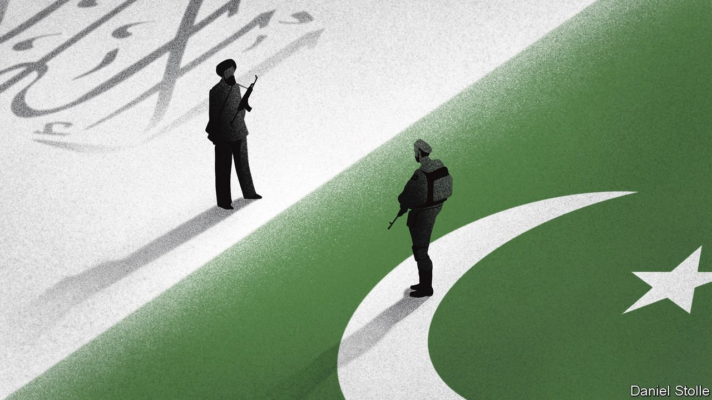
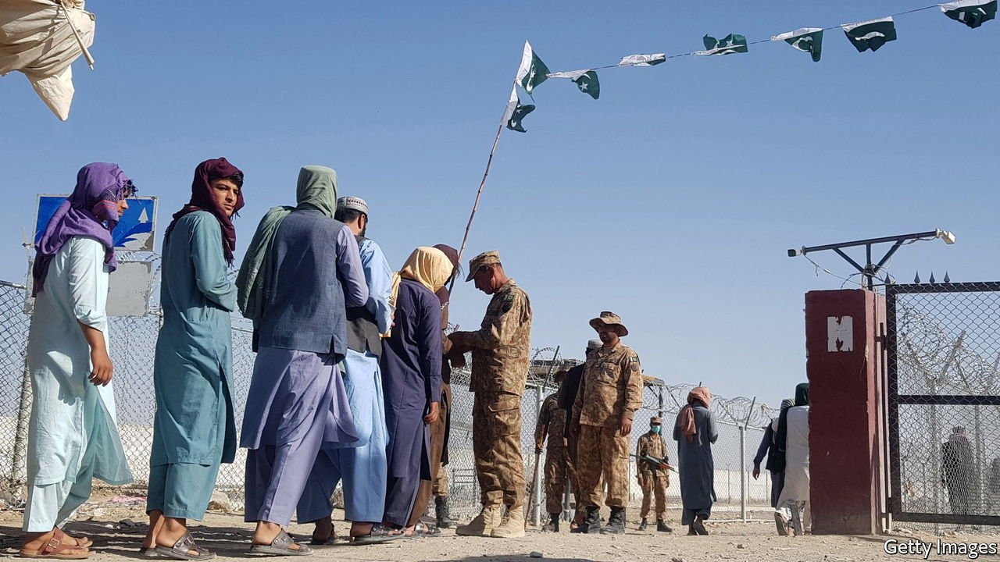
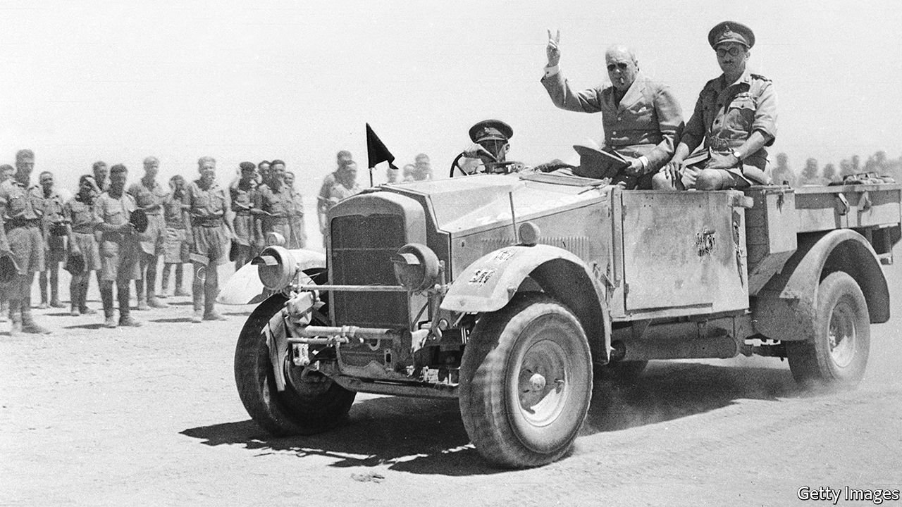
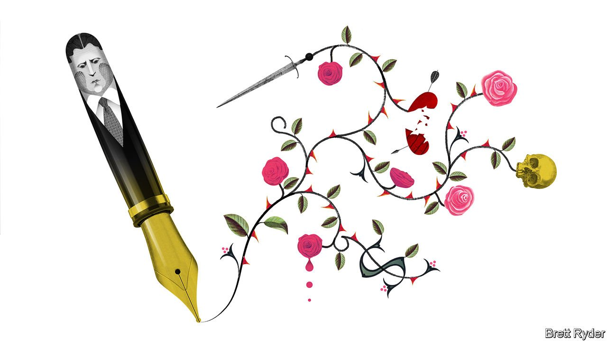
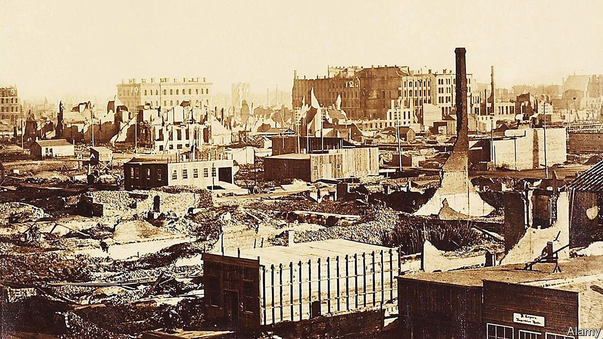
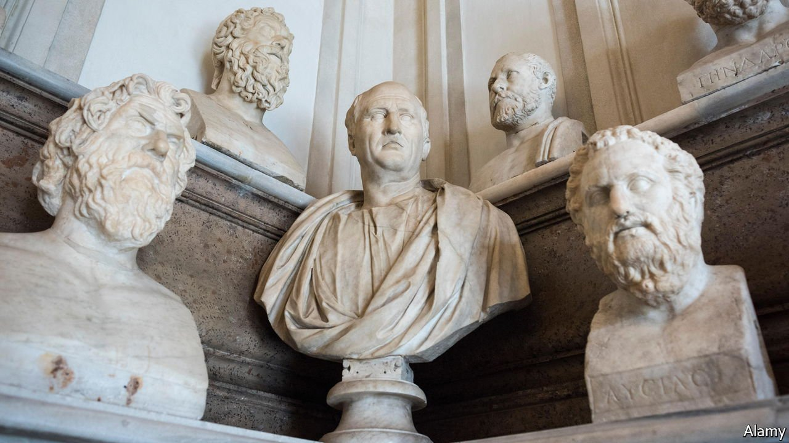
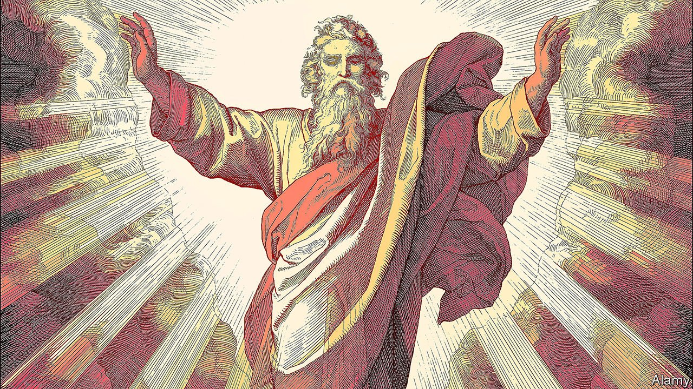

###### On Pakistan, the American navy, management, the Peshtigo fire, Ethiopia, learning classics, God

# Letters to the editor 

##### A selection of correspondence 

 

> Oct 23rd 2021 


Pakistan and Afghanistan

You repeated stale accusations about Pakistan’s role in Afghanistan (“”, October 9th). Industrial-scale corruption, the government’s loss of credibility among the Afghan people, internecine squabbling, Ashraf Ghani placing himself above the national interest and an intransigence towards dialogue were the real and only reasons behind the fall of Kabul.


Every country, and its armed forces, has a responsibility to safeguard its national interest as it deems fit, especially when hostile forces are operating in its backyard. Pakistan has paid a heavy price for supporting the American-led war on terror, with over 80,000 casualties. After 9/11 Pakistan extended full intelligence co-operation to the West, which resulted in the dismantling of al-Qaeda and the capture of hundreds of its operatives. It is regrettable that neither Pakistan’s concerns, nor our repeated exhortations for a more realistic approach, were ever really heeded. Our views were always processed through a jaundiced lens, and reduced to calls to “do more”.

Moreover, comparing Pakistan’s economy with that of its regional peers is as odious as it is simplistic. None of the regional countries was part of the West’s war on terrorism in the way Pakistan was, none faced the security fallout, and none incurred economic losses of more than $150bn.

If Pakistan wants other countries to help stabilise Afghanistan, it is because we do not want the world to repeat the mistakes of the past by abandoning Afghanistan and leaving a vacuum for terrorists. It is clear that the consequences would be no different this time around. While a deteriorating security situation and the subsequent refugee crisis will hurt Pakistan immediately, it will impact the West eventually.

MUNEER AHMAD

First secretary (press)

Pakistan High Commission

London

 


Your thoughtful leader on Pakistan argued that the West has a good chance of influencing Islamabad because the elite “send their children to American and European universities and holiday in London and Paris” (“”, October 9th). The penchant for nice destinations among problematic leaders is nothing new. Chinese and Russian bigwigs love American and European places, both for leisure and to educate their offspring. Even Kim Jong Un went to school in Switzerland. Svetlana Alliluyeva, Stalin’s only daughter, dashed off to America at the first opportunity. None of these instances led to improved relations, so perhaps one shouldn’t put too much faith in similar behaviour in Pakistan.

MICHAEL KUTTNER

Stege, Denmark

 


A racial first

The review of “Blood and Ruins” claimed that the American navy was white-only until 1942 (“”, October 2nd). African-Americans were allowed in the navy before 1942, although mostly for menial work. Doris Miller, a cook on the USS West Virginia, was the first black man to be awarded the Navy Cross for his heroic actions when the ship was bombed during the attack on Pearl Harbour on December 7th 1941.

DAVID JONES

Abu Dhabi

 


Required reading

I read with interest s column regarding bosses writing memoirs and guidance books (October 2nd). The former chief executive of Admiral Group, Henry Engelhardt, always had a nice turn of phrase, introspection and self-awareness introducing our annual reports. He also uttered many Henryisms, printed on T-shirts for staff on his last day in the office. I often wondered whether he would write his own book, and during the pandemic he did just that. It was a guidance book for the company’s entire management to help them and get the best out of their staff. No reward or publicity (though it was eventually published), just a desire to improve the performance and well-being of the staff working for the company he co-founded, even though it was years since he was in charge. Perhaps it should be read more widely.

GARETH ROWLANDS

Bridgend, South Wales

 


America’s forgotten inferno

The Chicago fire was indeed a tragic event (“”, October 9th). However, an even greater tragedy happened that same day, 250 miles north in Peshtigo, Wisconsin. Whereas the Chicago fire spread over 3.3 square miles and killed 300 people, the Peshtigo fire covered 2,344 square miles with an estimated death toll of 1,200 to 2,400. By any measure the Peshtigo fire was much larger, more destructive, and more deadly. It remains to this day the deadliest fire in American history, but because the blaze in Chicago occurred at the same time it has been mostly overlooked.

JOHN HOHOL

Madison, Wisconsin

 


Ethiopians would suffer

It was rather vexing to see The Economist join the spiteful campaign to remove Ethiopia’s trade benefits under America’s African Growth and Opportunity Act (“”, October 9th). The investments in light manufacturing that this preferential trade agreement attracts are by no means a major source of tax revenue or foreign exchange for the Ethiopian government, which you want to punish for expelling a handful of UN diplomats. This misguided sanction would only end up destroying more than 100,000 jobs directly, and hurt the livelihoods of almost a million semi-skilled, mostly female workers who toil below the poverty line.

The irony must have been lost on those who advocate such a malicious policy response in the name of humanitarian intervention.

TIGLUN MANAYE MANDEFRO

Hawassa, Ethiopia

 


Learning through play

Although the formal study of Latin, Greek and ancient history in Britain today is indeed “concentrated in fee-paying and academically selective state schools” (“,” October 2nd), a new generation is being schooled in the period in a novel and entertaining way. Over 10m copies of “Assassin’s Creed Odyssey”, an action role-playing video game, have been sold worldwide. The game is set in the years 431-422 BC and introduces characters and events in a way that should encourage players from all classes and races to seek more information. This would appeal to Socrates, who believed that “Education is the kindling of a flame, not the filling of a vessel.”

MICHAEL LAGGAN

Newton of Balcanquhal, Perthshire

 


A physical being

Your review of “God: An Anatomy” suggests that the book’s author, Francesca Stavrakopoulou, has illustrated in a dramatic way the truth of Voltaire’s remark that if God has created us in His image, we have more than returned the compliment (“”, October 2nd).

NEVILLE MOSES

Sydney

Surely God, to the extent that she exists, is a woman. And she walks among us incarnate. Anyone who has stood in the presence of a Renoir or watched a Sophia Loren movie can be in no doubt.

R. POETON

Lenox, Massachusetts

