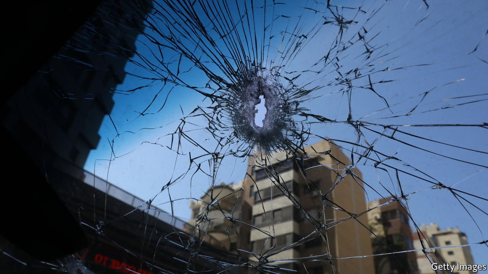

###### Probing too deep

# How an investigation led to a gun battle in Lebanon 

##### Most politicians do not want the probe of Beirut’s port explosion to find answers 

 

> Oct 23rd 2021 

IT WAS SUPPOSED to be a speech to celebrate a Muslim holiday, yet Hassan Nasrallah devoted a striking amount of it to a Christian politician, Samir Geagea. There was not much cause for celebration anyway. The leader of Hizbullah, a Shia political party-cum-militia, was speaking on October 18th, four days after an hours-long gun battle in Beirut that killed seven people. It was the worst street violence in Lebanon’s capital since 2008. Mr Nasrallah blames Mr Geagea.

In Mr Nasrallah’s telling, the Lebanese Forces (LF), the right-wing Christian party led by Mr Geagea, was trying to spark a civil war. Hizbullah, he added, has 100,000 fighters trained for battle, a claim that is impossible to verify but probably exaggerated. Still, the warning was clear. “Don’t miscalculate,” Mr Nasrallah told his rival. “Be wise and behave.”


The shoot-out on October 14th was centred on a protest against Tarek al-Bitar, the judge investigating the massive explosion at Beirut’s port just over a year ago. Hizbullah and Amal, another Shia party that co-sponsored the protest, said that snipers fired on demonstrators. The LF denied any role. A CCTV video, meanwhile, showed a Lebanese soldier firing at protesters, which the army says it is investigating.

However the shooting started, for many Lebanese the scenes in Beirut harked back to the 15-year civil war, which ended in 1990. Hizbullah and Amal have spent months using legal and political pressure to stall the port investigation. Now the spectre of violence hangs over it as well.

Mr Bitar has arguably the hardest job in Lebanon. The explosion, one of the largest non-nuclear blasts in history, killed 218 people and wrecked much of the city centre. It was caused by 2,750 tonnes of ammonium nitrate that arrived by ship in 2013 and was stored improperly for years. Many of Lebanon’s leaders were aware of the stuff and did nothing to make it safe. That leaves them reluctant to support the probe. The president, Michel Aoun, says he backs Mr Bitar but has barred him from interviewing Tony Saliba, the director-general of state security (who is, like Mr Aoun, a Christian). Hassan Diab, the prime minister at the time of the blast, ignored a summons for questioning last month and jetted off to America.

But it is Hizbullah and Amal that have done most to sabotage the probe. Mr Nasrallah has called for the judge to step down, accusing him of bias. A Lebanese reporter says Wafiq Safa, Hizbullah’s security chief, gave her a threat to pass to Mr Bitar. “We have had enough of you,” it is supposed to have read. “We will go to the end of the legal path, and if that does not work, we will remove you by force.” Former ministers from Amal have filed lawsuits (later dismissed) seeking Mr Bitar’s dismissal.

Families of the victims have long supported Mr Bitar. A day after the clashes, however, Ibrahim Hoteit, the spokesman for the families, released a bizarre video in which he called for Mr Bitar’s removal and denounced “American interference” in the probe. The message contradicted his past statements. Many Lebanese believe it was coerced; at one point Mr Hoteit glances away from the camera, seemingly at someone in the room with him.

Najib Mikati, the prime minister, has said he will not convene his cabinet (which includes Hizbullah and Amal) until there is a “solution” to the dispute. He took office in September after more than a year without a proper government (two other men tried and failed to form a cabinet during that time). His predecessor, Mr Diab, spent most of his tenure as a feckless caretaker.

Meanwhile, the country plunged into an economic crisis that the World Bank ranks as one of the worst anywhere since the mid-1800s. The economy shrank by an estimated 25% last year. The Lebanese pound, long pegged at 1,500 to the dollar, now trades around 21,000; annual inflation exceeds 100%.

Mr Mikati needs to negotiate a rescue package with the IMF, among many other tasks. He will not have long. Elections had been expected in May. On October 19th parliament voted to bring them forward to March, ostensibly to avoid candidates having to campaign during Ramadan. This will harden views on the port investigation. Mr Geagea, for example, will use his backing of Mr Bitar to drum up support among his Christian base (many of the worst-hit districts near the port in east Beirut are historically Christian).

There is no logic in trying to restart the civil war. Hizbullah is by far the strongest faction in Lebanon, better equipped even than the army. Foes lack the muscle to challenge it. If war is unlikely, however, so is stability. Thousands of soldiers have reportedly deserted the army, where conscripts now take home just $60 a month (compared with $800 two years ago). The crisis has created a vast pool of unemployed, angry young men. Mr Nasrallah may be confident that his militia can fend off rival warlords. But if the cabinet does not move quickly to arrest Lebanon’s collapse—which Hizbullah and Amal are making harder to do—no one will be able to keep the peace. ■

