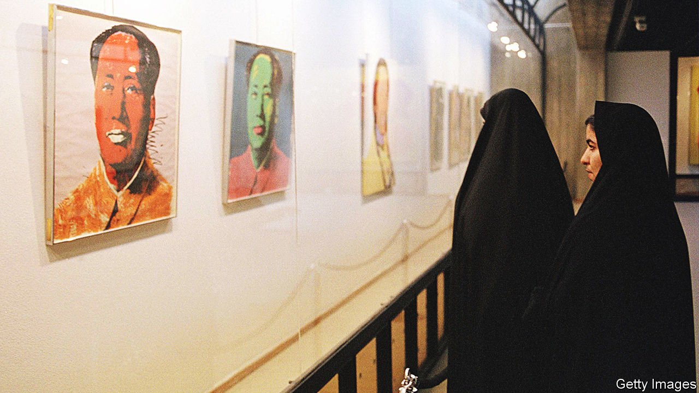

###### Andy Warhol and the ayatollahs

# Iran’s impressive collection of Western art 

##### A museum from the shah’s era reopens 

 

> Oct 23rd 2021 

DAYS BEFORE Ebrahim Raisi, a hardline cleric, won Iran’s presidential election in June, the Tehran Museum of Contemporary Art reopened to the public after a long refurbishment. It made for a strange juxtaposition. Mr Raisi celebrates the decline of American influence; his culture minister rails against “the deviation and secularism” of Iran’s art scene. Yet the museum welcomed back visitors with a retrospective of Andy Warhol, the American pop-artist. Fashionable men and chador-clad women gazed at portraits of Marilyn Monroe, the blonde seductress, and a mocking rendition of Mao Zedong, the Chinese dictator (pictured, from an old exhibition).

Warhol was a favourite of Farah Pahlavi, wife of Muhammad Reza Pahlavi, the late shah. The old regime built the museum in part to enhance Iran’s stature. When it opened in 1977 it showed works by Claude Monet, Pablo Picasso and Mark Rothko, bought under Mrs Pahlavi’s supervision during Iran’s oil boom.


For years after the shah was ousted by the clerics in 1979, the collection, worth billions of dollars, sat in its vaults. Most of the paintings were neither damaged nor sold, though a portrait of Mrs Pahlavi by Warhol was slashed with a knife. And the museum exchanged “Woman III”, by Willem de Kooning, for a rare volume of the “Shahnameh”, an ancient Persian poetry book. The painting, too risqué for the authorities, was later sold for $138m.

Many of the museum’s works have been brought out in recent decades, not without controversy. A panel from Francis Bacon’s “Two Figures Lying on a Bed with Attendants”, with gay overtones, was deemed offensive and removed. Today, apart from the museum’s nudes (such as Pierre-Auguste Renoir’s “Gabrielle With Open Blouse”) and Warhol’s portraits of the Pahlavis, anything goes, says a museum official. There are two works by Henry Moore in the sculpture park and an exhibition of Alexander Calder, which coincided with a show of the American sculptor’s work in Israel.

The culture minister, Mohammad Esmaili, has not batted an eyelid at the Warhol retrospective, says the official. Newspapers loyal to the regime have even praised it. Some observers say the government, faced with covid-19 and a struggling economy, has no time for such trifles. Others say it wants to prove that cultural life in Iran is on a par with that of its Gulf neighbours, such as the United Arab Emirates (UAE), which is building world-class art and cultural institutions.

Art and architecture schools are flourishing in Iran, with mostly female students. New private galleries in Tehran buzz with young crowds. But exhibits require licences; curators are often summoned for questioning. When the Tehran museum opened 44 years ago, “Iran was the most progressive country in Asia and Dubai [part of the UAE] had just two supermarkets—owned by Iranians,” says Kamran Diba, the exiled architect and founding director of the museum. “Look at them now—and look at Iran.”

