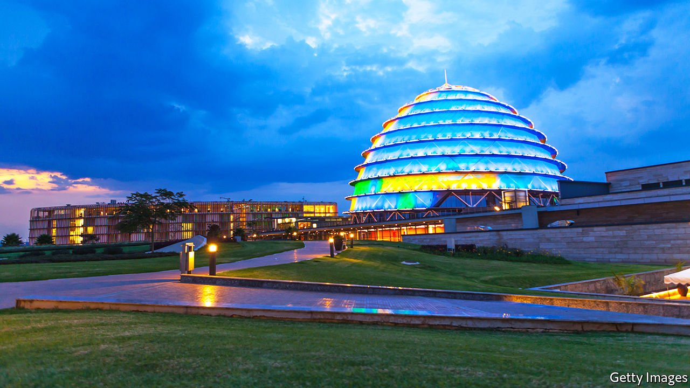

###### Capital cities

# Three places that dream of becoming Africa’s Singapore 

##### But plans for international financial centres worry tax campaigners 

 

> Oct 23rd 2021 

SMALL, LANDLOCKED and with few natural resources, Rwanda lacks an obvious route to riches. But a new international financial centre in Kigali, its capital, offers a clue to the government’s strategy. It has passed new laws to encourage investment and signed agreements with financial centres as far afield as Morocco and Belgium. The idea is to “position Rwanda as a gateway to the rest of Africa”, says Nick Barigye, chief executive of Rwanda Finance Limited, the agency that is driving the project.

Kigali (pictured) is one of several cities in continental Africa that are trying to become financial hubs to capture some of the business that currently flows through offshore centres such as Mauritius. Kenyan officials signed an agreement with the City of London as part of a plan to launch a financial centre in Nairobi. Ghana is drafting laws to create one of its own; Sampson Akligoh, an adviser to the finance minister, says Accra can become a hub for everything from pension funds to private-equity firms, like a Singapore for west Africa.


Jet-setting financiers have spread the gospel of free-flowing capital and low taxes through consultancy reports and study trips. Advice also comes from donors such as CDC Group, the British government’s development-finance arm. Colin Buckley, its head of external affairs, argues that this is good for development because foreigners are more confident about investing in countries that have strong financial centres. Locals can also learn new skills.

The architects of these would-be hubs talk of building a financial “ecosystem”, with expertise in law, accountancy and business services. “We’ve tried to move away from the notion that this is just a business precinct or an iconic tower,” says Vincent Rague, the chairman of the Nairobi International Financial Centre. It boasts that Prudential, a British insurer, will be the first firm to set up shop in the hub. A thriving local centre, he points out, would make it easier for borrowers in the region to issue bonds close to home. Its partnership with the City, meanwhile, would help firms listed on the Kenyan stock exchange access foreign capital by allowing them to also list their shares in London.

But nurturing this sort of ecosystem takes time, expertise and political will. Kenya has been talking about a financial centre for nearly a decade. The presence of established hubs serving Africa, whether in Mauritius or Casablanca, makes it harder for new entrants to break into the market. “The competition is not only African,” says a partner at a private-equity fund focused on Africa. “It is global.”

One way centres compete is by slashing taxes on the companies that move into them. But this can trigger “a race to the bottom”, warns Chenai Mukumba of Tax Justice Network Africa, a pan-African campaign group. It is going to court to challenge the tax breaks offered by Rwanda and is calling for a temporary halt to Kenya’s centre until its rules on tax and transparency are strengthened. When Ghana first tried to open an “offshore” banking centre in the late 2000s the project collapsed and the country was blacklisted by the Financial Action Task Force, an international money-laundering watchdog. None of the three countries is among the 130 that recently signed up to a plan by the OECD, a club mostly of rich countries, to set a 15% floor on corporation tax.

Each centre is offering its own package of investment incentives. In Rwanda that includes a basic 15% corporate tax rate that can drop to as low as 3%. It does not tax dividends, interest or royalty payments. Mr Barigye says that investments will be “clean and compliant [with] global standards”. The government has strengthened its money-laundering laws. Investors will have to show that they are doing more than just putting up letter boxes, but are establishing a genuine presence in the country.

Even with the lure of tax breaks, the odds seem stacked against the new centres. A fund manager at a European bank doubts that Africa’s new financial centres “will grow super-big”. But Mr Rague points out that it took cities like London hundreds of years to become the global leaders in finance they are today. If these projects succeed, he says, “we’ll be contributing to Africa’s coming of age.” ■

