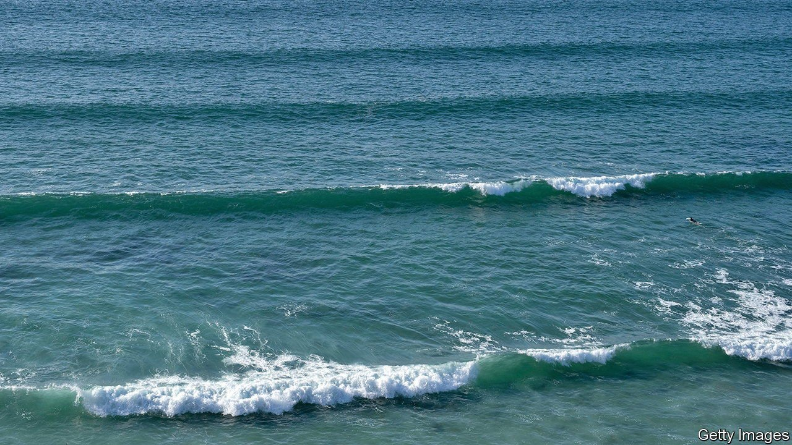
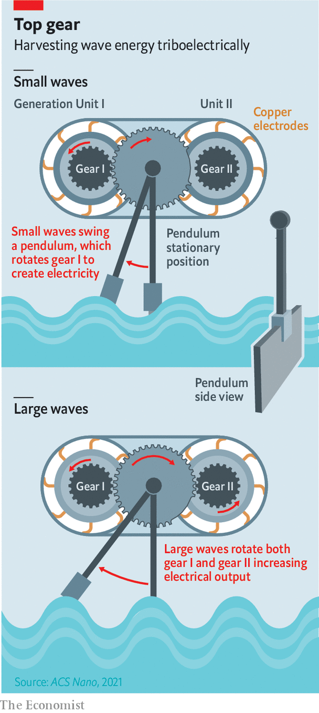

###### Wave energy

# A simple but ingenious mechanism may give wave power a boost 

##### It is inspired by a party trick and clockwork 

 

> Oct 21st 2021 

IN A WORLD where new technology is dominated by the movement of electrons and the manipulation of biomolecules, it is good to know that old-fashioned mechanics can sometimes get a look-in, too. Admittedly, electron movement is also involved in the device dreamed up by Wang Zhonglin of the Beijing Institute of Nanoenergy. But its true ingenuity lies in a mechanical arrangement that would have delighted an 18th-century watchmaker.

Dr Wang, who has just published a description of his device in ACS Nano, is interested in using ocean waves to generate electricity. That is not a new idea, but it has not taken off in the way that wind and solar power have. There are many reasons why. One is the hostile environment. Seawater is chemically corrosive and the very waves which provide the power can become destructive during a storm. A second is that servicing and maintaining a piece of floating engineering is difficult and costly. And a third is that waves are even more variable as sources of energy than wind or sunlight.


These challenges mean wind and solar have left wave-power far behind. But some still hanker to change that, and Dr Wang is one. In particular, his invention addresses the third point—waves’ variability as a power source. As he observes, existing designs are optimised to extract energy from large waves. But, though such waves are individually powerful, small waves collectively carry a lot of energy too. So a sensible generator would harness both.

 


Dr Wang’s answer to the problem is also twofold. First, he ditches the conventional approach to electricity generation, which is to move a coil of wire through a magnetic field, in favour of what he calls triboelectricity. The coil-and-magnet method requires the coil to move rapidly, which is fine for capturing energy from big waves, but useless when waves are small. Triboelectricity can cope with slower movements, too. It is like the party trick of rubbing a balloon on a woollen pullover to generate static electricity, except that in this case the balloon is a set of plastic strips and the pullover is a series of copper electrodes, which conduct the electricity away as soon as it is generated.

Second, he uses an elegant piece of clockwork to regulate the process. Instead of having a single triboelectric generator in each unit, there are two, each rotated by a small cogwheel. These cogs are rotated by a larger one attached to a pendulum with a paddle on its other end.

This paddle is immersed in the water on which the device floats, so is wafted to and fro by passing waves, rotating the central cog as it swings. That, in turn, rotates the generator cogs. But not necessarily both of them, for the central cog has a gap in its teeth. This gap means it is continuously engaged with only one of the generator cogs, so that when the ocean swell is small, the transmitted force is not dissipated by having to rotate too much machinery. Only when a wave of large amplitude passes does the pendulum swing far enough for the central cog to engage the second generator, thus applying the extra force now available to boost the power output.

This arrangement therefore extracts energy from waves both great and small, significantly increasing its potential. Admittedly, the yield of a single unit is minuscule, for the units themselves are tiny by the standards of electricity generation. Minus pendulum and paddle, Dr Wang’s prototype measures 23 x 11 x 10cm. But he imagines an arrangement that would carpet areas of sea measured in hectares, if not square kilometres, with rafts composed of arrays of these devices, much as a battery is composed of individual cells.

Back-of-the-envelope calculations suggest this arrangement would match the output of other designs for wave-power generators in areas where waves are predominantly large, while handily outcompeting them in places where they are of variable size. That would greatly extend the range of places where wave-powered generation could be considered.

Whether such a scale-up is feasible is a different question. Dr Wang’s design does not overcome the environmental-hostility and ease-of-servicing problems. But his new approach certainly shows that wave power’s supporters have not lost their enthusiasm for the fray. ■

An early version of this article was published online on October 20th 2021

