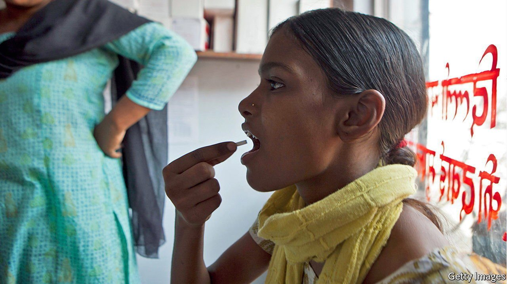

###### Tuberculosis

# Most resistance-causing mutations in TB have now been identified 

##### That will permit personalised treatment of the disease 

 

> Oct 19th 2021 

UNTIL SARS-CoV-2 emerged, the most destructive pathogen on the planet was Mycobacterium tuberculosis, the bug that causes TB. In 2020, according to the latest report from the World Health Organisation, published on October 14th, this organism cut short 1.5m lives—a figure 100,000 higher than the previous year (and the first annual rise since 2005), mainly because of disruptions to health services caused by covid-19. People whose immune systems have been wrecked by HIV are particularly at risk. Some 200,000 of the 680,000 annual AIDS deaths are a result of secondary TB infections.

More than a dozen antibiotics and other drugs are used to treat TB. But strains of M. tuberculosis that are not susceptible to one or more of these have emerged and are spreading at an alarming rate. Nearly 500,000 of the 10m cases of tuberculosis in 2019, for example, were drug-resistant. Good news, however, emerged on October 19th, when the Comprehensive Resistance Prediction for Tuberculosis International Consortium (CRyPTIC, for short), an international collaboration that has been searching for quick ways to diagnose resistant strains, published the fruits of its labours. The result of the consortium’s analysis of more than 15,000 samples from patients in 27 countries is a way of detecting any and every resistance-inducing mutation in a particular bacterium’s genome.


At the moment, determining whether the strain causing a particular case of TB is resistant to a particular drug is tricky. One common approach, now more than 100 years old, involves culturing microbes from a sputum sample in a Petri dish until they are abundant enough to form a visible plaque. A drug or drugs can then be sprinkled on this plaque, to see if the germs stop proliferating. But M. tuberculosis reproduces notoriously slowly in laboratory conditions. It takes two to six weeks to grow enough of it for a test, and up to three further weeks for that test to yield a result. Even then, the result may not be easy to interpret. The answer as to whether the drugs have worked is literally in the eye of the beholder—and different pairs of eyes often behold different answers.

About 15 years ago, however, researchers using new gene-sequencing technology began identifying specific, resistance-conferring mutations in M. tuberculosis’s genome. That led to the employment of a test called the polymerase chain reaction (PCR) to search samples for these mutations. PCR testing requires only a small amount of the bacterium, so it can be completed within hours. PCR tests are therefore now widely used to identify resistance-conferring mutations to rifampicin, one of the most effective anti-TB drugs.

CRyPTIC’s researchers proposed extending PCR testing’s scope by identifying all possible combinations of mutations that confer resistance to any combination of drugs, and also by assessing mutation-related levels of resistance to different doses of a drug. Instead of Petri dishes, participating laboratories used culture plates with 96 wells to grow the bacteria. The wells contained various amounts of 13 tuberculosis drugs. After the drugs had had time to act, the plates were photographed. The images were then entered into a database, for examination.

That part of the process, though, still required human eyeballs. These were supplied by 9,000 crowdsourced “citizen scientists”, with each plate being examined independently by about 15 such volunteers. Comparing the results of these examinations with full-genome sequences of each sample let CRyPTIC’s researchers discover what combinations of gene changes were correlated with which forms of drug resistance.

Decryption

Some of their findings are surprising. It turns out, for example, that a resistance-conferring mutation may co-exist with another that cancels that effect out. But they are confident they have identified almost all combinations of mutations that matter. The resulting catalogue will, they hope, be used to design better PCR tests. And, as rapid whole-genome sequencing becomes increasingly available, it will also identify the combination of drugs most likely to cure a particular patient.

This will enable personalised treatment for tuberculosis. It will also make treatment less gruelling. The current standard is a cocktail of several antibiotics that must be taken for at least six months—a regimen with harsh side-effects. Getting the prescription wrong and having to try another combination of drugs is hard on patients. Many drop out of treatment.

On top of all that, the CRyPTIC approach could serve as a template for investigations of drug resistance in other pathogens. This could help head off the spread of such resistance, which has accompanied the promiscuous and sloppy use of antibiotics around the world. If precise diagnosis can stop this spread in its tracks, CRyPTIC’s results will have implications for public as well as personal health. ■

An early version of this article was published online on October 19th 2021

