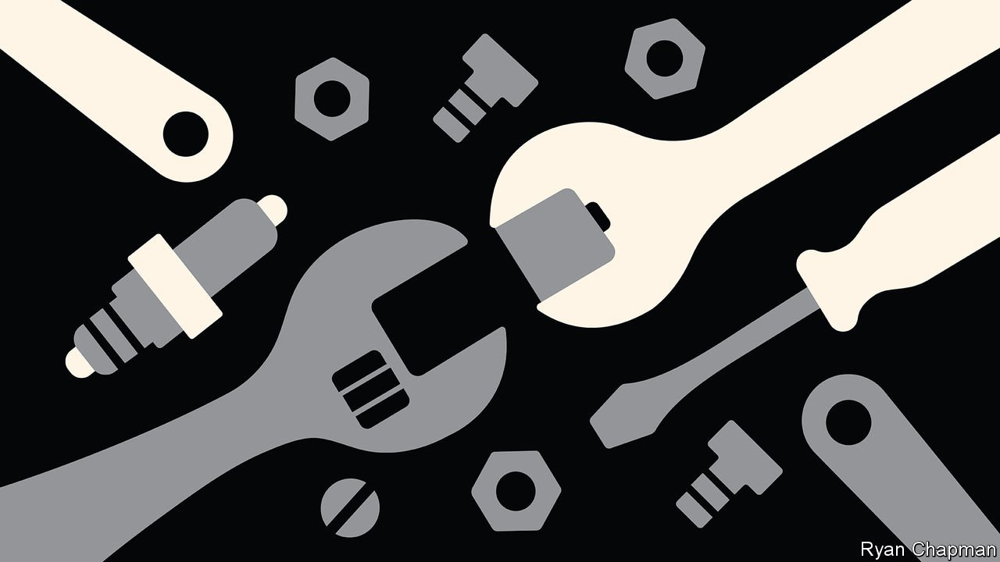

###### Inside the garage of the future

# Servicing and repairing electric cars requires new skills 

##### Many workshops will be out of a job 

 

> Oct 21st 2021 

AS A STRING of high-performance cars thunder round the twists and turns of Hockenheimring F1 circuit, in south-west Germany, a stripped-down vehicle at an adjacent Porsche customer centre offers a peek inside a speedy but far quieter way of getting round the track. Christian Brügger, a product engineer with Porsche, a sports-car maker that is part of the Volkswagen group, points to the edge of a large black box in the centre of the vehicle’s chassis. “This”, he says, “is where the knife goes in.”

The box is a 93kWh battery. The chassis belongs to a 260kph Taycan, Porsche’s first fully electric vehicle (EV). Cables, bright orange in warning, snake across it to a pair of motors and other electronic gubbins. As many a mechanic, professional and amateur, knows, fiddling with the 12V system of a typical internal-combustion engine (ICE) can give you a nasty electrical jolt. But this battery delivers 800V. Though it is fitted with safety systems, that is enough for a knockout punch that could kill you.


The knife Mr Brügger talks of is special. It has a blunt vibrating blade, like those used by doctors to remove plaster casts without damaging the patient. After some 160 bolts have been removed it can be slid under the edge of the battery’s cover to cut away the glue used to seal it tight. This reveals 33 modules containing the lithium-ion cells that constitute most EV batteries. With the cover off, a faulty module can be swapped for a new one.

Assault and battery

The battery is the most costly component in an EV. It typically represents about 30% of the value of the car when new. At present, if something goes wrong with a battery it is usually replaced with a new one because dealers’ service centres do not have the ability to undertake internal repairs. As a replacement battery can cost $20,000 or so for some EVs, that is an expensive proposition. If the car is fairly new and the battery still under its warranty (which usually lasts around eight years), the manufacturer picks up the tab. But as EVs get older and fall in value, many owners may decide to scrap their cars prematurely, rather than fork out such sums.

Some 45% of CO emissions involved in making an EV arise from producing the battery, so it makes sense to repair them and keep the vehicle on the road. Porsche reckons this can be done for about 20% of the cost of fitting a new battery. Most faults are caused by the failure of an individual module or cell. If fixed properly, the company reckons, they can provide many more years of service. Eventually, batteries will give up the ghost. When that happens carmakers aim to recycle them, in order to recover the valuable materials they contain and then use those to make new batteries.

Reparable batteries are good news for EV owners, but for garages they mean investing in specialist equipment, and also training technicians to do the work. Some of this investment is necessary to carry out even routine work on EVs. But as the skills required have more to do with electrical engineering, computing and software than wielding a spanner, there are other industries competing for this talent.

A looming shortage of EV technicians is causing concern in many countries. On October 18th, for example, the Institute of the Motor Industry, which represents Britain’s motor trade, said some 90,000 new automotive technicians will be required to service and repair EVs by 2030. As of last year, just 6.5% of Britain’s mechanics were qualified to do such work. Steve Nash, the institute’s boss, says that with the pace at which EVs are being adopted accelerating, government support is needed to boost training programmes and avoid a big skills gap.

The specialist equipment required, including high-voltage tools, computer diagnostics and safety gear, is expensive. Reportedly, Cadillac, part of General Motors, has told its American dealerships they will need to spend an average of $200,000 on tools and training if they want to stay with the marque as it becomes all-electric. Industry reports say some have thrown in the towel, but others see a chance to expand.

Many garages, especially small operators who look after older cars, may be reluctant to invest such sums. EVs are unlikely to make them as much money as cars with ICEs. Having fewer moving parts to wear out, EVs are more reliable and require less maintenance than ICE vehicles. A typical ICE drive-train (engine, gearbox and transmission) might contain 2,000 moving parts. An EV’s equivalent has 20.

All this could have a big impact on garages’ revenues. McKinsey, a consultancy, thinks EVs may reduce spending on spare parts at American dealerships by as much as 40%. With no oil to change or spark plugs to replace, income from routine servicing will also be lower. Porsche’s Taycan, for one, is reckoned to need 30% less maintenance than if it was an ICE vehicle. And fewer items on the service sheet will require a trip to the dealership at all, as an increasing number of fixes are carried out with over-the-air software updates.

Repairing batteries should go some way to compensating for lower service revenues, says Peter Reck, an after-sales manager at Porsche. He says the company is introducing three qualification levels for technicians who work on EVs. Those on the first level can carry out routine maintenance and those on the second can remove batteries, but only technicians trained at the highest level will be able to open them up for repair. In this way, the company thinks, some dealerships, staffed by members of this elite, can serve as regional battery-repair hubs for garages who have only level-one and -two technicians. Porsche also plans to provide a “flying doctor” service of mobile high-voltage technicians who can visit garages if needed.

As vehicle technologies advance, garages will face more changes. As is happening on some aircraft, the increasing number of sensors in vehicles will more closely monitor performance and automatically book them in for preventive maintenance before faults occur. Although fully autonomous vehicles are still some way off (see box), the day may come when EVs drive themselves to a service centre.

Cell-by date

Technological disruption like this does, though, provide an opportunity for new entrants. Elon Musk, after all, was an industry outsider when he set up Tesla, his (for now) Californian carmaker, which launched its first EV, the Roadster, in 2008. Already there are signs that companies from other areas are looking to enter the EV-servicing business.

After buying a Roadster, Pete Gruber started repairing them in 2013. His company, Gruber Motor, based in Phoenix, Arizona, has grown into an independent Tesla service centre. The firm has developed its own tools and test equipment to repair the individual components in the electronics and batteries of Tesla cars. This is possible, says Mr Gruber, because he has also had more than 30 years experience running a company that repairs high-voltage power systems in data centres, meaning the technology was familiar. But Mr Gruber, whose garage has its own R&amp;D lab, has a warning: “This is not the sort of work the average mechanic can transition to.” Grease monkeys, beware. Your days are numbered. ■

An early version of this article was published online on October 20th 2021

