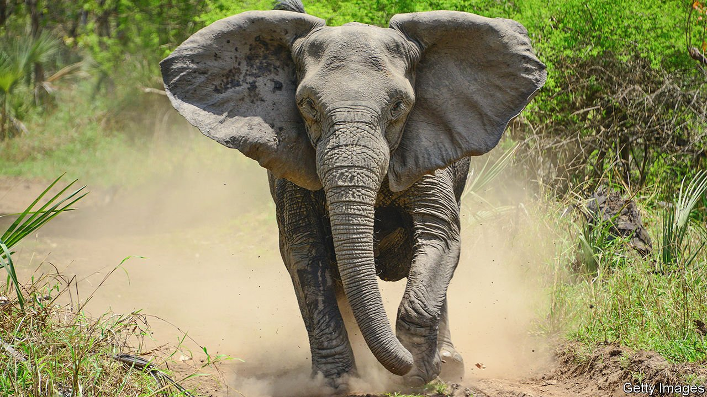

###### Evolution in action

# The Mozambique civil war created tuskless elephants 

##### The genetics of how this happened have just been unravelled 

 

> Oct 23rd 2021 

EVOLUTION ENSURES that animals are well-adapted to their circumstances. Sometimes, as with predators and prey, those circumstances include the behaviour of other creatures. And, as a paper just published in Science describes, that includes the behaviour of human beings, which can force drastic changes on a species in an evolutionary eyeblink.

Shane Campbell-Staton, a biologist at Princeton University, studies how animals adapt to human creations like cities and pollution. His interest was piqued by a film about the tuskless female elephants of Gorongosa National Park, in Mozambique. Their lack of tusks was thought to be a consequence of another human creation—the Mozambican civil war, which lasted from 1977 to 1992 and was partly paid for by the killing of elephants for their ivory. Around 90% of the pachyderms living in Gorongosa are thought to have been killed. Biologists therefore wondered if rising tusklessness might be an adaptation to make elephants less attractive to human hunters.


It was a plausible theory, says Dr Campbell-Staton, but no one had actually tested it. Through a mix of old video footage and surveys, he and his colleagues concluded that around 18% of the female elephants in Gorongosa lacked tusks before the war. Three decades later, after it was over, that number had risen to 50%. Computer simulations suggested that the likelihood of such a rapid change happening by chance, even in a diminished population, was tiny.

Besides confirming the change, the researchers managed to unravel its genetic roots. Tusklessness is caused by a mutation in a gene on the elephantine X chromosome. (As with humans, two X chromosomes make a female, while an X and a Y make a male.) Unfortunately for males, the mutation is a package deal, coming with changes to nearby genes that interfere with embryonic development. Males who inherit the mutant gene die before birth. Females can avoid the lethal side-effects if one of their two X chromosomes contains a non-mutated gene—but they will still grow up without tusks.

Fortunately for the females, the specifics of how the mutant gene is inherited make it impossible for them to inherit two copies. Since mutant males die before being born, those which survive to reproductive age carry only non-mutated versions of the X chromosome, ensuring that their daughters will have at least one copy too.

At the moment, the continual reintroduction of non-mutant X chromosomes from males puts a limit on how far tusklessness can spread through the female population. But, given time and genetic recombination, says Dr Campbell-Staton, evolution might disentangle the mutation for tusklessness from the maladaptive mutations in its neighbouring genes, opening the door for males to shed their tusks, too. There are occasional rumours, he says, of tuskless male elephants in the wild, but—so far at least—no firm evidence.

Finding one now seems unlikely. With the war over, the evolutionary pressure from poaching has eased. Tusks have gone back to being useful tools, helping their owners strip bark from trees and dig for water. In recent years the prevalence of tuskless females has fallen, to around 33%. But the speed of the change is a reminder that wars can alter evolutionary history as well as the human sort. ■

