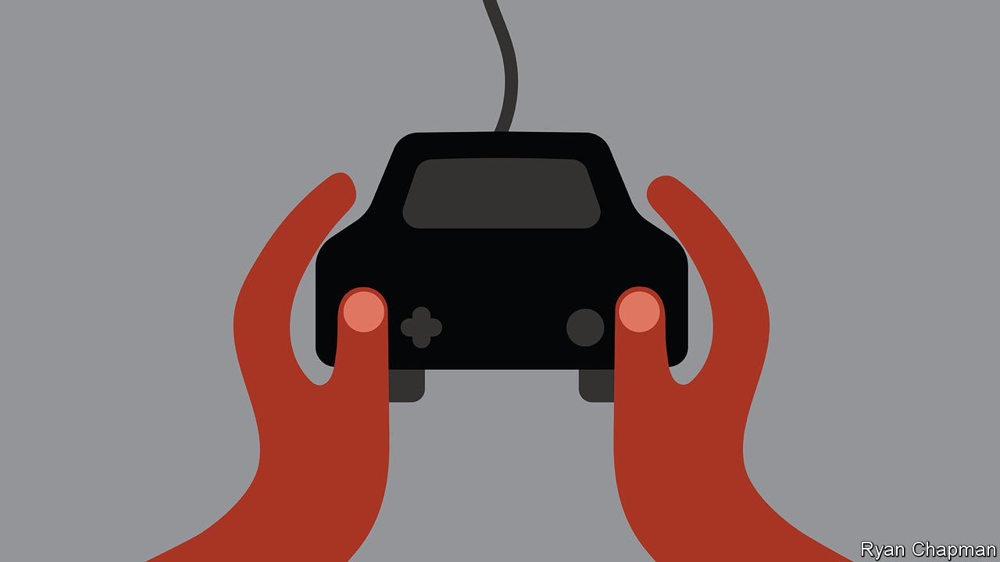

###### Hands off the wheel

# The hard job of teaching autonomous cars to drive 

##### Computer games help 

 

> Oct 20th 2021 

WHEN DRIVING, Clara-Marina Martinez makes a note of any unusual behaviour she sees on the road. She then feeds these into machine-learning algorithms, a form of AI, which she is helping develop for Porsche Engineering, a division of the eponymous German sports-car company.

Those algorithms are intended to produce a system reliable enough for a car to drive itself. Such a fully autonomous car, known in the industry as Level 5, should be able to complete an entire journey without any intervention from the driver, and cope with all situations on the road. But this is proving hard to achieve, and many attempts to do so are being scaled back. Last year, for instance, Uber, a ride-hailing service, sold off its unit developing self-driving cars.


Autonomous vehicles are touted as being not just convenient but potentially safer. However, just as people take time to learn how to drive safely, so do machines. And machines are not as quick on the uptake. The RAND Corporation, an American think-tank, calculates that to develop a system 20% safer than a human driver, a fleet of 100 self-driving cars would have to operate 24 hours a day, 365 days a year, and cover 14bn kilometres. At average road speeds, that would take about 400 years.

Carmakers such as Porsche therefore accelerate the development process using simulators. These teach software about hazards only rarely encountered in reality. Dr Martinez and her colleagues employ “game engines”, the programs that generate photorealistic images in computer games, to do this. These are used to create virtual worlds through which the software can drive.

Objects in these virtual worlds are assigned their physical characteristics (ie, buildings are hard, people are soft) so that the sensors in vehicles, such as cameras, radar, lidar (a form of radar that uses light) and ultrasound transceivers respond in the appropriate way. Once the software has been trained, it is tested in real autonomous vehicles by re-creating those situations on a test track.

How quickly, if ever, all this will translate into reality remains to be seen. Both regulators and customers will need to overcome scepticism that a software driver really can be safer than a wetware one. From Porsche’s point of view, though, there is one other pertinent question. Given that much of the reason for owning a sports car is for owners to show off what they perceive to be their driving skills, just how big a market will there be for a version where software takes those bragging rights away?

An early version of this article was published online on October 20th 2021

