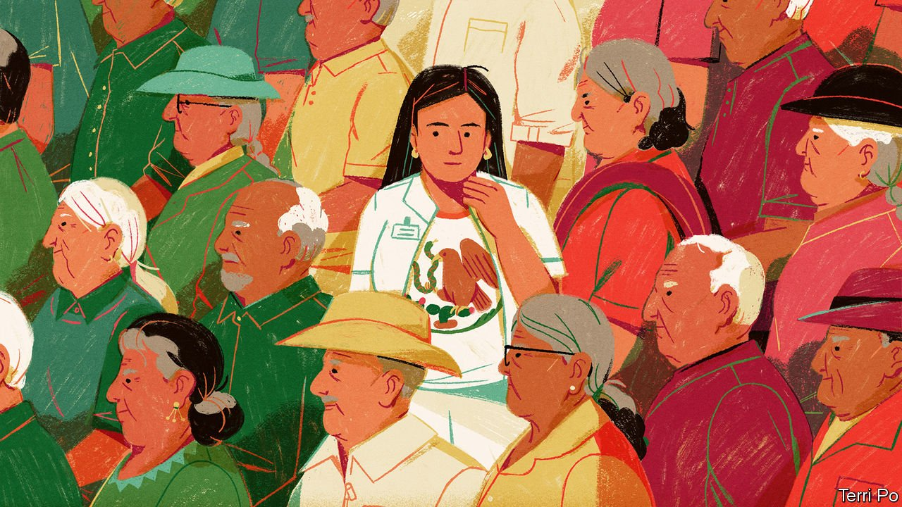
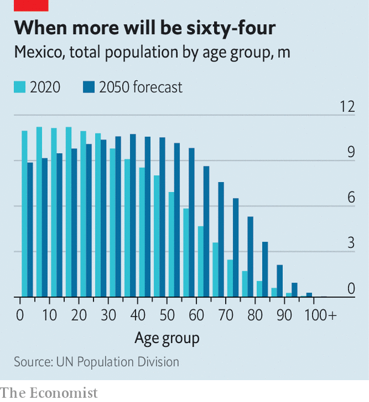

###### Not ageing gracefully

# As Mexico ages, public services are not keeping up 

##### Ill health is widespread; care homes are rare 

 

> Oct 23rd 2021 

IN A SUNLIT room in Mexico City a group of old people sit round a whiteboard. Some are asleep; others are playing a game. They shout out words, starting with the syllable that the previous one ends with: “Taco!” “Comal!” A bubbly young worker leads them along.

It is a rare sight in Mexico, where facilities for old people are sparse. Emma Tapia founded the home, Casa Alicia, in 2017. It has space for 20 female residents; the day centre is open to men as well. “Demand is growing very quickly,” she says.


Mexico is ageing fast. The proportion of its people who are under 20 peaked in 2010. The birth rate has been falling. In 1960 the average Mexican woman could expect to have seven children; now the figure is two. Life expectancy has soared from 57 to 75 over the same period, putting Mexico on a par with China or Lithuania. Today 12% of Mexicans are over 60, up from 9% in 2010; by 2050 they will be around a quarter of the population. “Mexico’s population pyramid is no longer so clearly a pyramid,” says Baruch Sanginés, a demographer. Covid-19, which according to The Economist’s calculations has resulted in over half a million excess deaths in Mexico, may have slowed down this trend, but only slightly.

Most countries that are grey are also rich, and so can afford good public services for the elderly. For not-yet-rich countries like Mexico, rapid ageing presents trickier problems. Mexican policy-makers are starting to take note of the situation and grapple with it, but too slowly, says Luis Miguel Gutiérrez Robledo of the National Institute of Geriatrics, a government research body.

Mexico’s old people, unfortunately, are not in good shape. Nearly a third of those over the age of 50 are obese, compared with one-fifth in 1995, according to the national statistical agency. Not surprisingly, diabetes and heart disease are widespread. As people live longer, dementia is becoming more common, too.

On top of this, Mexico’s public health-care system is fragmented. A survey from 2018 found that 12% of old people lacked access to any medical service, whether in private or public clinics. There are 700 geriatric specialists in the country, serving a population of 126m. In the United States there are ten times as many (for a population nearly three times the size).

 


For many Mexicans care homes have “negative connotations”, says Ms Tapia. As in many other Latin countries, most think the elderly should be cared for at home, surrounded by their relatives and loved ones. But this creates a burden that many middle-aged Mexicans find hard to shoulder. More women work outside the home, so have less time and perhaps less inclination to take on the traditional role of caregiver. In 1990 34% of women were in the workforce; 46% are now.

In a sunny patio filled with cactuses, Ramón Jordan explains that his mother, 100-year-old Amalia Rocha Hernández, moved in with him after being passed between his siblings, each of whom grew tired of looking after her. Mr Jordan is 66. “Híjole, he’s old too!” says Ms Rocha, looking up from her sewing. Mr Jordan says his mother is no burden, but then lists a litany of difficulties he faces, from her wanting to talk too much to her knocking on his door at night.

Help is hard to come by. There is no comprehensive public system of carers and private ones cost a lot. Mr Jordan relies on his son and daughter-in-law to help. The National Institute of Geriatrics reckons there are only 1,490 care homes, offering 40,000 places, in the whole of Mexico. Almost all are private and costly. Casa Alicia charges 16,000 pesos ($793) a month for residents, and 9,500 pesos for those who use the day centre.

Will you still feed me

An estimated 38% of old people are poor, by an official measure that includes not only income but access to services. No universal social-security system exists in Mexico. Since most jobs are informal, less than half of Mexicans have a pension. Pedro Vásquez Colmenares, the author of a book on the subject, describes the lack of universal pensions as the country’s “biggest failure since the Mexican Revolution”.

President Andrés Manuel López Obrador has increased cash handouts to the elderly. But even if these bungs outlast his time in office (he is stepping down in 2024), it is not clear that they are sustainable, as the number of old people grows.

A few states are trying to provide more care. In Veracruz, which is ageing faster than all but two of Mexico’s 32 states, the local health authority runs three public homes that look after 120 people. And some private firms are stepping in, too, by hiring the elderly, whom they praise as enthusiastic and diligent. Walmart, an American supermarket chain with branches in Mexico, hires over-60s to bag groceries. When Walmart said it would end the practice in the pandemic, the elderly packers protested. They are now back at the checkouts, doubled-masked.■

