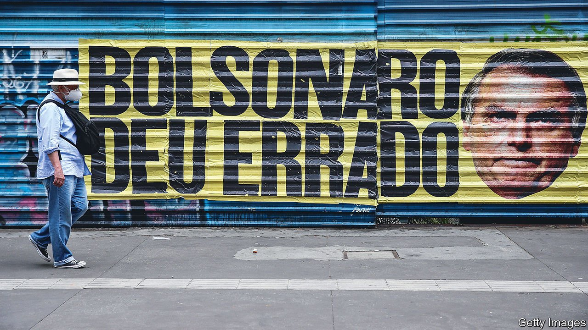

###### President anti-vaxxer

# Jair Bolsonaro is accused of crimes against humanity in Brazil 

##### It will harm the reputation of the beleaguered president further 

 

> Oct 21st 2021 

FEW BRAZILIANS had high hopes for a Senate inquiry into the country’s disastrous handling of covid-19. But its thousand-page report, leaked this week, is far more damning than expected. President Jair Bolsonaro should be tried for “crimes against humanity”, its authors say. His “macabre” approach to the pandemic, including organising large gatherings of his supporters and disparaging scientists, constitutes a “crime against public health”. Some 65 others are also implicated and could face criminal proceedings.

“The president has committed several crimes and will pay for them all,” said Omar Aziz, one of the senators behind the investigation. But the payment may be some way off. On October 19th the head of the inquiry announced that it would be dropping the most incendiary accusations, of homicide and genocide against indigenous groups.


The president is likely to escape legal consequences for the other claims, too. The report looks at two kinds of misdeed: “ordinary crimes”, which can be prosecuted in the courts, and “crimes of responsibility”, for which the president might be impeached. To try the president in court requires the approval of the attorney-general, an ally. An impeachment needs the nod of the head of the lower house of Congress, who is also close to the president.

Even so, the inquiry will hurt Mr Bolsonaro. Since it started in April, the president’s approval rating has fallen from 33% to 22%, according to Datafolha, a polling firm. During the six months the proceedings were broadcast live, half a million viewers regularly tuned in.

Having lost support from the middle classes, Mr Bolsonaro had hoped to shore up his base with poorer Brazilians, who benefited from emergency aid during the pandemic. But fully 14% of Brazilians are unemployed, the central bank is increasing interest rates and rising prices, up more than 10% over the past year, are eating into wages. Energy rationing, which the government may soon have to introduce as a result of the global energy crisis, would further erode his popularity.

Mr Bolsonaro’s attempt to boost support by increasing social welfare—a common tactic for Brazilian presidents seeking re-election—is not without problems. On October 19th, the announcement of the “Auxílio Brasil” cash-transfer programme, which replaces and doubles an existing welfare programme, was suspended after the proposals spooked investors and Ibovespa, Brazil’s main stockmarket index, fell by 3%. The proposal had split the government; Paulo Guedes, the economy minister, is against it. Yet the following day Mr Bolsonaro confirmed that the monthly benefits of 400 reais ($71) to Brazil’s poorest would go ahead—without, he claimed, violating spending limits.

Mr Bolsonaro may pride himself on his Teflon qualities. He has remained in power despite his abysmal handling of covid-19 which, according to The Economist’s calculations, has resulted in 680,000 excess deaths in Brazil. But this week’s news might dent even the toughest of egos. Mr Bolsonaro and members of his family are already being investigated for spreading fake news and corruption, all of which they deny. Even if the latest accusations do not stick, next year Mr Bolsonaro may be fighting both an election and jailtime. ■

Dig deeper

All our stories relating to the pandemic can be found on our . You can also find trackers showing ,  and the virus’s spread across .

