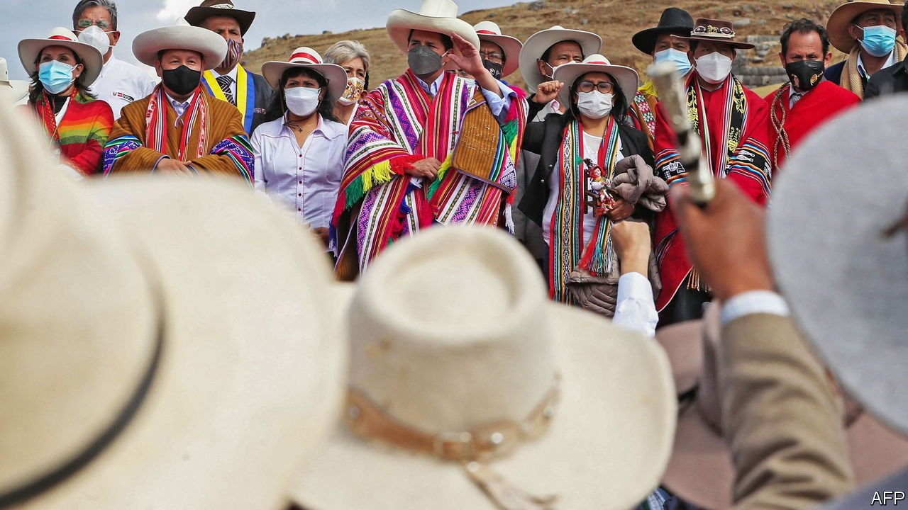

###### Jobs for the comrades

# Pedro Castillo, Peru’s new president, tries to seem less left-wing 

##### Investors are not entirely convinced 

 

> Oct 23rd 2021 

WHEN HE TOOK office as Peru’s president on July 28th, the bicentenary of the country’s independence, Pedro Castillo declared that he would not govern from the presidential palace. Built on the site of the house of Francisco Pizarro, the Spanish conquistador, the palace is a “colonial symbol”, he said, which he would turn into a museum. Three months later President Castillo is quietly living and working there after all. It is a sign that whatever Peru’s hard-left president might like, the country is not in the throes of revolution.

Rather Mr Castillo’s presidency has been defined so far by his political inexperience and indecision, the extremism and infighting of his allies and his weak mandate. A rural schoolteacher, farmer and union activist from a small town in the Andes who had never before held political office, his victory by just 44,000 votes out of 17.5m was a surprise. For his supporters he represents both the Peru that has not shared fully in the country’s economic growth and a provincial rebellion against Lima, the capital. He won because politics has fragmented, because the pandemic exposed injustice and neglect and because many Peruvians could not bring themselves to vote for his opponent, Keiko Fujimori, a conservative whose father ruled the country as a corrupt autocrat in the 1990s.


Mr Castillo wasted his first nine weeks in office, appointing a dysfunctional cabinet of the far left that many Peruvians saw as an affront. His own political base is of radical teachers, many close to the former Maoist terrorists of the Shining Path. Police records suggested that the labour minister may have taken part in terrorist attacks. Vladimir Cerrón, the boss of Perú Libre (Free Peru), the party under whose banner Mr Castillo ran, is a Cuban-trained Leninist doctor. Mr Cerrón tried to co-govern through Guido Bellido, his nominee as Mr Castillo’s first prime minister, an agitator who publicly countermanded any sign of moderation from the president. Mr Cerrón and Mr Castillo both want a constituent assembly, the device through which other leftist Latin American presidents have imposed authoritarian regimes.

With the government destabilising itself, the currency depreciated daily, pushing up inflation (to 5.2% over the past year). The opposition-controlled Congress began to murmur of impeachment. In early October Mr Castillo “decided to take some decisions in favour of governability”, as he put it.

For a start, he replaced Mr Bellido with Mirtha Vásquez, a human-rights lawyer and former speaker of Congress. Although she has leftist convictions, she is seen as realistic and consensual. Of a constituent assembly, she said the government “is not going to propose this for tomorrow” and that its priorities were vaccination, reopening schools and economic recovery. At the same time Mr Castillo reappointed Julio Velarde, the respected central-bank president, for a fourth five-year term. That calmed the currency market. “We are left-wing, but we are not going to do crazy things,” insists Pedro Francke, the economy minister.

The new cabinet is only a marginal improvement. The interior minister is a former policeman with a string of (unfair, he says) disciplinary reprimands. As a lawyer he has represented arms traffickers as well as Mr Cerrón (who was convicted of corruption). Only four or five ministers have a reputation for competence. But at least Mr Castillo has bought some time.

Can he use it to achieve change that benefits poorer Peruvians? The government wants to expand tax revenues from 15% of GDP to 17%, to spend more on health care, education and family farming. Mr Francke sees scope to raise taxes on mining companies, which are enjoying high prices, and to crack down on evasion. He has asked the World Bank and the IMF to advise on tax reform “so that it’s not anti-competitive”. Whereas Mr Bellido had threatened to nationalise the Camisea natural-gas field, Ms Vásquez’s team is studying ways to build pipelines so that more Peruvians can benefit from it.

Brothers in arms, and government

Mr Castillo faces two big problems. He mistrusts “technocracy, the market, business people and Lima”, says an official who has dealt with him. He shuns the media, preferring rallies with his base in the interior. That mistrust is reciprocated. Many in private business are alarmed, especially by the threat of a constituent assembly. While output has already recovered from last year’s slump (though employment has not), lack of confidence means that Peru will be lucky if its economy grows by 3% next year. Lima’s once-booming property market is dead. Capital and business people are leaving the country.

The second problem is that the government’s diagnosis of Peru’s difficulties is mistaken. It is not the market economy that has failed but an inefficient state. Tax collection is low because 70% of Peruvians work informally. In many ministries, Mr Castillo’s team are placing supporters in senior posts for which they are unqualified. That has happened in the social-development ministry, which has a big role to play in ensuring that the 3m Peruvians who fell into poverty last year get out of it. The new education minister is a friend of Mr Castillo, and a former teacher, who wants to repeal a successful reform that requires teachers to be subjected to evaluation and paid according to performance.

Mr Castillo and his supporters reject the idea of ending up like Ollanta Humala, a former president who campaigned as a radical leftist but presided over a mildly social democratic government. Yet that may be the only way for Mr Castillo to survive for five years. “The country is so complicated, there’s no space for their more radical proposals,” says Miguel Castilla, who was Mr Humala’s economy minister. It looks likely to become even more complex.■

