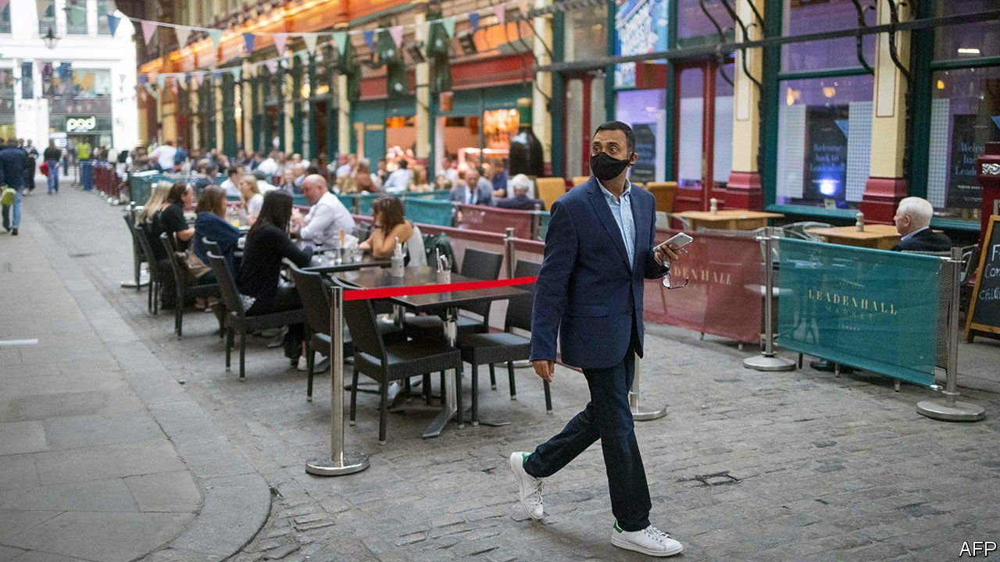

###### The world this week

# Business 

#####  

 

> Oct 23rd 2021 

Britain’s annual rate of  inflation dipped slightly to 3.1% in September, pulled down by a fall in restaurant prices. As in other countries, inflation is expected to remain high because of the dual crunch in energy markets and supply chains. Speaking before the release of the data, Andrew Bailey, the governor of the , said that action might be needed to tame inflationary pressures. Some saw this as a sign that the central bank will raise interest rates before Christmas, though Mr Bailey suggested he is more concerned about taming prices over the medium term.

 announced that he would step down as president of Germany’s Bundesbank, a position he has held since 2011. As a leading hawk on the European Central Bank’s council, Mr Weidmann was a vocal critic of quantitative easing, saying in 2019 that the ECB had overreacted to the euro zone’s slowdown. In remarks this week he warned central bankers “not to lose sight of prospective inflationary dangers”.


Demand for supply

European  again, after a closely watched auction of pipeline capacity suggested that Russia will not increase its supply in the coming weeks. Russia provided 43% of the European Union’s gas imports last year. The Kremlin denies it is withholding supplies as a way of pressing Germany to certify Russia’s recently completed Nord Stream 2 pipeline. In Germany a senior Green politician accused Russia of blackmail and said the pipeline should not get a permit.

Tesla reported quarterly records for both revenue ($13.8bn) and net profit ($1.6bn). The electric-carmaker delivered its most vehicles ever in the quarter, overcoming a shortage of chips that has put a dent in the sales figures of other car companies.

America’s first bitcoin-linked exchange-traded fund listed in New York. Investments are made in , not the cryptocurrency itself. The price of a bitcoin reached a new high, rising above $67,000 for the first time.

 


Hit by , which powers two-thirds of its electricity generation, China’s gdp grew by just 4.9% in the third quarter, year on year. Amid rolling blackouts, industrial production expanded by only 3.1% in September. A spate of covid-19 outbreaks, leading to severe localised lockdowns, has also knocked the economy.

Another factor dragging on Chinese GDP is the fallout from financial troubles at , a big property developer. As Evergrande approached a deadline to settle payments, Sinic, another developer, defaulted on a bond. China’s economic data revealed that output in the property sector has shrunk.

The IMF is looking for a new chief economist. Gita Gopinath is leaving the job in January and returning to her academic position at Harvard.

Y viva España

Jack Ma reportedly made his first trip abroad—a holiday in Spain—since his run-in with regulators in China a year ago and subsequent government campaign against big tech. The share price of Alibaba, the e-commerce giant founded by Mr Ma, jumped in response to the news that he had been let out of the country. The company also unveiled a new chip to increase its cloud-computing capabilities.

Another 4.4m subscribers signed up to Netflix in the third quarter,taking its total customer base to 214m. North America still accounts for the biggest chunk of revenue at the streaming service, though Europe (and the Middle East) is closing the gap in the number of most users: 70.5m compared with 74m in North America. Netflix’s production schedule was disrupted by covid-19 but is now back on track and it is releasing oodles of new content in the coming months. It is also acquiring the rights to Roald Dahl’s stories.

More than two years after its disastrous attempt to go public through an IPO was dropped when its valuation failed to live up to the hype, WeWork was set to debut on the stockmarket through a merger with a special-purpose acquisition company. The provider of office space is no longer offering free beer, but is still making heavy losses.

Italia Trasporto Aereo made its maiden flight as Italy’s state-owned airline. A slimmer version of Alitalia, which has now stopped operating, ITA has the same colours as its predecessor and is wholly owned by the government.

 was reportedly preparing to change its name to capture its role across the “metaverse”, which it has described as “a new phase of interconnected virtual experiences”. Back in the physical universe, the company reached a settlement with the American government over claims that it unlawfully reserved jobs for immigrants and refused to consider American workers for some positions.

