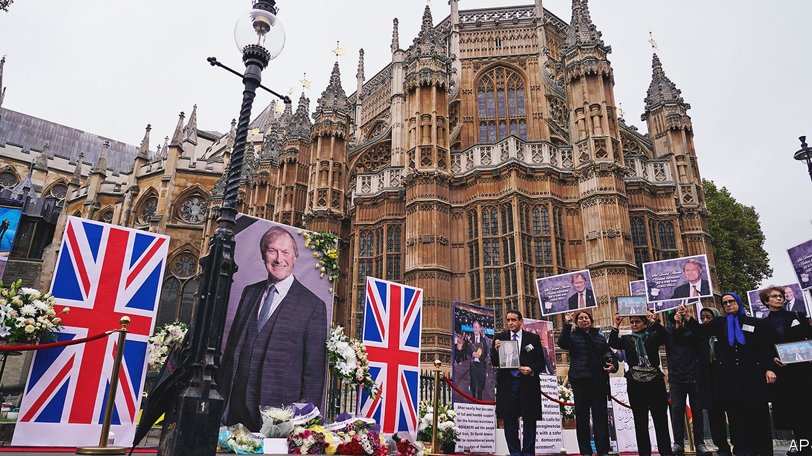

###### The world this week

# Politics 

#####  

 

> Oct 23rd 2021 

Police investigating the murder of a Conservative MP in Britain were treating the incident as an act of terrorism. , who represented the town of Southend, to the east of London, was stabbed to death while holding one of his weekly consultations with constituents. The suspect is a 25-year-old man born in Britain to a Somali family. He had reportedly once been referred to a programme that tries to turn youngsters away from radicalisation.

Time for Plan B?


Health-service leaders in Britain called for the immediate reimposition of pandemic measures, such as masks in public places and work-from-home orders. Deaths from covid-19 are at their highest level sinceMarch, though still less than 10% of the peak in January. The government said infections could reach 100,000 a day over the winter, but it was not planning to reintroduce restrictions. The British Medical Association described that as “wilfully negligent”.

In Russia Vladimir Putin backed a plan to keep workers at home for a week to curb a tide of covid-19 infections. It will be the closest Russia has come to a lockdown.

The European Parliament awarded its annual Sakharov prize to Alexei Navalny, Russia’s leading opposition figure, who has been imprisoned after surviving an assassination attempt by Russian agents.

Ursula von der Leyen vowed that  after its constitutional court, acting on a legal request from the prime minister, ruled that parts of the EU treaties are not compatible with Polish law. The commission president’s threat is directed against Polish access to some €57bn ($66bn) in funds for recovery from the pandemic.

A primary involving members of six opposition parties in  chose Peter Marki-Zay, the mayor of a small town, as their joint candidate to take on Viktor Orban, the prime minister, in elections due next spring. The parties will also field joint candidates for all parliamentary seats.

A panel of senators in Brazil recommended in a draft report that , the president, be charged with crimes against humanity, among other things, for playing down the covid-19 virus and failing to tackle it. Mr Bolsonaro, who has told Brazilians to “stop whining” about the disease, is unlikely to stand trial. More than 600,000 of his countrymen have died.

Thousands of people protested in El Salvador against President Nayib Bukele. Salvadoreans are angry about the introduction of bitcoin as legal tender and decisions that have eroded democracy, such as the dismissal of judges. Responding to the protests, Mr Bukele changed his Twitter profile to “Emperor of El Salvador”.

A group of 17 American and Canadian missionaries, including children, were abducted by a gang in Haiti. The Caribbean country already had one of the highest kidnapping rates in the world, but the security situation has deteriorated since the assassination in July of the then president, Jovenel Moïse. Emboldened gangs are vying for territory.

Seven people were killed and dozens injured in Lebanon when gunfire broke out at a protest against . The rally was organised by the country’s two main Shia parties, Hizbullah and Amal, which are unhappy with the probe. They blamed the violence on a Christian faction, which denied involvement.

A bomb attack on an army bus in Damascus killed 14 people, according to Syrian state media. Though the country is still fighting a decade-old civil war, attacks in the capital have become rare. No group claimed responsibility, but the army responded by shelling the opposition-held Idlib region, reportedly killing ten people.

The Democratic Republic of Congo accused Rwandan troops of crossing its border and invading several villages, leading to clashes with Congolese soldiers. Rwanda said its men were only chasing smugglers and that it wished to maintain friendly relations.

Ethiopia bombed Mekelle, the main city in the breakaway province of Tigray, in an escalation of the year-long civil war. Abiy Ahmed, Ethiopia’s prime minister, also threatened to stop all food aid coming into the country. That would further hamper efforts to avert famine in Tigray, which is under a blockade.

Deleting its profile

Microsoft said it would shut down its local version in China of LinkedIn, a professional networking site. A LinkedIn executive wrote that the service was facing a “significantly more challenging operating environment” there.

China denied reports that it had tested a  in August. It was subsequently reported that there had been two tests, the first in July.


North Korea confirmed that it had tested a new submarine-launched ballistic missile, which it is prohibited from doing by the UN. The missile landed in the Sea of Japan. The launch comes against a backdrop of increasing missile tests by both North and South Korea in recent weeks, causing concern about an accelerating arms race.

Floods and landslides killed more than 150 people in India and Nepal after heavy rain that lasted several days. The subcontinent’s monsoon generally recedes by October, but changing weather patterns have made it more unpredictable.

India has now dispensed 1bn covid-19 vaccines. More than 60% of the population has received one jab, and around a quarter have had two doses.

America’s Justice Department asked the federal Supreme Court to suspend a law in Texas that in effect bans  abortion, arguing that it contravenes decades of constitutional precedent. The law has been crafted in such a way as to allow private citizens to sue anyone who assists in an abortion. Its backers say that is legally a deterrent, and not a ban.

