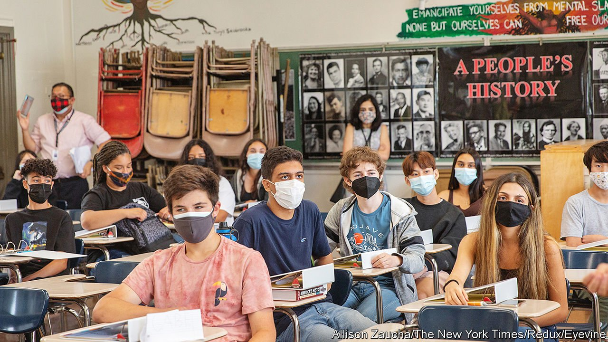

###### Race and class

# Ethnic-studies lessons benefit low-achieving non-white pupils 

##### That might not be enough to convince naysayers of the course’s value 

 

> Oct 23rd 2021 

SOME CONSERVATIVES have been on a mission to remove critical race theory from classrooms. Described by these advocates as any coursework discussing topics through the lens of racial identities (which is well beyond the original definition used by the critical theorists themselves), they argue that this approach to pedagogy is divisive. Eight states have passed laws banning these discussions in classrooms. Six have proposed similar legislation, or plan to. Some teachers claim they now fear discussing race with their pupils. But there is a trade-off here: according to a study published in the Proceedings of the National Academy of Sciences, removing discussions about race from the classroom could disadvantage some low-achieving pupils.

The study shows that San Francisco’s ethnic-studies curriculum, a programme for ninth-graders (who are about 14 years old) that is designed to focus on the history of disadvantaged communities and encourages a focus on social issues, had benefits beyond merely what was learned in the classroom. Sade Bonilla of the University of Massachusetts, Amherst and her colleagues show that the programme increased high-school attendance by 6-7 percentage points, course credits earned by up to 15 points (equivalent to about 3 courses) and high-school graduation by 16-19 percentage points.


The researchers were able to study the effect of the programme on low-achieving pupils by comparing children required to enroll (because of earning a grade-point average below 2.0 the previous year) with those slightly at or above the 2.0 grade point average who were not required to enroll. The study follows an article published in 2017 (by two authors of this current study) showing that the same programme improved shorter-term outcomes too: ninth-grade attendance, grade-point average and credits earned all improved.

San Francisco’s school district began its ethnic-studies pilot programme in the 2010-11 school year, with faculty members from San Francisco State University. The majority of pupils in the study (1,405 in total) were non-white: 60% were Asian, 23% Hispanic, 6% black and 5% white. Because of the small sample of black and white pupils, the researchers were unable to draw conclusions about those groups.

The curriculum focused on a variety of topics: race as a social construct, the history of eugenics, federal housing discrimination, and others. It also taught pupils about practices to counter racism and oppression: marching, voting, campaigning. Pupils were encouraged to think of ways to counter racism in their own communities.

The results are encouraging. Improving high school graduation is not a trivial matter. Pupils who graduate from high school enjoy higher wages, greater wealth accumulation and better health outcomes. But these positive results probably will not sway everyone. The programme improved outcomes for low-achieving Asian and Hispanic pupils, but the study was unable to measure an effect on other pupils: higher-achieving or white pupils, for example.

California has decided to require the course for graduation for all, starting in 2030. But there are risks with scaling up pilot programmes, and not just because the curriculum has not yet proved to be effective for all. There are also concerns about quality. San Francisco’s programme was taught by teachers who chose to offer the curriculum and had extensive training. Educators begrudgingly teaching the programme with lesser training would probably not have the same effect.

Yet the programme in San Francisco was clearly successful at motivating low-achievers who were otherwise uninterested in their schooling, explains Ms Bonilla. These at-risk pupils began engaging more deeply with their schoolwork and may have even attended college at higher rates. “The course seems to really engage them and make them lean into school,” she explains. “And not just in their ethnic-studies class, but in science, math[s] and everywhere.” Unfortunately for low-achieving pupils in the eight states now banning critical race theory, such teaching may not be allowed in their schools. ■

