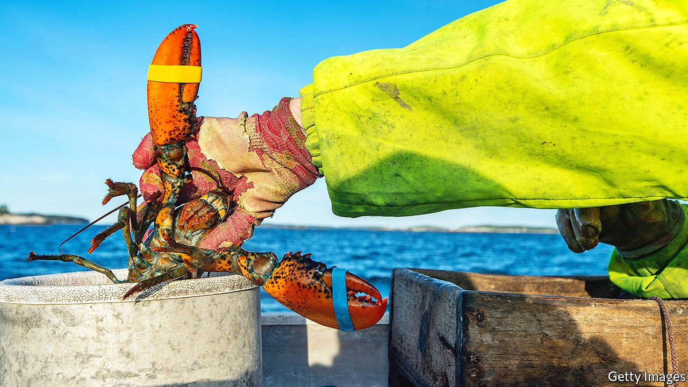

###### Considering the lobster

# Maine relies on its marine life, but climate change will alter what that means 

##### Dogfish rolls, anyone? 

 

> Oct 23rd 2021 

STEVE TRAIN used to finish work by 1pm. In those days, Mr Train—who has worked as a lobsterman in Maine for more than 30 years—didn’t have to travel far to find the critters. Now he sometimes wraps up closer to 4pm. Some lobsters are still close to shore, but rising temperatures have pushed many of them into deeper, cooler waters that take longer to reach. Where Mr Train will find the creatures has turned into something of a guessing game. “More of us are hunting all the time,” he says, as he sips a mezcal margarita from Luke’s Lobster, a waterfront restaurant in Portland’s historic Old Port. This is where he docks his boat, sells his catch and, three or four days a week, stops in for lunch (often a lobster BLT, lobster roll or fried haddock bites). Lobstering is more than a job, he says. “It’s a culture.”

Warming waters have done more than change lobstermen’s schedules—they have disrupted entire ecosystems, the Gulf of Maine among them. The Gulf of Maine’s waters have warmed faster than 99% of the world’s oceans over the past 30 years. Experts attribute some of that to changing currents. The effects of the Gulf Stream from the south have grown stronger and have begun to constrict the flow of the Labrador current, which delivers cold water from the North Atlantic to the Gulf of Maine. “The magnitude of change is really going to be dependent on how much water temperatures change,” says Kathy Mills, a research scientist at the Gulf of Maine Research Institute. So far, the heat has altered the patterns of the state’s two most profitable species, lobsters and soft-shell clams, with some experts and industry folk worried about the potential for further population declines. Maine’s overall commercial landings brought in more than $500m last year, but maintaining those profits will require flexibility—at the least, it means acknowledging the gulf may look vastly different in years to come.


Maine produces more fish and shellfish than any other state on the east coast, and much of that is due to its hearty crop of lobsters. The state’s harvest increased sixfold, from about 22m lb in 1988 to close to 132m by 2016. Since that peak, lobster landings have fallen by more than a quarter. “We could see an upswing again,” says Bob Steneck, a marine scientist at the University of Maine. “But by the time you get this many years into a decline, it’s concerning.”

 


Mr Steneck says researchers are not sure why Maine’s landings have dipped, and most experts say the population is—and will probably continue to be—robust, even if it continues to fall from its recent peaks. But given what happened in southern New England, some industry men are wary. Rhode Island and Connecticut saw their lobster catches plummet over the past decades. There, the creatures did not reproduce well in the warmer waters and died en masse from shell disease, which studies have linked to rising temperatures.

Statewide, the soft-shell clam harvest in 2020 was still the second-most valuable—accounting for 3% of the state’s commercial landings—but their numbers have declined, too. Predators like green crabs fare well in the warming climate and have killed off many of the soft-shells. As a result Chris Green, a clammer who lives and works in Brunswick, has increasingly relied on the hard-shells, or ‘quahogs.’ They have done better in warmer waters, and the harvest has grown from 17,265lb in 1964 to over 1.3m lb in 2017. “They’ve carried our town for three years,” Mr Green says, as he digs his hoe into the mud to pull out another quahog. He is wearing a short-sleeved T-shirt to keep cool on an unusually warm October day (“It’s indicative to where we’ve been headed,” he says).

Locals have taken note of the different cast of animals on the shore as well. North Atlantic right-whale sightings have decreased, as the mammal’s primary food source—calanus finmarchicus—has died off in warmer waters. Other creatures take a liking to the heat, such as the squid and black sea bass that have appeared in higher numbers in the gulf. The Portland Lobster Co. used to serve a salad with lightly seasoned local shrimp. Then Maine’s fishery collapsed, and the restaurant stopped. “There’s nothing else that comes close to the Maine shrimp,” says general manager Ethan Morgan, insisting that the state’s product was sweeter and had a “good snap to it”. He still offers shrimp, but only in fried form. “It’s more a vessel for the sauce you’re using,” Mr Morgan admits.

Ecosystems absorb change regularly, and humans can adapt to alterations. Ms Mills recognises that transformation does not mean catastrophe. “We have seen fisheries go through changes in the past,” she says. To diversify his lobstering income, Mr Train farms for kelp and scallops. Mr Green hopes to start clam farming as a supplement to his wild catches and, in part, as a backup if a harsh winter kills off the quahogs he relies on. The Portland Lobster Co. offers dishes with local catches as often as it can. But few people come to Maine for dogfish, and Mr Morgan laments that specials prepared with it haven’t landed well with customers. ■

For more coverage of climate change, register for The Climate Issue, our fortnightly , or visit our 

