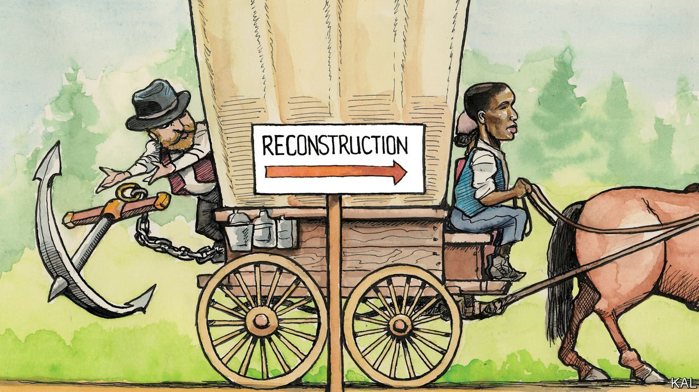

###### Lexington

# Reconstructing America 

##### On the failed promises and quiet successes of America’s most propagandised decade 

 

> Oct 23rd 2021 

PAUL GARDULLO, co-curator of the Smithsonian’s new exhibition on post-bellum Reconstruction, had warned Lexington that it “played with time a bit”. This was an understatement.

The exhibition, which opened this month at the National Museum of African American History &amp; Culture, begins in a war-ravaged plantation house and ends with Georgetown University’s recent announcement of a bursary for the descendants of 272 slaves sold to cover its debts. In between visitors step from a re-enactment of Fredrick Douglass’s chilling 1876 speech to the Republican Party—“When you turned us loose, you gave us no acres, you turned us loose to the sky, to the storm”—to a shrine-like display of a grey sweatshirt punctured by a single fraying bullet-hole. Trayvon Martin was wearing it when he was shot dead running an errand in 2012, leading to the Black Lives Matter movement.


Lexington can be a bit of a fuddy-duddy about museums. But Mr Gardullo’s time-chopping exhibition could not be more apposite. Reconstruction refers to the momentous decade following the civil war, which saw sweeping legal and constitutional reforms and the formation of biracial governments across the former Confederacy. And then vicious white reprisals, leading, after federal troops were withdrawn from the South in 1877, to Jim Crow. Yet as the historian Eric Foner has written, the term also describes the epic process that those great, contradictory changes represented: America’s ongoing effort to manage the legacy of its 200-year-old institution of slavery. “The definition of citizenship and voting rights, the relative powers of the national and state governments, the relationship between political and economic democracy, the proper response to terrorism, racial bias in the criminal-justice system—all of these are Reconstruction questions.”

They have rarely been more pressing. Since Mr Gardullo started work on his exhibition, covid-19 has revealed black Americans’ residual ill health; America has been swept by the biggest race protests since the 1960s (sometimes called the “Second Reconstruction”); and a race-baiting president has tried to win re-election by rallying whites against those protests. Such headlines make it possible to ask whether America has made racial progress at all.

The African-American museum is one sign that it has. First proposed in 1916, it was finally opened on the National Mall by Barack Obama a century later. Since visited by millions, it stands as a symbol of the political and cultural influence African-Americans now wield. It also represents the importance racial-justice campaigners attach to reappraising history. The New York Times’s campaign to recast America’s freedom struggle as a war over slavery indicated the excesses this effort can lead to. Mr Gardullo’s exhibition illustrates how necessary it generally is.

Until relatively recently Reconstruction was considered a corrupt, reckless experiment in democracy that southern whites sensibly put paid to. Emancipated blacks were unready for suffrage; giving it to them was a ruse to mask northern carpet-bagging. The primary purpose of the exhibition, as laid out in its satisfyingly stodgy timeline, is to promulgate the more accurate view that historians now unanimously hold.

Reconstruction was an astonishing liberal experiment, which conjured multi-racial democracy amid the ashes of slavery. Before the civil war, only three African-Americans had held public office of any kind; during Reconstruction over 1,000 were elected, including 16 to Congress. A 54-foot-long petition for equality, signed by 3,740 “coloured citizens of South Carolina” and recently unearthed in a dusty drawer on Capitol Hill, gives a sense of the mass craving behind this revolution. Yet the experiment failed not because its architects went too far, but because they stopped short.

The failure to provide former slaves with means to support themselves—the promised 40 acres and a mule—left them vulnerable to their former owners. Their defenders, northern whites, ultimately allied with the same. This is not what most Americans over the age of 40 learned in school—as Hillary Clinton showed, on the trail in 2016, when she equated Reconstruction with Jim Crow.

The exhibition’s achievement is not only in correcting that gross error. It also adds nuance to the notion that Reconstruction failed. On a political level, this is incontestable; African-Americans’ new rights were ignored. Yet the period also produced enduring social infrastructure, including the black church, public schools in the South and the reunified black family. These were fruits of the 4m freed slaves’ new agency. Thus, most movingly, the mass effort to find scattered relatives. “Mr Editor,” wrote one Lewis Wright of Mississippi. “I wish to inquire for my wife and children. She used to belong to Matison Gunn…he sold her to R.D. Dick Price in 1862, and he sold her and children on Flint Creek, GA.”

Desperately inadequate though this was—a matter of notional rights and inching progress—it was the foundation for the civil-rights struggle. In turn, the accelerated progress that that Second Reconstruction unleashed is what makes the Black Lives Matter movement seem not a throwback, but perhaps a Third Reconstruction. The exhibition’s elision of past and current events points to this history of erratic but undeniable progress. The failure to compensate former slaves locked millions into bonded labour; beneficiaries of the Georgetown University bursary will likely be drawn from the world’s biggest black middle-class. Reconstruction was a time of everyday terror for African-Americans; Trayvon Martin’s killing was an outrage that sparked a movement.

An easier rebuild

Mr Obama viewed race relations through an “arc of history” bending towards justice. The exhibition shows how much more spasmodic than that rainbow-like image their advance has been. But he was right about the direction of travel. America, alas, may require more Reconstructions yet to fulfil its founding promise. At least each would be less improbable than what went before.■

