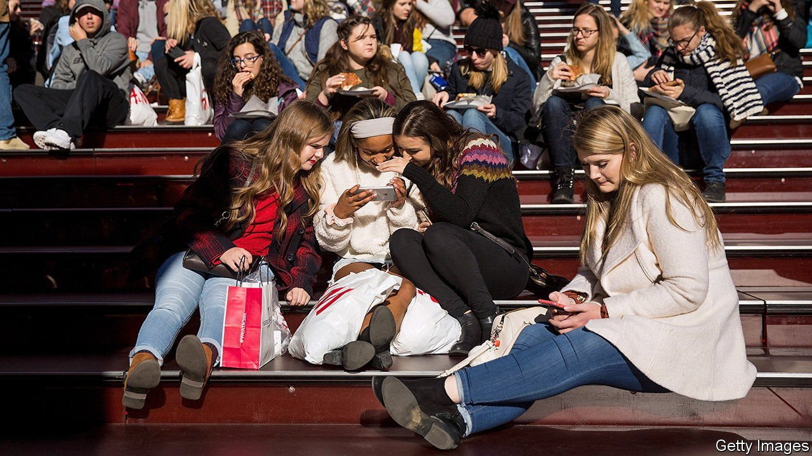

###### Devious licks

# TikTok and toxic memes 

##### Parents worrying about Facebook and Instagram should pay more attention to the video-sharing app 

 

> Oct 21st 2021 

FOR AN INSIGHT into the thoughts of teenagers about social-media, TikTok is the place to look. “Anyone else feel like it’s low key kinda cringe to post on Instagram now?” asks one in a clip uploaded to the video-sharing platform in June. It has been liked over 368,000 times. Facebook, which owns Instagram, is under fire after Frances Haugen, a former employee, leaked internal documents suggesting the firm was aware it was causing harm to the mental health of teenage girls in particular. But the internet’s youngest users have been falling out of love with Facebook’s platforms for a while. American children aged between four and 15 spent an average of 17 minutes per day on Facebook in 2020, down from 18 minutes in 2019, according to a report from Qustodio, a security software company. Instagram stayed at 40 minutes, and Snapchat was up from 37 minutes to 47. Screen time on TikTok, meanwhile, surged, from 44 average daily minutes to 87.

These numbers are a consequence of lockdowns, but are also a testament to TikTok’s engrossing “For You” page (FYP), which is powered by an algorithm that serves users an endless stream of videos they might be interested in. Getting featured on it is often an indicator that a clip will go viral (many videos are tagged #FYP to boost their chances), which is part of the app’s thrill. The platform, owned by Beijing-based ByteDance, has become synonymous with lip-synching teenagers, dances and challenges. And despite interventions from various governments, including the threat of its removal from app stores by former President Donald Trump, TikTok has continued to soar since its launch in 2016: last month it hit 1bn monthly users.


As a newer platform, TikTok also had a chance to learn from the mistakes of its predecessors. It has proposed the creation of a “global coalition” of social platforms to protect users better from harmful content. The FYP makes people internet-famous very quickly—and makes them targets for harassment. To address this, TikTok deleted millions of accounts belonging to users under the age of 13, and limited the use of its more public features from its youngest profiles. It also claims that less than 1% of videos uploaded in the first quarter of 2021 violated its terms of service—and those that did were removed within 24 hours. All this, in theory, ought to mean TikTok is healthier than other social media apps.

The reality is different. Last year the Intercept, a news site, published Chinese moderation documents, revealing a preference to filter out users with “ugly facial looks”, “beer belly” and content that risked “endangering…national honour and interests”. Teenage girls have been targeted with adverts about intermittent fasting. And reports by the Institute for Strategic Dialogue (ISD), a think-tank, have found that videos peddling harmful covid-19 vaccine misinformation and white-supremacist content accumulated millions of views before they were taken down by the company. Some of these exploited TikTok’s features, it says, such as trending songs, to extend their reach. The ISD found the firm’s application of its policies to be “lacking in accuracy, consistency and transparency”.

Ms Haugen’s leaks about Instagram have put a spotlight on the platform’s role in perpetuating negative thoughts about body image among teenage girls. A similar culture flourishes on TikTok, too. There are currently 8.8bn total views on videos tagged #whatIeatinaday, a viral trend where mostly young girls document their food diaries, some of which include under-eating. Learning from Facebook’s mistakes, TikTok announced that it would include safety announcements on these videos and do more to direct users to support resources. Yet the lines between what is a direct consequence of social media and what is symptomatic of wider cultural pressures about body shapes are blurred.

Tumblr, a blogging platform, was polluted with content promoting eating disorders and self-harm over a decade ago, prompting the site to censor accounts that were endorsing harmful behaviour. Internet users are wise to moderators, though. Misspellings of hashtags are used on TikTok to bypass censored words. Last month TikTok censored videos tagged “devious licks”—a viral challenge which saw teenagers vandalising or stealing school property—from its search bar. Yet misspellings of the phrase are still accessible and are even suggested by the platform. Similarly, misspelt eating-disorder tags are easily discoverable and the videos tagged under them have thousands of views. One such post, live for a week at time of writing, promotes eating fewer than 500 calories a day.

Most TikToks are innocuous. But like its predecessors, the app has not yet effectively addressed problems that hide in plain sight. If an under-age user wants to create an account, no community guidelines can stop them from lying about their age. If someone wants to view harmful content, they will seek it out. And the features that make TikTok so successful also make it risky: the more a user engages with certain tags, the more the FYP will serve similar content. Much like Facebook’s platforms, in other words. ■

