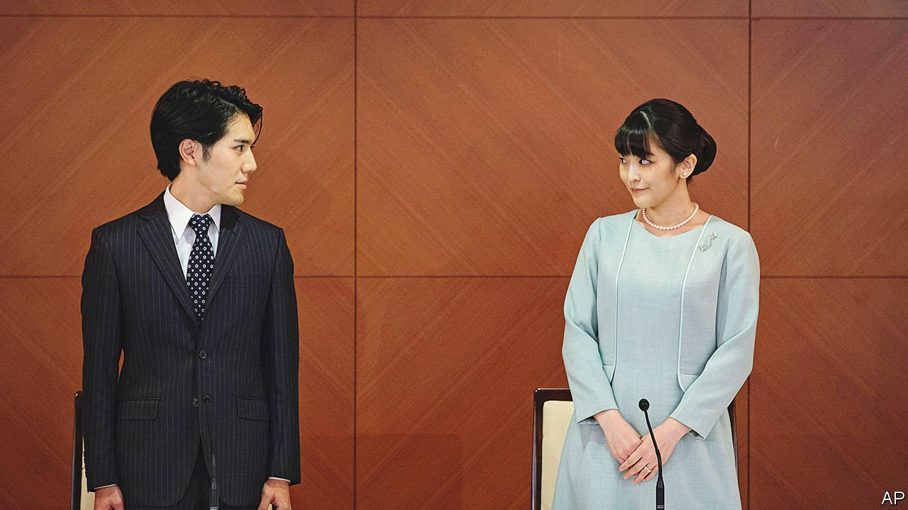

###### The sun, the moon and the ponytail

# A long-delayed royal wedding reveals awkward truths about Japan 

##### Women are still badly treated, politics is out of sync with the people and the monarchy is dwindling 

 

> Oct 27th 2021 

PRINCESS MAKO and Komuro Kei were undergraduates when they first met in Tokyo back in 2012. Mako was drawn to Kei’s “smile that is like the sun”. Kei saw Mako as “the moon watching over me tranquilly”. The couple began dating and kept in touch while Mako studied abroad; in 2017, they got engaged.

The problems began when Japanese tabloids dug into Mr Komuro, and discovered that his mother had reportedly taken a loan of ¥4m ($35,000) from her ex-fiancé that she did not return. Commentators called Mr Komuro, a commoner, a gold-digger. They questioned whether his love for Mako was real. The couple delayed the marriage and Mr Komuro went to study law in America, but the furore did not die down. On his return earlier this year, Japanese media seized upon his ponytail as further evidence of his unsuitability for their beloved princess.


On October 26th the couple married at last, but without the typical formal ceremony and despite a small street protest held the same day. By most measures, the accusations are not scandal-worthy. But they reflect broader anxieties around the challenges confronting a changing Japanese society and institutions that have been slow to catch up.

One challenge is to the royal family itself, which is the world’s oldest surviving hereditary monarchy. It has been slow to adapt to modern media. The Imperial Household Agency is masterful at managing archives and fussing over rituals, but struggles with public relations. It did little to correct misinformation that spread about the couple online.

Another is the harsh treatment of royal women, a magnified version of the sexism that many Japanese women face on a daily basis. Mako was diagnosed with post-traumatic stress disorder during her ordeal. Empress Masako, the wife of the current emperor, Naruhito, has also suffered from stress-related illness amid intense pressure to produce a male heir. Empress Michiko, her predecessor, lost her voice for months in the 1960s and 1990s as a result of stress.

The affair has also brought the family’s tenuous future to the fore. By marrying a commoner, Mako has ceased to be royal (this rule would not apply if she were male). Her departure leaves just 17 royals, and only men can inherit the Chrysanthemum throne. Merely three potential heirs remain. Japan’s ruling Liberal Democratic Party has blocked moves to allow future female monarchs.

The episode highlights how Japan’s politics, especially on social issues, are hostage to a vocal, conservative minority. Recent polls show that most Japanese in fact support the partnership of Mako and Kei. Some 85% favour allowing female succession. A similar dynamic—where the public is far more liberal than legislators—exists around gay marriage and the question of whether to allow couples to keep separate surnames, which Japanese law does not allow.

Like a certain British duo, the Japanese royal couple have decided to make their future outside the stodgy confines of their homeland. Mako and Kei will soon join Harry and Meghan in America.

