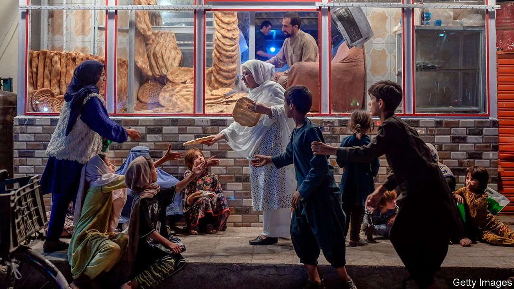

###### The next crisis

# Afghanistan’s economy is collapsing 

##### More than half its people may go hungry this winter 

 

> Oct 30th 2021 

FIRST THE children lost their bedridden father. Then they lost their grief-stricken mother. Then they were left to fend for themselves in west Kabul. In normal times their plight would have been tragic. In today’s Afghanistan, where more than half the population is running short of food, it was deadly. Neighbours said they helped out with bread and water where they could, but it was not enough. Earlier this month the eight children starved to death. The youngest was less than two years old.

Afghanistan is on the brink of the world’s worst humanitarian crisis, the UN said on October 25th, exceeding even the misery in Syria and Yemen. A new report from UN agencies estimates that some 23m of the country’s 38m people will not have enough food to get through the winter unless aid is rapidly scaled up.


The crisis has been a long time coming. Drought and war had already left many destitute. The fallout from covid-19 lockdowns squeezed household finances further. Since the Taliban took over the country in August, the economy has collapsed. The UN estimates that half the country was living on less than $1.90 a day when Kabul fell. By the middle of 2022, that may rise to 97%. “We’ve not seen this level of near universal poverty in any country in recent history,” said Kanni Wignaraja of the UN Development Programme on October 21st.

The immediate reason for the crisis is the loss of foreign aid, on which the Afghan economy previously depended. Before the Taliban took over the country received around $8.5bn a year, which was two-fifths of its GDP. Three-quarters of the government’s budget was paid for by foreign donors, including almost all of health and education. The central bank also relied on regular cash injections from abroad.

All that ended on August 15th, when the previous government fled the country. Aid payments were suspended and the country’s $9bn in foreign reserves was frozen to prevent the Taliban from getting their hands on it. The government’s hefty wage bill, which included salaries for 220,000 teachers, has since gone unpaid.

With no dollars being shipped in, the hard currency needed to purchase foreign goods has dried up. Fear of sanctions has largely halted transactions related to foreign trade in any case. Foreign correspondent banks, which provide currency exchange and help with money transfers, are cutting their links to Afghan banks. They worry that they will be punished for dealing with the new regime, many members of which are under UN sanctions. The currency is in free fall; basic necessities are scarce; inflation is rising.

Because much of the economy is informal, it is hard to know precisely how bad things are. Informal money transfers and the black market may be taking some of the strain. Yet many people are apparently unable to afford even bare necessities. Kabul residents have taken to selling their possessions by the roadside to buy food. The IMF estimates GDP may contract by 30% in the coming months.

There is little hope that things will get better soon. The Taliban, who this month somehow found the money to hold a reception celebrating their suicide-bombers, seem to have no plan to tackle the disaster other than to blame it on foreigners. Afghanistan’s former backers, meanwhile, are turning their attentions elsewhere. Despite pledges made at a recent donor conference in Geneva, aid plans are only one-third funded. Moreover, says Robert Mardini, the boss of the Red Cross, “no humanitarian organisation can...replace the economy of a country.”

Attitudes towards the regime, which shows little sign of keeping its promises to form an inclusive government or respect women’s rights, are hardening. Having allowed the Taliban to take over the country, Western leaders look set to observe its economic collapse from afar.■

