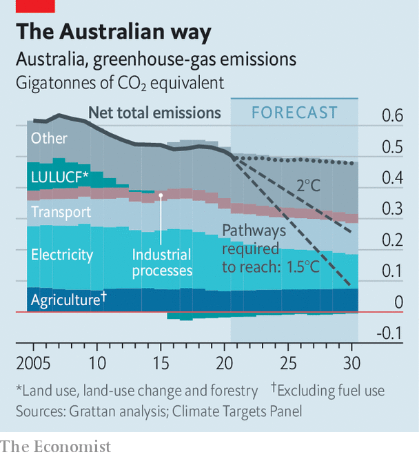

###### Zero effort

# Australia’s climate policy is all talk and no trousers 

##### It relies too much on future technology and not enough on present action 

 

> Oct 30th 2021 

THERE IS A “uniquely Australian” way to tackle rising temperatures, believes Scott Morrison, the country’s prime minister. After weeks of being hassled to beef up his climate commitments, his conservative coalition government on October 26th at last pledged to reduce its emissions to “net zero” by 2050—but without addressing the tricky matter of fossil fuels. The country can both deliver “action on climate change” and “protect the Australian way of life”, the prime minister argues.

Australia has long danced around climate change. It is the world’s biggest exporter of coal by both energy and value. Mining of all sorts accounts for 11% of GDP and supports some 270,000 jobs. Over the past 11 years, three of Mr Morrison’s predecessors have lost their jobs for trying to cut greenhouse-gas emissions.


That Mr Morrison still leads the country, even while uttering words like “net zero”, is progress of a sort. Yet his government had to concede something to its international allies before the UN’s climate talks start in Glasgow on October 31st. Alas, its plan has “all the strength of a wet paper bag”, as Joe Fontaine, an ecologist, put it.

Mr Morrison’s government will not pass a law to enforce any cuts. Nor will it put a price on carbon, as a Labor government did between 2012 and 2014, before the scheme was ripped up by the conservatives. Instead, Mr Morrison’s vision rests on five principles, which boil down to hoping and praying. Apart from “technology not taxes” and “drive down the cost” of technology, the principles include keeping energy cheap, not insisting anybody do anything, and promising to be accountable for its progress.

There is “no new money, no new policy and no credible plan”, says Tim Baxter of the Climate Council, an NGO. His organisation calculates that Australia is doing less to cut emissions than any other rich country. The government’s proposal, dating from Paris in 2015, aims to reduce greenhouse-gas emissions by 26-28% by 2030 from 2005 levels, compared with the 50-52% that America promises. No matter, says Mr Morrison. Australia will surpass its goal, with reductions of about 30-35%. Yet for it to do its part to keep global temperatures below 2°C as it promised in Paris, it too would have to raise its target to at least 50%, according to the Climate Targets Panel, a group of scientists. Hitting 1.5°C would involve cutting by 74%.

 


Australia’s intransigence matters for the rest of the world. Coal is still the source of most of the country’s electricity, accounting for a big chunk of its domestic emissions (see chart). Factoring in the vast quantities it exports, the country of just 25m people rises from the world’s 15th-biggest emitter of CO{-2} to its fifth. It is lobbying alongside other energy giants such as Saudi Arabia to weaken the UN’s recommendations for phasing out fossil fuels.

Neither of Australia’s major parties has any plans to do so. Its coal exports are booming, and the federal and various state governments are waving through new mines as prices rise. Mr Morrison’s has approved the expansion of three in the past two months. It also wants to open five new natural-gas fields as part of a “gas-fired recovery” from the pandemic. Mr Morrison plans to limit the damage by pumping A$20bn ($15bn) into “low-emissions” technologies. Green pressure groups complain that it is prioritising projects in nascent fields such as carbon capture and storage, which give it an excuse to keep burning fossil fuels.

Still, Mr Morrison may calculate that he has done enough to placate voters in a coming election. More than 60% of Australians think that climate change is a “serious and pressing problem”, compared with 36% in 2012, according to the Lowy Institute, a think-tank in Sydney. Yet fewer want to make changes that would lighten their wallets. Less than half of people surveyed in another poll want coal-fired power to be phased out within a decade, and 44% would prefer to keep exporting the stuff until overseas demand dries up.

The lack of alarm is all the stranger given that the continent feels the effects of climate change more acutely than many rich countries. It suffers crippling droughts and increasingly ferocious bushfires. Half its most prized natural treasure, the Great Barrier Reef, has been killed by warming waters. Islands in the Torres Strait, off its northern coast, are slipping into the sea. “Time is ticking,” says Yessie Mosby, a Torres Strait Islander who is part of a group trying to force the government into more urgent action by lodging a human-rights claim with UN. Three decades, he says, is too long for Australia to wait to cut emissions. By then, his people “will be refugees in our own country”.■

For more coverage of climate change, register for The Climate Issue, our fortnightly , or visit our 

