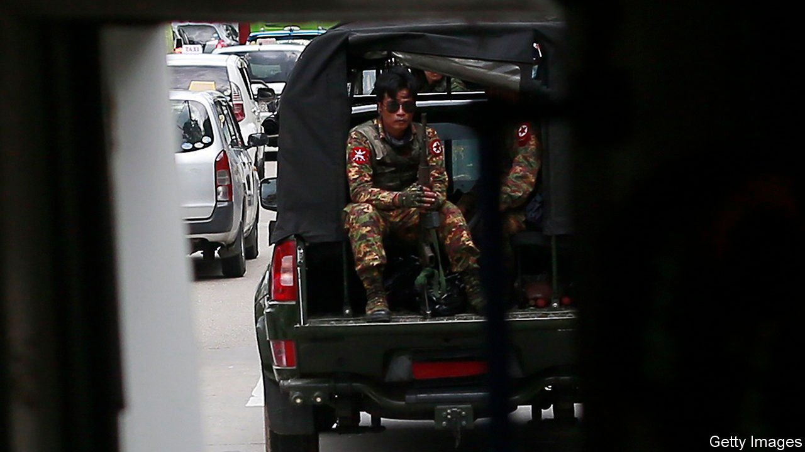

###### David 1, Goliath 0

# Rebels fighting Myanmar’s junta are doing better than expected 

##### Nine months after a coup, the country is facing a long civil war 

 

> Oct 30th 2021 

THE BOYS from Pale should be dead by now. Armed with little more than homemade rifles, in June the group of some 2,000 fighters, most of them farmers unversed in war, began attacking soldiers in their rural township in Sagaing state, in north-west Myanmar. The army they were up against, known as the Tatmadaw, last seized power in a coup in February but has been fighting rebels for the past 70 years. It deployed its usual tactics to crush the uprising in Pale. Soldiers looted homes, raped women and set a village on fire, according to Bo Nagar, the rebels’ commander. Yet the militia claims to have ejected the army almost entirely from Pale, killing 400 troops in the process and losing just five of their own. Tatmadaw soldiers “are like walking dead”, says Mr Nagar. “I think they are not willing to fight this war.”

Such claims are surely exaggerated. But Mr Nagar’s swagger contains a kernel of truth. Fighters resisting the Burmese army have fared far better than many analysts predicted. Since the coup some 250 rebel groups have emerged, ranging from small urban underground cells to militias comprising thousands. Anthony Davis of Janes, a defence-intelligence firm, counts around 50 that conduct “sustained operations”.


These forces clash with army units, assassinate low-level junta officials, and bomb strategic routes, army bases and infrastructure. At least 120 telecom towers partly owned by a military conglomerate have been destroyed over the past two months. Guerrillas are increasingly targeting bridges and railways, presumably to obstruct the flow of army troops and supplies around the country.

The resistance enjoys several advantages. “Revolutionary fervour”, as Mr Davis puts it, has inspired thousands of Burmese to take up arms. Doing so during the rainy season, when the army cannot conduct big operations, has bought the militias time to forge informal alliances with experienced ethnic-minority rebels (some are even going into battle together). It also helps that the top brass did not expect widespread opposition, least of all in the Burmese heartlands. The region is home to the ethnic-majority Bamar, from which the Tatmadaw draws most recruits. The army has not fought there in decades, if ever. Soldiers do not know the terrain, and being told to kill their own saps morale. And their informants are being assassinated.

The Tatmadaw is struggling. Between February and September, “conflict incidents”, from battles and bombings to defections, took place in 250 out of Myanmar’s 330 townships, according to Matthew Arnold, an independent analyst. To put out these fires, the army has spread itself thin. More than 1,700 soldiers were killed by anti-coup forces in the three months to September, according to the National Unity Government, a shadow cabinet made up of deposed lawmakers. Some 1,500 troops have defected, and the army is struggling to recruit officers. That alone should not hurt the Tatmadaw, which may have as many as 300,000 troops. But many are poorly trained and equipped. Morale is low. Forced, in effect, to cede swathes of the country to rebels, the junta “is facing an existential crisis”, says Mr Arnold.

Yet things may soon look up for the army. Since August, it has been sending reinforcements to the country’s north-west, where resistance is fiercest, in anticipation of the dry season, which has just begun. The Tatmadaw is said to be preparing for a long campaign there. It may be planning to conduct “clearance operations”, a tactic used against the persecuted Rohingya minority in Rakhine state, in which soldiers raze villages, forcing civilians to flee, in order then to hit exposed rebels with overwhelming firepower. “The scale and geographical breadth of the impending campaign is…arguably unprecedented” in the Tatmadaw’s already bloodstained history, writes Mr Davis.

There is a strong chance resistance in this region will be crushed. But that still leaves all the guerrilla fighters in the rest of the country. A long and bloody civil war increasingly looks inevitable. ■

