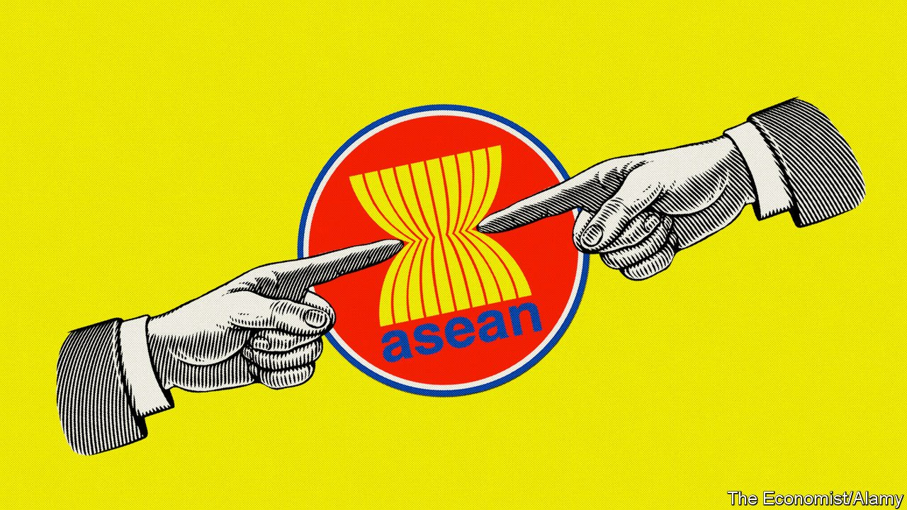
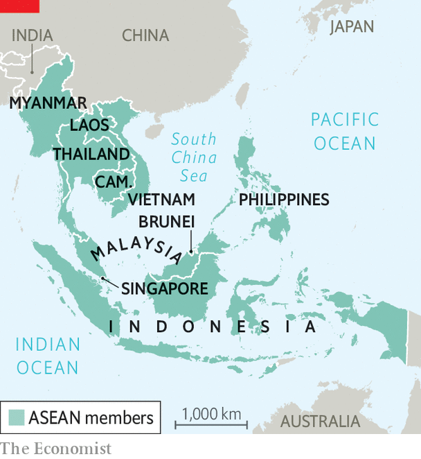

###### ASEANgst

# South-East Asia’s regional club faces its greatest tests yet 

##### Credibility trumps consensus as ASEAN attempts to remain relevant 

 

> Oct 30th 2021 

FOR A SECULAR grouping, the summitry of the ten-member Association of South-East Asian Nations (ASEAN), which this week it is Brunei’s turn to host, has a decidedly sacramental quality to it. For one, in non-pandemic years there is always a cathedral—some shiny convention centre, often freshly built. And there is a creed to which all bow, the “ASEAN way”.

Like most dogmas, this one gets ever squishier towards its core—but the ASEAN way is precisely about not poking it. One part of the dogma is all about order, civility and concord: ASEAN’s hallowed “consensus”. An obsession with appearing harmonious is perhaps unsurprising in a region whose modern story is replete with disharmony, and whose political systems run from absolute monarchy (Brunei itself) to flawed democracy (the Philippines). The story is flecked with wars (Indonesia’s undeclared war against Malaysia) and invasions (Vietnam’s, of Cambodia). There have been coups (Thailand), civil wars (Vietnam) and ethnic or religious pogroms (Indonesia); Myanmar has had all three. It all puts a premium on at least outward shows of agreement in a fissiparous region. The flip side of consensus is a supposedly unbending commitment to “non-interference” in other members’ affairs.


Unbending, at least, till now. For in mid-October, following intense behind-the-scenes discussions, ASEAN took the step of barring General Min Aung Hlaing, Myanmar’s military ruler, whose coup in February ousted Aung San Suu Kyi and her civilian government, from taking his seat at this week’s summits. In other parts of the world, this snub to a junta leader who has , initiated an orgy of bloodletting and brought the economy to the point of collapse would be a bare minimum. Yet in South-East Asia it is “the most severe sanction that ASEAN has handed down to a fellow member state in over five decades of diplomacy,” notes Aaron Connelly of the International Institute for Strategic Studies, a think-tank in Singapore.

Non-interference, one ASEAN ambassador explains, “doesn’t mean turning a blind eye and holding your nose”. The Burmese junta, badly in need of legitimacy abroad and respect at home, is appalled. The general’s exclusion, it declared, was contrary to the group’s “provisions, objectives and cherished principles”.

As for ASEAN, the way its high priests explained their decision shows a masterly grasp of liturgical matters. The general’s disbarring was no departure from the canon of consensus, they intoned, but rather a consequence of an earlier “five-point consensus” agreed on with Myanmar at a special summit in April. It included initiating dialogue with “all parties”, ending violence and allowing an ASEAN special envoy access to the country. The junta has done none of these things—the envoy being refused even 15 minutes with Miss Suu Kyi. Until that consensus is carried through, a consensus on inviting the general will have to wait.

 


The snub does not extend to inviting the government-in-exile that carries the mantle of the ousted, democratic one. It is not clear that even the countries in ASEAN most critical of the coup—namely Indonesia, Malaysia, the Philippines and Singapore—wanted to go that far. Yet doing nothing about Myanmar, as Teodoro Locsin, the Philippine foreign secretary, put it, would mean “our credibility as a real regional organisation disappears.” It would only highlight how ASEAN is “a bunch of guys who always agree with each other on worthless things”.

Though some critics of ASEAN insist the snub still has mainly symbolic effect, Mr Connelly argues otherwise. A failure to act would have “greatly diminished ASEAN in the eyes of diplomats around the world and, perhaps more importantly, its own people”, he says. What is more, despite Myanmar’s protestations a consensus was reached among the remaining members, one which pulled more authoritarian countries such as Thailand (itself run by a coup leader), Cambodia, Laos and Vietnam closer to the more critical position shared by the rest of the region. That, in turn, has helped narrow an alarming gap that had grown over Myanmar between an over-complaisant ASEAN and other countries around the world—in June only Belarus opposed a UN resolution containing much stronger language over Myanmar than ASEAN had managed. With the disbarring of General Min Aung Hlaing, ASEAN has averted international irrelevance.

Bland man’s bluff

A desire for relevance has everything to do with the second hallowed plank of dogma, ASEAN “centrality”. This is jargon for ASEAN being the first port of call for issues that affect South-East Asia.Though the word has mainly totemic value, getting outside powers constantly to recognise ASEAN’s centrality obliges them to acknowledge its interests. Chief among these is keeping great powers at bay, either to prevent their meddling in the region or to avoid their rivalries playing out there. That was a founding tenet in 1967 of ASEAN’s original members, who intended it as a bulwark against Soviet influence at the height of the Vietnam war.

Until recently, centrality seemed to work. It also helped confer convening power on ASEAN over a plethora of summits in which the group brings together world and regional leaders—this week President Joe Biden of America, plus Narendra Modi and Li Keqiang, prime ministers of India and China, joined ASEAN’s annual East Asia Summit by video link. It is true that form often trumps substance at these talking-shops. But they are just about the only ones going in a region notably short of institutions. And they have helped ASEAN to punch above its weight.

Yet great-power rivalry is playing out in South-East Asia once again, this time between America and China. Centrality has not prevented China from expanding its presence deep into the South China Sea, encroaching on the waters of its ASEAN neighbours. Nor, more recently, has it held America back from seeking to balance against China’s military build-up through “minilateral” alliances such as the Quad, a grouping with Australia, India and Japan, and AUKUS, which, with Britain, will supply Australia with nuclear-powered submarines with the range to patrol South-East Asian waters. Though they make token avowals of ASEAN centrality, neither China nor America seeks the group’s permission in these matters. The limits of centrality, then, are being laid bare.

Some ASEAN diplomats, broadly approving of a robust American presence in South-East Asia, argue that the dogma of centrality no longer serves South-East Asian interests in an era when China’s rising military power needs to be countered. The foreign-policy establishments of Singapore, the Philippines and Vietnam have generally welcomed AUKUS as helping to restore a regional balance of power. Thailand, a treaty ally of America’s but close to China, is tongue-tied. Perhaps out of alarm that China might be offended by AUKUS, the new prime minister of Malaysia, Ismail Sabri Yaakob, reverted to shibboleths about South-East Asia being a “zone of peace, freedom and neutrality” or, in the region’s pathological inclination for acronyms, ZOPFAN. More hard-nosed policymakers in Malaysia describe their political masters’ back-to-the-past utterances on the subject as “clueless”.

If ASEAN is to remain central in more than rhetorical terms, a Singaporean strategist argues, it has to be clearer about what it is prepared and not prepared to do with America—and with China. That will require a new consensus on centrality, one that will prove much harder to reach than the new one on Myanmar. ASEAN’s existential moment is arriving.■

