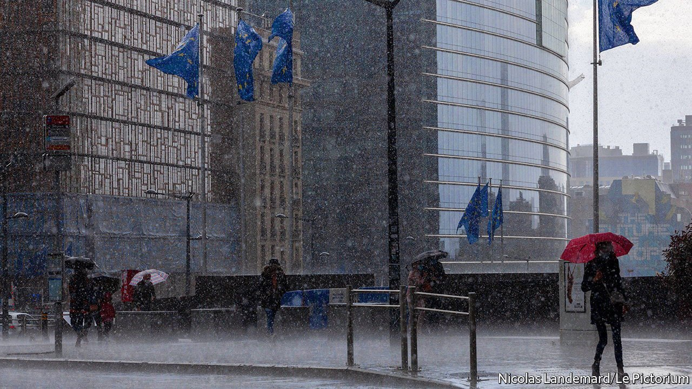

###### Crisis management

# Geert Mak takes stock of the past 20 years of European history 

##### Among the disasters and gloom are glimmers of hope 

 

> Oct 28th 2021 

The Dream of Europe. By Geert Mak. Translated by Liz Waters. Harvill Secker; 592 pages; £25

“WHAT HAS happened”, wonders Geert Mak, “in these 20 glorious years of globalisation and the free market?” You can tell by the way that he phrases the question that the answer is not going to be pretty. Sure enough, even the most hardened miserabilist will find plenty in this latest Europe-spanning investigation by Mr Mak, a Dutch journalist and historian, to deepen his or her gloom. Things that have gone right (Mr Mak admits that there are some) would have made for a much slighter volume.


It all started out so well. “The Dream of Europe” opens where the author’s previous mega-volume, “In Europe”, left off, at the end of the last century. Mr Mak flits from city to city, recounting what New Year’s Eve felt like in Amsterdam, Copenhagen, Kirkenes in northern Norway, Vasarosbec in southern Hungary. It was a time of vast optimism after a century of unimaginable upheaval. The 1990s had been a golden and, in retrospect, deceptive decade. The Soviet empire had bloodlessly evaporated; the enslaved countries of eastern Europe were heading for the European Union; even Russia thought of joining NATO. America ruled supreme, and only Sinologists cared much about China.

Yet how quickly it all turned. Mr Mak unfolds the debacle in a series of meditations, each pegged to a theme and a date but discursively wandering in time and space, introducing a cast of characters he frequently returns to (a Hungarian mayor, an Iranian refugee, a pair of Greek shop-owners, a Catalan journalist) as his rough chronology unfolds.

The progression of disasters is familiar: the attacks of September 11th 2001 and the terrorist reactions it triggered in Europe; the global financial crisis, followed by Europe’s own euro-zone crisis; the migration crisis of 2014-15; the Brexit crisis; the covid-19 crisis; populism of right and left; American isolationism. Digressive, itinerant and philosophical, Mr Mak’s style might not suit everyone and it certainly makes for a doorstopper, but it is mostly compelling and readable. Anecdotal nuggets sparkle on every page.

The nature of the European Union is the central mystery that runs through the whole book. Is the EU a ramshackle, secretive, undemocratic outfit that is destined to melt away like the Habsburg empire? Or will it cohere into a durable state-like polity, as Mr Mak’s Netherlands did? Perhaps sensibly, he does not attempt a definitive answer, punting the question to a mythical reader in 2069. But the glimmers of hope that the author does discern point, improbably, to success. The EU flounders when faced with a “polycrisis”, but it muddles through. It invents new instruments, which live on, and over time it gets better at invention, too. The economic response to the coronavirus pandemic was far faster than to the euro-zone crisis.

The other broad thread that runs through the book is sympathy. Not just for the desperate migrants drowning in the Mediterranean, or the legions of unemployed in southern Europe. Mr Mak shows a real understanding of people whom you might expect him to dislike: those who voted for Brexit, for example, or Russians who mourn their vanished glory. He understands what drives people to suspicion of outsiders, or to take refuge in a past that can only be recovered in the false dreams of demagogues.

There are irritations. In the course of his chapter on Brexit, Mr Mak recounts just how much the people of Wigan hate George Orwell, who went there in 1936 with a pre-formed agenda and duly saw awfulness everywhere. Yet he seems unable to see how much he suffers from the same affliction. He writes of the “devastation” of Wigan (though he earlier describes a city where everything is “clean, impressive, beautifully restored”.) Globalisation is always a curse, never producing benefits. The fantastic increase in living standards in much of eastern Europe gets far less attention than the anxieties that have emerged. But if you want a broad sweep of the past 20 years in a baffling, teeming continent, you can get it here. ■

