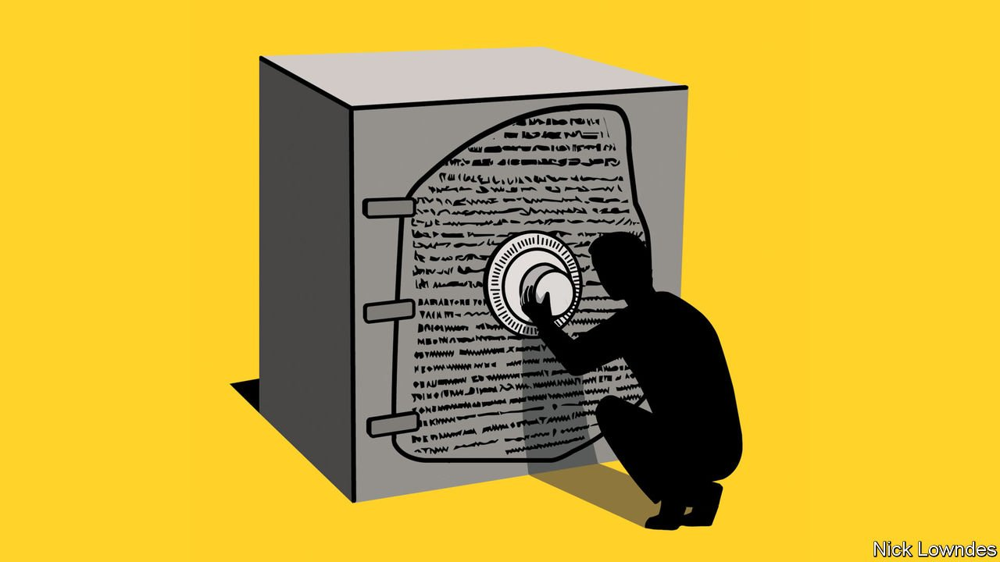

###### Johnson

# How the Rosetta Stone was deciphered 

##### “The Writing of the Gods” is an entertaining account of a great intellectual achievement 

 

> Oct 28th 2021 

YOU MIGHT think the most daunting decoding challenges occur when an enemy makes a message difficult to read by design. To break ciphers such as Germany’s Enigma code in the second world war requires enormous ingenuity.

So why did the decipherers of Egyptian hieroglyphs take hundreds of years to complete their task? The codemakers didn’t aim to obscure their writing. But they had been dead for 2,000 years, and scholars knew nothing certain of their language. They faced texts that could be receipts or prayers and lacked the cultural knowledge to guess which. They weren’t sure where words and sentences began, or even which way the text ran. At least the Enigma codebreakers knew they were looking for something resembling military orders in German.


Napoleon invaded Egypt in 1798 in part because French intellectuals were awed by the ancient culture that had produced the pyramids and sought to conquer it. But they knew little of the mental life of the Egyptians; hieroglyphs had been out of use for millennia.

The discovery of a stone during the renovation of a fort gave them a chance. Inscribed on the slab was what seemed to be the same text rendered in three writing systems: Greek, an unfamiliar script and hieroglyphs.

The scholars studying the Rosetta Stone were operating with scant information and their accomplishment will astonish readers. Edward Dolnick’s new book, “The Writing of the Gods”, is a short, accessible and highly entertaining account of the work—primarily that of Thomas Young and Jean-François Champollion—that cracked the code.

The two men were inventive in their approach to deciphering. Young was a polymath, positing the wave theory of light among other achievements. Champollion was obsessed with Egypt: he talked to himself in Coptic, the liturgical language of the Egyptian Orthodox church.

The Englishman made the first breakthrough. European Egyptology had laboured under a misconception for centuries, believing that the Egyptians wrote in a mystical language of pure ideas, not in anything as boring as an alphabet. Young noticed that the name Ptolemy, a Greek ruler of Egypt, recurred in the Greek text. He had seen that the Chinese would write Western names with Chinese characters, using those that sounded most appropriate even if they had an irrelevant meaning. He guessed that the Egyptians did something similar. Luckily the Egyptians also put an oval, which the French called a cartouche, around royal names. Young worked out glyphs that seemed to correlate with “Ptolmes”, confirming that hieroglyphs did not just convey ideas.

Champollion then took the case forward. After the deciphering of a few more Greek names he turned to Egyptian ones, particularly “Ramesses” (also known as Ramses). Unlike many others in the field, he believed Coptic, which was replaced by Arabic as Egypt’s primary language in the first millennium AD, to be a descendant of ancient Egyptian. He guessed that the latter letters of the word might have something to do with “mise”, the Coptic for “birth”, and looked for something similar in the Greek. Once he had found it, he returned to the hieroglyphs and found the symbols he was looking for outside a cartouche. He is said to have fainted on announcing his breakthrough: the Egyptians used hieroglyphs for the sounds of ordinary words too, and he was on the way to unravelling how.

Much was left to discover. A hieroglyph could represent a whole word, syllables or individual sounds. Mysterious characters called determinatives were unpronounced but elucidated a word’s meaning in ambiguous situations. The stone’s middle script was a red herring—it was a kind of simplification of the hieroglyphs, not a key to understanding them. Champollion worked out lots about grammar, though, as a work for the general reader, “The Writing of the Gods” skips through it. He left much unfinished when he died at 41.

As great a mind as Isaac Newton believed that the Egyptians had figured out everything that mattered and the moderns’ task was merely to unveil those existing truths. Young and Champollion made it possible to unravel just how brilliant Egyptian civilisation was. But it was also strange (the passion for mummification extended to ibises, a sacred bird) and primitive (labourers built the pyramids without so much as a wheelbarrow). Young’s and Champollion’s intellectual achievement deserves at least as much reverence as pyramids, sphinxes and masks of gold.

