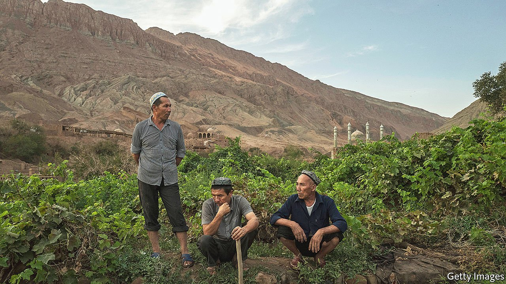

###### Xinjiang blues

# Two new books shed light on the plight of the Uyghurs 

##### Darren Byler documents life inside the prison camps. James Millward considers the repression as part of a broader history 

 

> Oct 28th 2021 

In the Camps: China’s High-Tech Penal Colony. By Darren Byler. Columbia Global Reports; 159 pages; $15.99. To be published in Britain in February by Atlantic Books; £12.99

Eurasian Crossroads: A History of Xinjiang (Revised and Updated). By James Millward. Hurst; 536 pages; £16.99. To be published in America in December by Columbia University Press; $35

BETWEEN THE 1870s and 1940s foreigners published a glut of accounts of Xinjiang, the vast territory that is at the centre of Eurasia but perennially on the fringes of China. Stories of sand and snow sold back home because they were exotic, but they were written because Xinjiang was increasingly connected to the world, explains James Millward, an eminent Western scholar of the region. The territory had always been a melting pot for peoples and a test for advancing empires.


Now Xinjiang has the world’s attention once more, this time as a site of horrors. In recent years the Chinese Communist Party has detained more than 1m Uyghurs (an indigenous group who make up 45% of Xinjiang’s population), Kazakhs and other mainly Muslim minorities in prison camps. Party officials claim they are re-educating “extremists” and help Uyghurs train for better jobs. Observers say they preside over a crime against humanity. In the West, the plight of the Uyghurs has prompted an explosion of books and articles—and many angry Chinese rebuttals.

Two books by Americans offer complementary ways of understanding what has been happening. “In the Camps” by Darren Byler, an anthropologist, considers the detention of the Uyghurs through the eyes of former inmates and camp workers. Mr Millward’s weightier tome, a revised version of “Eurasian Crossroads”, first published in 2006, sets the developments within 4,000 years of history.

Mr Byler’s book is more typical of the recent flood of material which documents life inside the camps. Seeking to emulate the work of the Italian writer and Holocaust survivor Primo Levi, he narrows in on the mundane details of internment which, taken together, dehumanise the detainees. The inmates’ heads are shaved. The women are forced to take the contraceptive pill because the “school” cannot provide enough sanitary towels. They perch on plastic stools for so long that some detainees’ intestines fall down. In their prison cells, TVs blare hours of footage from Xi Jinping’s tours. On occasion, they tell the inmates to sing.

The voices of detainees filter through the pages. Adilbek, a Kazakh farmer, recalls being struck by guards, often as a punishment for not speaking Mandarin or for stepping out of line. Yet sometimes the beatings were random: “They called us livestock. Animals.”

A broader ideology undergirds these stories. Mr Byler shows how China uses the rhetoric of the global “war on terror” to try to justify the persecution.But his principal focus is technology. The camps, though shocking, are only the most extreme application of digital surveillance used by other governments around the world, Mr Byler argues. Similar technologies help America hem migrants into camps on its southern border and allow India to stage communications blackouts in Kashmir. He suggests that “nearly all major US tech firms…have been entangled in Chinese surveillance technology development.” They profit by refining what traps people.

By contrast, Mr Millward writes of the camps as the unhappy coda to a story of jostling empires and dynasties. Readers unfamiliar with Asian history may struggle to tell the Xiongnu from the Tokharians. But the snippets about Chen Quanguo, an architect of Uyghur misery today, are much richer for being considered alongside the region’s pre-communist rulers.

Unfortunately Mr Millward has not revised his entire book. This grates, particularly when outdated projections or examples remain. (The predictions for the “dry port” of Khorgos, for example, are jarring to read almost two decades later, now that the transport hub is an established stop on the “New Silk Road”.) But it is useful to see how the author has changed his tone.

In the first edition of “Eurasian Crossroads”, Mr Millward dispassionately surveyed the chauvinistic debates which dog scholars in his field, particularly in China: the possible Indo-European origins of the Xinjiang Stone Age; the contested beginnings of a Uyghur nation. The goal is not to be political, he says in his original preface, but to offer an overview of history. He has both Han Chinese and Uyghur friends, he tells the reader. Profiles of those who attempt to balance their Uyghur and Chinese identities close out the book.

In the intervening years Mr Millward has been dragged into the politics he sought to avoid. In 2011 he and 12 other academics said they were denied Chinese visas after publishing a fairly innocuous book about this “Muslim borderland”. The balancing act proved to be an illusion. China has “lost its balance” too, Mr Millward asserts, by forgetting the lessons of history. The Qing and the Kuomintang were able to implement policies effectively when they accepted that Xinjiang was different and governed accordingly. Today the party exerts total control over the region precisely because it fears this diversity.

Like the fallout from the Cultural Revolution, which also convulsed Xinjiang, the consequences of this policy are devastating. Qeyser, a young Uyghur whom Mr Byler later helped to escape, never saw a phone until he was 15. When officials announced that they would be searching all students’ smartphones, he was terrified that they would find an article by Ilham Tohti, the Uyghur intellectual to whom Mr Millward’s book is dedicated, and who was sentenced to life in prison in 2014 for “separatism”. Mr Tohti’s crime was to argue that the country’s development had not sufficiently benefited Uyghurs.

Xinjiang today is a different kind of crossroads from the one Mr Millward first described 15 years ago. China’s vision of a homogenous nation is more in keeping with the European empires of the 19th century, but in Xinjiang, these ideas from the past merge with the technology of the future. Americans may write the first mainstream accounts, but trapped in the middle are the Uyghurs. China is trying to erase Uyghur culture, discourage births and cow the entire people into submission. ■

