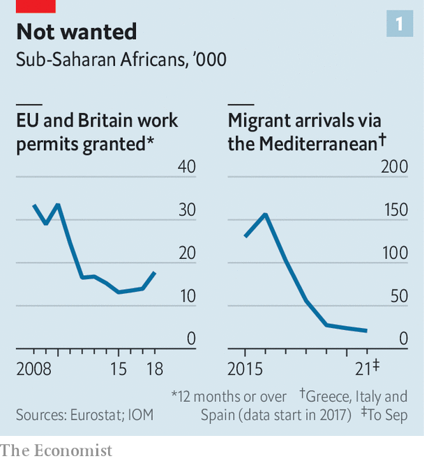
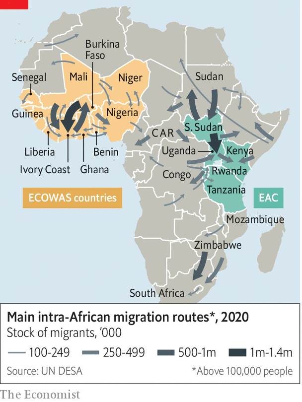
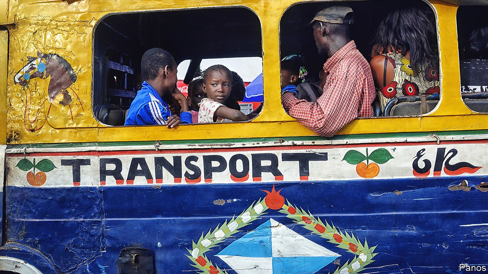

###### African odyssey

# Many more Africans are migrating within Africa than to Europe 

##### Some governments are trying to make moving easier 

 

> Oct 30th 2021 

“MAN, NIGERIA has been a ride,” laughs Mawuli Gavor, a 32-year-old star in Nollywood, Nigeria’s booming film business. Mr Gavor does not fit the stereotype of an African migrant, struggling to cross the Mediterranean in a leaky boat. Born and raised in Ghana, he was working as an accountant when an admirer suggested he try for a modelling job. Soon, he was in Nigeria, making a fortune in films.

Many Africans are taking similar journeys, though most are less glamorous. In a market in Dakar, the capital of Senegal, Ibrahim Bary, a 25-year-old from Guinea, sells cows’ livers hanging from hooks. Work is easier to find in Senegal than back home.He makes around $4.50 a day and plans to send four days’ pay home to his family in Guinea this month. He previously worked as a taxi driver in Ivory Coast. “I will stay a while, earn some money, and then go home,” he says.


In the decade to 2020 the number of sub-Saharans living abroad jumped from about 20m to 28m. This causes conniptions in Europe, where many voters fear a flood of immigrants. Europe is indeed attractive to Africans. Average incomes are 11 times higher and, though African migrants often do menial jobs, they earn on average three times what they did back home.

 


But it has become very hard for Africans to move to Europe unless they have rare skills, such as treating sick people or scoring goals (though ageing Europe will soon be short of ordinary workers, too). New permits for sub-Saharan Africans to work there plummeted from 33,000 in 2008 to about half that number in 2018. European governments have lavished cash on border controls and done deals with north African countries to stop migrant boats from setting sail. They sometimes do this brutally. Arrivals have plummeted (see chart 1). A migrant who heads for Europe without permission must pay a fat sum to smugglers and faces a high risk of failure or even death.

Sub-Saharans with get-up-and-go have long been migrating closer to home. Only 18% of those living abroad are in Europe. About 70% are in other African countries (see map). Between 2010 and 2020 the UN says the number of sub-Saharan migrants within Africa rose by more than 40% to 19m (a figure many experts call an underestimate). The Immigration Policy Lab at Stanford University analysed a survey by the International Organisation for Migration (IOM) of 88,000 people on popular migration routes in west Africa. It found 90% planned to stay in Africa.

 


Africans are likely to become more mobile. Today, the continent has fewer migrants as a share of population (2%) than the world average (3.5%). Moving costs money: a migrant needs enough to cover at least a bus fare and a few nights’ accommodation while looking for a job. Many Africans cannot yet afford that, but one day they will be able to. Global research suggests that as poor countries grow richer, more of their people tend to emigrate, until average incomes reach around $10,000 a year. Income per head in sub-Saharan Africa is currently $3,800, so there is a lot of room for growth.

The population is increasing, too, at 2.7% per year, more than double the speed in South Asia. More people need not mean a higher rate of migration, but it obviously increases the absolute number of potential migrants. Estimates vary a lot, but there could be twice as many Africans by 2050, and many will be young men, the group most likely to move.

Climate change has not yet spurred large population movements, but it may do so. Large swathes of Africa will become harder to live in. A study in Burkina Faso finds that, because droughts make people poorer, they can reduce cross-border migration. Still, the World Bank says that by 2050 over 50m people in sub-Saharan Africa might move within their own countries because of climate. The authors do not focus on international migration but note that many parts of sub-Saharan Africa that are expected to be climate-migration hotspots are close to borders.

Some Africans are forced to flee their homes. There are 6m refugees on the continent who have crossed a border (and 18.5m displaced within their own countries). However, in most countries migrants are motivated largely by a desire to make a better living. Less than 1% of those in the Stanford analysis said conflict was their main reason for moving.

Migration presents an opportunity for Africa. Migrants’ skills and hard work boost productivity. The taxes they pay fund public services. They send billions home in remittances. And when they return, as many do, they bring back new ideas and valuable contacts. The question for African governments is whether they will make it easier for Africans to move around, or throw up more barriers. There are some signs that they are choosing the former.

Standing at the crossroads

African governments can co-operate, as they showed with a continent-wide free-trade agreement that became operational this year. The African Union, a body that is much looser than the European Union but has ambitions to promote more integration, has put forward a protocol that would allow free movement across Africa. So far, however, few governments have ratified it.

Some still see migrants as a problem (much as European governments do). Barriers to movement are still high. Border guards often hassle migrants, delay them and demand pay-offs. Qualifications from one African country are often not recognised in others, leaving nurses selling fruit in markets. Few states consider migrants in their urban planning. And sending money home is absurdly expensive: to transfer $200 costs about $16, more than in any other region.

Nonetheless, there are reasons to think some of these barriers will fall. Africa has a long history of mobility. Before colonisation, nomads crossed what are now international borders, trade caravans strode the Sahara, and many Africans migrated during the dry season before returning with the rains.When colonies became independent, some of their leaders, such as Kwame Nkrumah of Ghana, pushed a pan-Africanist vision of a borderless continent. His ideals were neither universally shared nor consistently upheld by Nkrumah himself. In 1957 his government passed a deportation act and expelled Nigerians who were helping the Ghanaian opposition. Between 1958 and 1996 there were 23 mass expulsions of migrants by 16 African countries.

Still, the pan-African ideal helped create the Economic Community of West African States (ECOWAS), a group of former British, French and Portuguese colonies. In 1979 the bloc came to an agreement on visa-free movement and promised that, within 15 years, all its citizens would have the right to work and start a business in any member state. That right still exists, at least on paper. Mr Bary, the Guinean butcher in Senegal, did not need a visa. He just went. It has made “a huge difference”, agrees Mr Gavor, the film star. “If we had more of these unions that actually worked, just imagine the things we could do.”

The right to visa-free travel is mostly respected in all 15 ECOWAS states, but the right to do business is not. “Almost all member states are in violation,” says Franz Celestin of the IOM. Some states still try to reserve industries for locals.

Other regional blocs also allow a measure of free movement. The six countries of the East African Community (EAC) mostly offer visa-free entry to each other’s citizens. Half have eliminated fees for work permits, too. Regional blocs in southern and central Africa are trying to follow suit, but are further behind.

In South Africa many politicians are quick to blame migrants for problems at home. In 2019 mobs of armed men looted and torched shops owned by migrants. At least 18 foreigners were killed, says Human Rights Watch, an NGO.“There is xenophobia every day in South Africa,” says Timothy Sangweeni (not his real name), a Zimbabwean who moved in 2008. At police stations and clinics if “officials hear your voice and see your skin colour they are rude and unhelpful and tell you that you don’t belong,” he says. But, he concedes, “You are allowed to access services.”He first came without papers, but now has a permit, lives in a better neighbourhood, and is married to a South African.

Others are fed up. Aganze Bulonza, a waiter in KwaZulu-Natal, says he wants to go back to Congo. “Even though it is not stable, it’s better than being in a place where you are not wanted.”

An old gripe

The complaint that immigrants take jobs from locals, or drag down wages, is especially loud in South Africa, where wages are high by African standards and unemployment is rife. Yet the evidence is mixed. Migrants sometimes compete with locals for jobs, but they also spend money, which creates other jobs. Costanza Biavaschi of the Norwegian University of Science and Technology and co-authors find that, at the local level, male migration reduces employment for native South Africans, but not their income (at the national level, it has a negative effect on South Africans’ total income, but not on employment rates). But a World Bank study, which includes female workers, finds that at the provincial level immigration increases both native employment and wages. And the OECD, a club of mostly rich countries, finds new immigrants boost employment and wages of South Africans at the regional level.

In most measurable ways, migration benefits locals. In Africa, it increases manufacturing in both sending and receiving countries, finds the UN Conference on Trade and Development (UNCTAD). It reckons that a 1% increase in the number of migrants to a country is associated with a 0.2-0.4% increase in manufacturing output, possibly because they bring skills and ideas. The better educated the migrants, the bigger the impact.

In Ivory Coast migrants contribute about 19% of GDP despite only being 10% of the population. Migrants are more productive than natives because they are more likely to be of working age. And they often bring complementary skills. Some are hired to fill niches; some move to places where their skills are in demand.

Many also have contacts with their home countries that boost trade.Since 2014, Rwanda, Kenya and Uganda have allowed movement across their borders with just an identity card. Within two years this had increased cross-border trade by 50%, says the Rwanda Development Board, a state agency. Free movement is “essential” for Africa’s new free-trade agreement to succeed, says Paul Akiwumi of UNCTAD.

In Rwanda migrants pay on average three times more tax than locals. An OECD study of Ghana, Ivory Coast, Rwanda and South Africa found that migrants contribute much more in taxes than the cost of the extra public services they use.

The biggest winners from migration are migrants themselves. If they did not think moving would make them better off, they would not go. For obvious reasons, they are more likely to want to move to countries where they can earn more, such as South Africa. Wages there are five times higher than in Zimbabwe or Mozambique, which is one reason why 700,000 Zimbabweans and 350,000 Mozambicans live there. Some 1.4m migrants from Burkina Faso are in Ivory Coast, where income per head ($5,500) is twice as high.

Cosme, a 37-year-old chef in Lagos, had been looking for work for three years in Benin before coming to Nigeria. He found a job in a restaurant in a posh part of town. In Benin “there are no job opportunities like that,” he explains. Today he laments Nigeria’s high inflation but still advises friends to come. He now has a small nest-egg and sends $120 a month to his family.

Such remittances are vital. The World Bank says that in 2019 almost $50bn flowed into sub-Saharan Africa, easily topping the $31bn of foreign direct investment that year. About 40% of remittances are from other parts of sub-Saharan Africa, up from 29% in 2012—a larger share than comes from Europe (see chart 2). Those sent within Africa tend to reduce poverty more, says Dilip Ratha of the World Bank, because intra-African migrants have poorer families than do migrants who cross oceans.

 


Migrants who return provide another boost. Catia Batista of the University of Lisbon finds that those returning to Mozambique are 25 percentage points more likely to own a business than those who have not been abroad, even controlling for the possibility that more talented people may travel abroad.Ms Batista also found that people in Mozambique who live in the same village as families with a member who has gone abroad are almost 15 percentage points more likely to vote in elections.

Migration also spreads good ideas. Scientists and engineers who have worked abroad bring back cutting-edge techniques. They bring other things, too. “Any kind of African restaurant you want in Abidjan, you can find,” boasts Issiaka Konaté of the Ministry of African Integration and Diaspora in Ivory Coast. “It’s like London.”

Some African leaders have begun to push for freer movement. Benin, the Gambia and the Seychelles offer visa-free travel for all Africans. At least 34 countries have signed on to a plan to create a single air-transport market that would allow airlines to open up more direct routes. In 2018 the African Union drew up a “free-movement protocol”, which would allow visa-free entry across the continent and subsequently the right to work and to establish a business. By February this year, 33 African states had signed up, but just four had ratified it. Some fear it could bring insecurity or loss of sovereignty, though the protocol could bring some of the vast untaxed informal sector out of the shadows.

African leaders may find promoting migration more popular than they expect. In South Africa, one of the least welcoming places, 29% of people say they would dislike having foreigners as neighbours. Yet in Ivory Coast, just 4% hold that view. Of the 20 most accepting countries in the world for migrants, nine are in sub-Saharan Africa, says Gallup, a pollster. In west Africa 60% of people would like migrant flows to stay the same or increase. In Africa as a whole more people would like to increase or maintain immigration than reduce it.

 


One obstacle, says Mohammed Abdiker of the IOM, is that migration policy in Africa often reflects European priorities. “A lot of European money” tries to persuade African governments to halt migrant flows north, says Loren Landau of the University of Oxford. This “legitimises a whole lot of really nasty things that can be done to migrants” within Africa, he says. “It also works against any kind of sensible discussion about what countries could be doing.”

The EU funds and advises countries to add more border security and conduct more frequent checks. European-funded anti-migration campaigns tell Africans harrowing stories of death and disaster; that if they move to Europe they will end up begging, and “everyone will hate you for it,” says Mr Landau. All this can stigmatise migration within Africa, increase the chances of police harassment, and make regional migration harder.

Give me your unskilled masses

Some countries, such as Ivory Coast, are trying to include migrants in their planning. “We must say it clearly: migration is an opportunity for Ivory Coast,” says Alcide Djédjé, the minister for African integration. “Ivory Coast applies the ECOWAS free-movement protocol better than anyone,” he boasts. Migrants have the same access to health care and education at the same cost, he adds. Indeed, surveys find they are more likely to go to health centres than locals (though, struggling to pay costs, they are less likely to use local schools).

Migration policy is hard to get right. African governments could start by punishing police who abuse migrants. West African governments should uphold the deal they made long ago: that any ECOWAS citizen can work and open a business in any ECOWAS country. Other regional groups could do likewise. And African governments should ratify the continent-wide free movement protocol, which is a remarkable step on the path to a more integrated and prosperous continent.

All this would make life easier for migrants, most of whom just want to earn a living. Peter Adoa (not his real name), a Ugandan, learnt Swahili on arriving in Kenya seven years ago, got a work permit, opened a nail salon and is engaged to a Kenyan.Yet he is constantly harassed by the police. Recently he was forced to pay $90 to a cop who was threatening him. Not even that can deter him. “That experience fatigues me, but nothing else does,” he smiles. “Everything else is great.” ■

