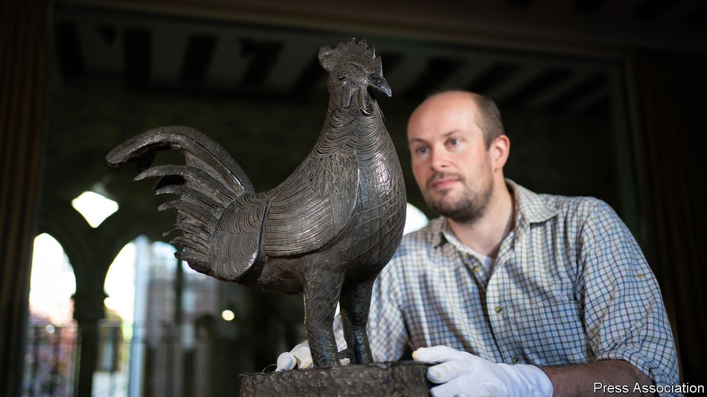

###### African art

# A bronze chicken looted in 1897 is flying back to Nigeria 

##### Where one goes, many others will follow 

 

> Oct 30th 2021 

IN FEBRUARY 1897 British soldiers raced from the Nigerian coast to Benin City, machine-gunning as they went. Their “punitive expedition” aimed to avenge the killing of several Britons a month earlier and to destroy the Edo kingdom. By the time the soldiers entered the city it was lifeless, all the residents having fled or been killed. But the troops were not disappointed. They discovered thousands of sculptures, which they removed before burning the city.

The bronzes came to be seen as a high point of African art. Given away or sold by officers, they were collected by artists such as André Derain and Pablo Picasso and by European and American museums. One bronze cock ended up in Jesus College, Cambridge—which, on October 27th, handed it to officials from Nigeria. It was the first time a British institution had freely handed a bronze over.


George William Neville, a businessman from Lagos, gave the cock to Jesus College in 1905. Neville was not part of the military expedition but made his own way to the city and grabbed what he could. He was given a guard of 20 soldiers for the return journey. “I would advise you to push on as quickly as possible,” a lieutenant-colonel told him, “for the fact of so many ancient heirlooms leaving the city may attract attention and possibly lead to molestations.”

For decades the cock stood unmolested on a plinth in the college hall. But in 2016 two students (one now a correspondent at The Economist) called for the sculpture to be returned. Three years later Jesus College agreed. Universities can move more quickly than national museums, which are bound by laws and scrutinised by politicians. They also mind how young people see them. When Oxford’s Oriel College asked school pupils whether a statue of Cecil Rhodes, a famous colonialist, would discourage them from applying, two-thirds said yes.

As The Economist went to press a delegation was travelling to Aberdeen University to receive a second bronze. New York’s Metropolitan Museum of Art has agreed to return two more. Next year German museums will start handing theirs back. At that point the British Museum, which holds the world’s largest collection of Benin bronzes, will begin to look uncomfortably exposed.

