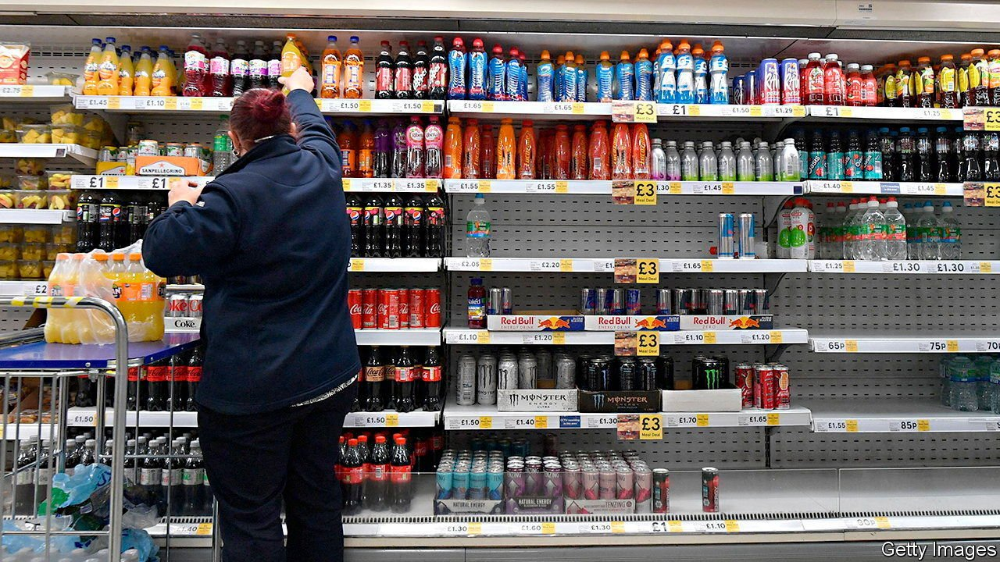

###### Pay up

# Britain’s minimum wage is catching up with pre-pandemic ambitions 

##### Another bold increase after a pause during the covid-19 pandemic 

 

> Oct 30th 2021 

ONE OF THE pre-budget leaks—designed to ensure positive press in advance of the big event—was that the minimum wage would rise from £8.91 ($12.23) to £9.50. This will lift the pre-tax pay of a full-time worker by £1,000 a year from next April, in keeping with the government’s promise to deliver a high-wage economy. Yet if the politics of the move were obvious, the economics were less so.

The Low Pay Commission (LPC), a group of economists, employer representatives and trade unionists, has advised the government on the minimum wage since 1997. In recent years the government has given it increasingly ambitious goals. The latest, which it received in 2020, was to work out how to put an end to low pay altogether, defined as earning below two-thirds of the median hourly wage.


Previous changes have yielded results. The share of people on low pay fell sharply from around 23% in the 2000s and early 2010s, to just 15% in 2019. But it is uncertain whether further climbs will be as easy. Across the OECD, a club mostly of rich countries, only Chile, Colombia, Costa Rica and Turkey have minimum wages with a sharper bite.

Worries about the new target paled into insignificance when the covid-19 pandemic struck. The quality of the data available to the LPC plummeted, and the furlough scheme muddled average earnings figures by replacing 80% of people’s pay. A year ago the commission’s best guess suggested that staying on track to meet the target would have implied raising the minimum wage to £9.06. Given the extent of the uncertainty, they instead advised the government to apply an “emergency brake” and to raise it to just £8.91.

The impact the minimum wage had on the labour market during the pandemic is still unclear (when asked, businesses told the LPC they had no idea). A glance at the data suggests the commission was maybe too pessimistic about employers’ capacity to absorb higher wages, as its latest estimates show the number and share of workers paid the minimum wage have fallen slightly. But that same observation may also suggest they were correct to be cautious, since it could be that the lowest-paid workers were more likely to lose their jobs.

The LPC’s latest estimate is that achieving the government’s goal means the minimum wage will need to reach £10.70 in 2024. A number of factors support the case for a meaty rise now. Inflation is higher than usual; earnings growth is strong, particularly in sectors where pay is lowest; unemployment is relatively low in places with lots of minimum-wage workers; and businesses do not seem to be planning waves of redundancies.

Next year’s rise is almost—but not quite—on course to hit the target. The slightly cautious increase the LPC and chancellor ultimately plumped for reflects concerns about other business pressures looming in April, including a rise in National Insurance contributions and the end of tenants’ protection from eviction. Despite long-standing fears, higher minimum wages have yet to noticeably increase unemployment. But no one wants to reach the point at which they do. ■

Dig deeper

All our stories relating to the pandemic can be found on our . You can also find trackers showing ,  and the virus’s spread across .

