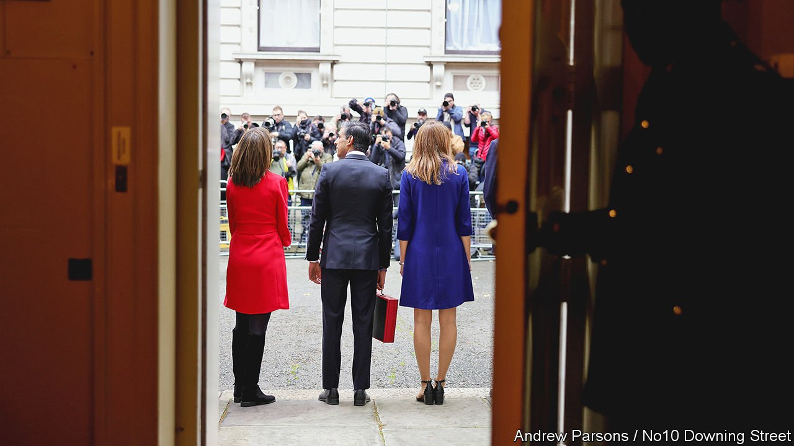
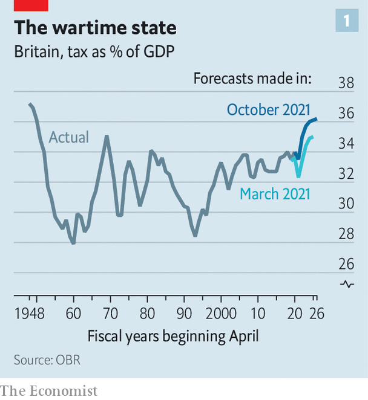
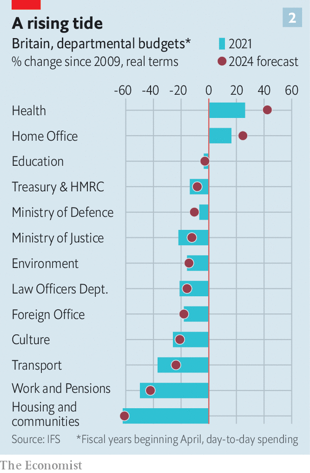

###### Farewell to austerity

# Rishi Sunak’s budget marks a turn to big-state Conservatism 

##### British tax rates will rise to levels last seen in the 1950s 

 

> Oct 27th 2021 

WHO IS RISHI SUNAK? Listen to the chancellor’s recent rhetoric, and you could be forgiven for thinking he was cast in the mould of a predecessor, George Osborne, who slashed the state in response to the global financial crisis. In a speech to the Conservative Party faithful on October 4th Mr Sunak described borrowing as “immoral”, and emphasised his eagerness to restore order to the public finances. But the budget he delivered on October 27th confused the picture. Reeling off spending measures, he refused to apologise for raising taxes and lauded the spending they supported. “The Conservatives are the real party of public services,” he trilled.

Mr Sunak displayed rare munificence. Government departments will get real increases in their budget of 3% a year on average until 2024-25, an increase reminiscent of largesse last seen consistently in the 2000s. Even more eye-popping are the chancellor’s plans for the size of the post-pandemic state. According to forecasts by the Office for Budget Responsibility (OBR), a watchdog, spending will grow from 39.8% of GDP before the pandemic to 41.6% by 2026-27, the highest sustained share since the 1970s. Tax will rise from 33.5% of GDP to 36.2%, a level not seen since the early 1950s. The announcements recalled not Mr Osborne, but a very different predecessor: Labour’s Gordon Brown.


The Brownite giveaway was prompted by a surprisingly perky economy. In March the OBR projected GDP growth of 4.1% this year. Now, thanks to rosier employment figures, it predicts 6.5%. In the same period, medium-term damage expected from covid-19 has gone from a gloomy 3% of GDP to a cautious 2%. Part of this is simply the passage of time revealing that investment has performed better than expected. But Mr Sunak is also benefiting from his adroit handling of the pandemic, which limited the hit to corporate balance-sheets.

All of this means Britain is borrowing less than expected. People are earning more, which increases the tax take. And Mr Sunak has raised taxes. In September he announced a health and social care levy, which will bring in a net sum of £12bn ($16bn) by 2024-25, and increased dividend tax rates. This year has seen the biggest overall tax rise since 1993—which is not a message the Tories will put on leaflets at the next general election.

 


Mr Sunak did offer some red meat to Conservative members. There was relief for payers of business rates, a cut to corporate-tax rates for banks and the now traditional fuel-duty freeze (as has happened without fail for the past decade). But none of these will cost more than £2bn a year by 2024-25. Mr Sunak also announced new fiscal rules: there will be no borrowing for day-to-day spending in three years’ time and debt will fall as a share of GDP. On current plans, he will meet these targets, but he has left less margin for error than his predecessors did with their rules, which all went unmet.

By the next election, Mr Sunak plans to be using most of the windfall delivered by better economic growth to lower borrowing (or, perhaps, as a slush fund for tax cuts). But now, he is spending—and in particular to ease the pressure on public services brought about by the pandemic. The health department will see the biggest increase, because hospitals must deal with both covid and an enormous backlog, but most will have at least some sort of rise. This will begin to reverse the cuts applied by Mr Osborne (see chart).

 


Given how much of the budget was trailed before, some wondered whether anything would be left for the main event. But the chancellor managed a few surprises. Half the planned increase in departmental spending in 2024-25 will restore foreign aid to 0.7% of GDP, a target abandoned during the pandemic. A welcome simplification to the mess of alcohol taxation was seized on by Mr Sunak, a Brexiteer, as a benefit of leaving the EU (it would not have been possible as part of the bloc). Firms running retail, hospitality and leisure properties will enjoy a temporary cut to business rates, to help their post-pandemic recovery.

The most impressive rabbit Mr Sunak pulled out of his hat was an increase in the generosity of Universal Credit, a benefit for working-age people. He faced criticism in September for allowing a pandemic-related uplift to expire, which cost recipients £1,000 a year. Rather than reverse the cut, Mr Sunak reduced the rate at which the benefit is withdrawn as people earn more. The Resolution Foundation, a think-tank, was quick to point out that together with higher minimum-wage rates, the change would still leave the poorest fifth of households £280 a year worse off.But it does at least cushion the blow.

Critics complain that the outlook for households’ disposable income is still pretty dismal. Mr Sunak’s cursory treatment of climate change smacked of complacency—and the trove of documents released alongside his speech revealed little that would fulfil Britain’s bold climate-change ambitions. Given the number of global leaders about to descend on Glasgow to discuss the matter, it was slightly odd to announce a cut on short-haul flights taxes (and not to raise fuel duty).

Before the budget, there was lots of noise about the growing distance between Mr Sunak and the prime minister, Boris Johnson. There were even rumours that Mr Johnson would move the chancellor to a different, less prominent job, so perturbed was he by his rival’s star power. But the fiscal event revealed them to be aligned, at least as far as governing the country is concerned. Both are happy to spend big if circumstances call for it. Neither is a small-state ideologue. ■

