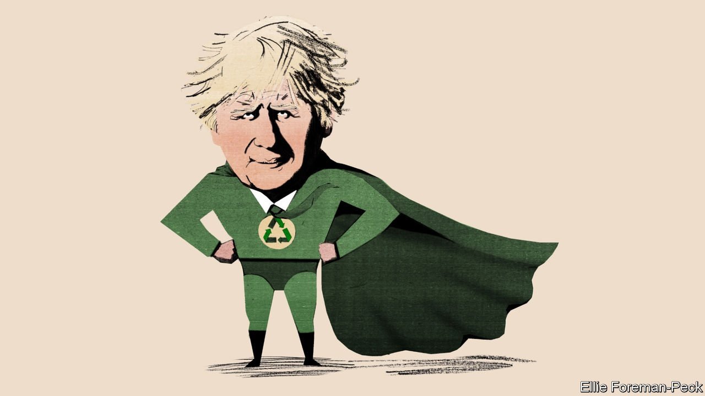

###### Bagehot

# The greening of Boris Johnson 

##### The prime minister is gung-ho about climate change—perhaps too much so for his new voters 

 

> Oct 30th 2021 

WHEN DECIDING which side to support in the Brexit referendum Boris Johnson famously wrote two columns—one for and the other against—and chose the argument he found most convincing. Over the years he has adopted a similar endorse-both-sides approach to greenery. As a student politician and as mayor of London, he branded himself a “green Tory”; as a fire-breathing Daily Telegraph columnist, he denounced the green blob. In January 2013, for instance, he wrote a column speculating that the world was entering “a mini ice-age”, quoting no less an authority than the former Labour leader Jeremy Corbyn’s brother, Piers, an eccentric weather forecaster and anti-vaxxer, and pointing to the evidence that it was snowing outside. “If the climate can change”, he now says in self-justification, “I don’t see why my mind can’t.”

Since the general election in 2019 Mr Johnson has firmly come down on the green side. In a speech to the United Nations in September he urged global leaders to “grow up” and “recognise the scale of the problems we face”.In a statement to the Middle East Green Summit in Saudi Arabia this week he urged the world to go “further and faster” to limit global warming. The government has already made some solid green pledges—promising to cut carbon emissions by 78% by 2035, to ban the sale of new petrol- and diesel-powered cars by 2030 and to phase out gas boilers by 2035—and will no doubt make more at the COP26 meeting in Glasgow.


Mr Johnson’s conversion to greenery not only brings a jolt of energy to a lethargic international process. It also brings some ideological diversity. The debate about greenery has been in danger of becoming part of a proxy war between the right and the left, with environmental activists calling for the end of the capitalist system and populists such as Donald Trump dismissing environmentalism as crypto-communism. Mr Johnson likes to point out conservative heroes such as Edmund Burke embraced greenery long before socialism was invented. Arriving by tunnel for a book launch of a volume of Charles Moore’s biography of Margaret Thatcher, because Downing Street was blocked off by Extinction Rebellion protesters, Mr Johnson told the audience that the “crusties” outside would do well to read the biography because the first true green revolutionary was “not Greta Thunberg but Baroness Thatcher”. Mr Johnson may possess a unique ability to build a bridge between conservative climate sceptics such as Brazil’s Jair Bolsonaro and Australia’s Scott Morrison and establishment environmentalists such as America’s Joe Biden.

Why did Mr Johnson go green? And will his conversion stick when the going gets tough? It is tempting to ascribe the shift to his wife, Carrie Johnson, whose arrival on the scene certainly fits the timing. Mrs Johnson, a former director of communications for the Conservative Party, devotes much of her time to campaigning for green causes, particularly marine life and animal rights. In her first public statement after moving into Downing Street she said that politicians have a “gigantic responsibility to make the right decisions” over climate. But Mr Johnson is also much influenced by both his father, Stanley, and his friend, Zac Goldsmith.

The older Mr Johnson has been campaigning for environmental causes since he was at Oxford 60 years ago. He held green jobs at the World Bank, the Ford Foundation and the European Commission. He also wrote a succession of books on green issues; focusing, at first, on the danger of overpopulation. Lord Goldsmith is at the heart of the green aristocracy. His father, James, combined environmentalism with hatred of the EU; his uncle, Teddy, founded the Ecologist magazine and helped inspire the Green Party; his close friends include a menagerie of eco-toffs, such as the socialite and club-owner, Robin Birley, an animal lover who was disfigured by a tiger as a child. Lord Goldsmith has spent his life at the heart of the green movement—as editor of the Ecologist, a supporter of rewilding, the owner of an organic farm and, after David Cameron brought him into the Tory orbit, as the party’s most influential green. Mrs Johnson has worked closely with Lord Goldsmith for years, starting as his parliamentary aide in 2010. Indeed, the first couple recently spent a week relaxing at Lord Goldsmith’s 1,400-acre estate in Spain.

Trusting Mr Johnson is a fool’s game. But it is hard to see him resurrecting his ancestral (Piers) Corbynism. Shrugging off speeches to the UN is more difficult than disavowing articles for the Daily Telegraph. Moreover, Mr Johnson’s government has made concrete promises which it will be hard to forget. The pertinent question is whether he can take the rest of his party with him. Mr Johnson’s greenery is laced with cake-ism: confronted with the problem that people might have to travel less to reduce carbon-dioxide emissions, the prime minister speculates that the problem will be solved by the invention of carbon-neutral aeroplanes.

Come rain or shine?

Keeping his promises will require annoying Tory voters. Liz Truss, the foreign secretary, distinguishes between Waitrose Tories and Lidl Tories: that is middle-class Tories who have money to buy fair-trade stuff and just-about-managing Tories who struggle to make ends meet. When it comes to greenery, Mr Johnson has surrounded himself not so much with Waitrose Tories but with Petersham Nursery Tories: that is people who frequent the eco-branded garden-centre-cum-delicatessen chain where afternoon tea can set you back £55 ($75) and a flower vase another £920.

Petersham Nursery Tories think nothing of spending £100,000 on a Tesla and £15,000 on a heat pump,not to mention more on every mouthful of organic cruelty-free food. But the Lidl Tories who voted for Mr Johnson because they thought he was on their side against meddling bureaucrats and their expensive regulations will have a different view. If anything can break the seemingly adamantine link between Mr Johnson and his Tory faithful, it is the long-term cost of his green conversion. ■

For more coverage of climate change, register for The Climate Issue, our fortnightly , or visit our 

