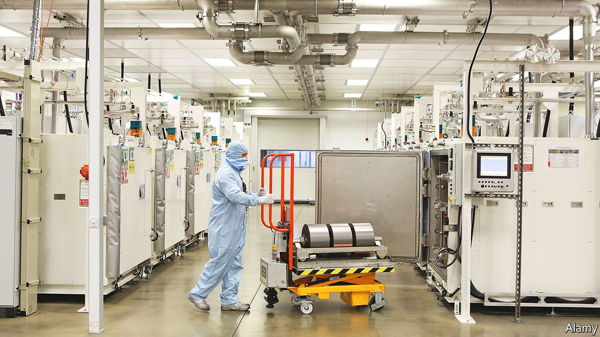

###### Industry

# What’s behind the Great British Battery Bonanza? 

##### Explaining the rush of gigafactories 

 

> Oct 30th 2021 

FROM 2030, the government says, every one of the 2.3m new cars sold in Britain each year must be electric. All will need batteries, the most complex component in electric vehicles and the fulcrum around which their emerging supply chains turn. In November last year the government set aside £2.8bn ($3.9bn) to support the transition, and to help ensure that those supply chains run through Britain.

The result is a flowering of new battery factories which have emerged to meet the demand—and to take advantage of the subsidies. One, in Northumberland, under development by a two-year-old startup called Britishvolt, is courting the government for hundreds of millions of pounds. Another, in Sunderland, is being developed by a little-known Chinese battery company called Envision, which is expanding the plant that now supplies Nissan, a Japanese carmaker. Coventry City Council wants a factory of its own, and has filed for planning permission to build one. The local authority has yet to decide which company should operate it.


The stakes are high. This is thanks, in part, to the terms under which Britain left the EU. The rules-of-origin requirements in the withdrawal agreement mean that 40% of the components of cars exported to the EU must be of British or European origin. By 2027 this rises to 55%. Because the battery is such a large proportion of an electric vehicle’s cost, if Britain cannot build battery-manufacturing capacity, the resultant lack of access to the European market will mean it loses car manufacturers, which would be costly. The manufacturing of internal-combustion vehicles currently supports around 180,000 jobs.

The new battery facilities, and any that come after them, face several challenges. Electric vehicles, by their nature, contain a higher proportion of electronic components than their fuel-burning counterparts. The manufacturing of these components, and particularly batteries, which alone make up some 30% of the value of an electric vehicle, is dominated by Chinese firms. This means that the government is subsidising the operation of factories not only with much higher labour costs, but also with a technological handicap.

An alternative is to attract Chinese firms to British shores. So far Envision is the only one with such plans. Contemporary Amperex Technology, by a long way the biggest and most important of the Chinese operators, has no public plans for a British plant, but does have plans for them in Indonesia and Germany. BYD, a Shenzhen-based maker of electric vehicles and batteries, may be an option. Whereas attracting Chinese manufacturers to British soil probably offers the best value for money, it comes with political baggage. Chinese investment in Britain is unpopular.

In favour of Britain’s aspirations is the fact that batteries are heavy, bulky and flammable—and thus relatively expensive to ship. Willy Shih of Harvard Business School says this means batteries will not follow exactly the same path as solar panels and flat-screen displays, two high-tech items whose production is dominated by China. Instead it will make more sense to produce them close to their markets.

How well this works out depends on the route that the industry ends up taking. Tu Le, an automotive analyst in Beijing, explains that there are broadly two possible paths. One is that Chinese firms set up manufacturing hubs around the world, like Envision’s in Sunderland, but keep their intellectual property, research and development in China, rather as Apple does with smartphone manufacturing and design. The other is a more traditional model whereby car manufacturers drive innovation in batteries and electric-vehicle power electronics, and the Chinese battery companies become mere suppliers.

If the traditional model prevails, then Britain’s battery investments may well pan out. But if the future is one in which Chinese manufacturers control the advancing technology which underpins electric vehicles, then Britain’s battery factories will end up expensive, behind the technological curve and a waste of money.■

