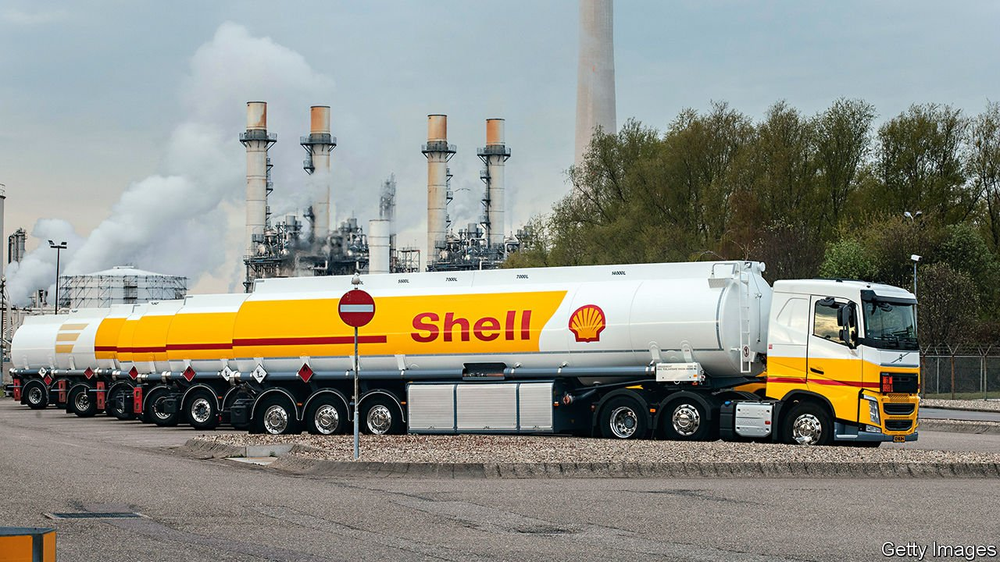

###### Splitting time?

# An activist investor targets Shell 

##### The plan to break up an oil major 

 

> Oct 30th 2021 

“THERE IS PERHAPS no bigger ESG opportunity than in ‘Big Oil’, and specifically, at Royal Dutch Shell.” Regarding Shell as an environmental, social and governance investment is the hyper-green explanation offered by Dan Loeb for his move against one of the fossil-fuel industry’s biggest firms. Third Point, an activist hedge fund run by Mr Loeb, revealed on October 27th that it has taken a stake (thought to be worth $750m) in the Anglo-Dutch oil firm. His aim, Mr Loeb declared, is to unleash trapped shareholder value by forcing the breakup of the energy supermajor.

The accelerating race to decarbonise the global economy has put the world’s oil companies in a bind. They are denounced as immoral carbon-spewers for peddling petroleum. On October 28th, executives from several big oil firms were due to be grilled by America’s Congress, with some politicians vowing a repeat of the treatment handed out to Big Tobacco. In May Shell was ordered by a Dutch court to slash its emissions of greenhouse gases (GHGs) by 45% below the levels in 2019 by the end of this decade, a ruling that it is now challenging in a higher court.


In response to the legal challenge and mounting financial pressure from ESG investors, Shell’s management has been speeding up its cautious embrace of greenery. The firm says spending on renewable energy and low-carbon technologies will make up a quarter of its budget by 2025. It is putting money into hydrogen, carbon capture and sequestration, and other non-oily efforts. It is also slowly shrinking its petroleum footprint, divesting some $4.7bn worth of refineries and hydrocarbon assets in the first half of 2021. Environmentalists remain unsatisfied.

On the other hand, the company is also criticised by hard-hearted investors who care little for ESG fads but do demand better financial returns. Though Mr Loeb dons a green cloak, he is more obviously in this camp. His explanation for his move on Shell starts by observing that “it has been a difficult two decades for shareholders”, with annualised returns of only 3% and falling returns on capital. On October 28th, Shell’s announced quarterly results that sought to please everyone. It said that adjusted profits had increased four-fold compared with a year ago and that cash flows were at a record, and set a new target of halving its emissions by 2030 compared to 2016 levels.

Third Point thinks Shell’s long-run underperformance arises from “too many competing stakeholders pushing it in too many different directions.” The resulting incoherent strategies can only be fixed, it insists, by breaking up Shell into “multiple standalone companies”. IHS Markit, a research firm, identifies “strategic divergence” among oil majors into three camps in response to the carbon challenge. The unrepentant, like America’s ExxonMobil and Chevron, have stuck with legacy oil and gas businesses. The super-green, like Eni and BP, have dramatically shifted their portfolio mix towards low-carbon energy.

The problem, argues Christyan Malek of JPMorgan, a bank, lies with those in the third camp like Shell, which have tried to do both. “Investors’ apparent lack of conviction in the hybrid model has forced a rethink,” he says in explaining why a challenge like Third Point’s was inevitable. On his analysis, Shell’s massive business in natural gas is undervalued because it is tarred with the same dirty brush as its oil division, and should be spun out. “Shell’s ‘breakup-ability’ is quite high once you consider renewables plus gas”, he insists.

So will Shell really be split up? It is unlikely. Mr Loeb’s investment may seem big until you consider Shell’s valuation of roughly $190bn, making it a mere 0.4% stake. Ben van Beurden, Shell’s boss, is well-established, at the peak of his power and backed by a board whose chairman, Andrew Mackenzie, fiercely battled a similar activist challenge when he ran BHP, an Australian mining firm. However attractive a split might be in theory, Mr Malek reckons there is not enough financial pressure to force a break up.

Even so, Shell’s boss would be wise to heed some of Mr Loeb’s unsolicited advice. Short of dismantling his empire, he could give his renewables and gas divisions far more autonomy and capital, for example. If he chooses instead to stick with the current hybrid muddle, he may find that it satisfies neither the greens nor the greedy.■

For more expert analysis of the biggest stories in economics, business and markets, , our weekly newsletter. For coverage of climate change, register for The Climate Issue, our fortnightly , or visit our 

