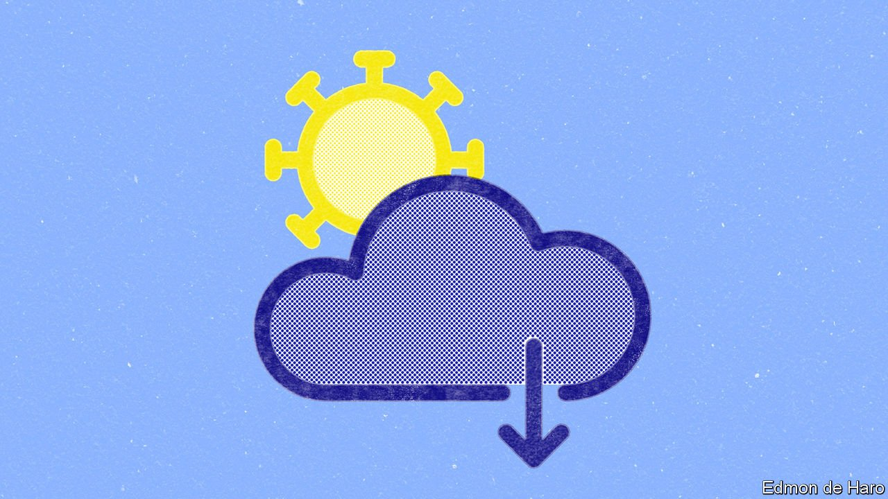
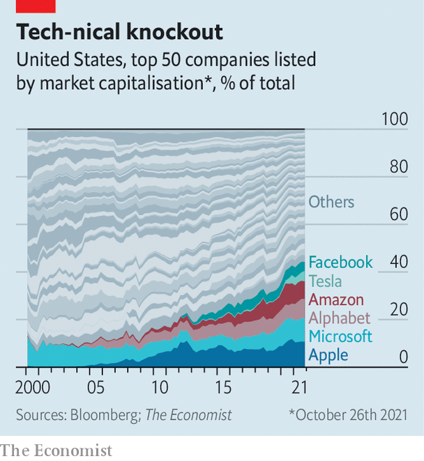

###### Cloudy with a dearth of chips

# How the pandemic has changed the weather in the technology industry 

##### The cloud, hardware and competition are gaining in importance 

 

> Oct 30th 2021 

THE TECH industry recently appeared to be sitting on cloud nine. One record after another fell when quarterly results were reported three months ago. Revenues had grown by 40% on average compared with the same period a year ago and profits by 90% for the five Western technology titans—Alphabet (Google’s parent company), Amazon, Facebook, Apple and Microsoft, collectively known as GAFAM. Indices of tech shares, such as the S&amp;P 500 Information Technology benchmark, climbed to stratospheric heights.

If the latest round of quarterly earnings are any guide—three of the digital giants have already reported and results from Amazon and Apple are due to after The Economist goes to press—the tech industry is coming back down to earth. Assuming that the pair meet analysts’ expectations, GAFAM’s revenues and profits will both have increased but by a more modest 30%. Share prices are languishing. The slowdown—or breather, if you will—provides additional evidence of the degree to which the pandemic has changed the tech industry. The question now is whether the sector is on a new trajectory or will revert to type over the next few years.


For starters, one of the first predictions when covid-19 hit in early 2020 was that it would make big tech even bigger. Those firms, ran the theory, would be best placed to benefit from an increased demand for digital offerings, whereas smaller firms, having fewer resources to get through the pandemic, would suffer most from its downsides. The first half of this prediction has come true: as the growth of the five firms’ market capitalisation shows. In January 2020 their combined value accounted for 17.5% of the S&amp;P 500.Today their share hovers around 22%.

 


That said, many smaller companies have also grown in size and value. The pandemic has given rise to a group which could be called “tier-two tech”, the weight of which, measured by market capitalisation, has grown notably relative to the titans. In May we defined this group to include 42 firms with a market value then of no less than $20bn that were incorporated in 2000 or later. In February 2020 these had a joint market capitalisation of 22% of GAFAM’s. Today the figure stands at 31%

The reasons for this new strength are multiple. One is the large number of listings of late, particularly of tech startups: more than 100 since the start of the year, says Renaissance Capital, a data provider. Despite some high-value deals, a backlash against big tech’s acquisitiveness has slowed the pace of mergers and takeovers this year. Most importantly, the pandemic has shown that there are big digital markets that are not dominated by GAFAM. The group of tier-two firms, for instance, is led by PayPal, a payments provider, that boasts a market capitalisation of $276bn.

Yet the most intriguing shifts are qualitative. The first is that the tech industry has become far cloudier than previously. “We saw two years of digital transformation in two months,” said Satya Nadella, the boss of Microsoft, early in the pandemic, referring mostly to the growth of its cloud. Taken together, revenues of the three biggest clouds—Microsoft’s cloud business, Amazon’s AWS and Google Cloud Platform, which between them provide more than 60% of online-infrastructure services—have surged by more than a third from $27bn in the fourth quarter of 2019 to nearly $37bn in the second quarter of this year.

The gathering cloud’s bigger beneficiaries seem to be smaller firms, however. Taking a panel of 50-odd second-tier tech firms today, about four-fifths are providers of cloud services. Some are now forces to be reckoned with: Snowflake, a cloud-based data platform, is worth $104bn; Twilio, which provides corporate-communication services, some $61bn; and Okta, which manages employees’ digital identities, some $39bn.

Older tech firms are now also more firmly anchored in the cloud. Salesforce, a software giant, was one of its pioneers. Adobe, another software titan, has successfully reinvented itself for this new form of computing. Even the cloud’s laggards, Oracle and SAP, the world’s largest vendors of conventional corporate software, are at last making use of it. The biggest hardware-makers—Cisco, Dell and IBM—are also increasingly selling their wares “as-a-service”, accessed remotely through the cloud on a pay-per-use basis rather than installed on office computers.

The industry’s second shift is that lowly hardware has also made a comeback of sorts during the pandemic, despite the migration up into the computing skies. Most surprisingly, personal computers staged a revival as remote workers required better gear. In 2020 PCs saw their biggest growth in a decade, with more than 300m devices shipped, 13% more than in 2019, according to IDC, a market-research firm. Growth has since slowed, but mainly because shortages of chips and other components are holding back production. Dell, the world’s third-largest maker of PCs after Lenovo and HP, has done best, increasing shipments in the third quarter by nearly 27% compared with last year, according to IDC—almost guaranteeing good results when Dell reports on November 23rd.

Chipmakers give an even stronger signal of the return of hardware to the industry’s core. Although Intel disappointed investors when it released its quarterly results on October 21st, sending its share price down, sales were up by 5% to $19.2bn and profits by 60% to $6.8bn. Samsung Electronics, the world’s largest memory-chipmaker, which will also reported results on October 27th, saw its profits jump to the highest level in three years. And TSMC, the top contract manufacturer of semiconductors, for its part said on October 14th that sales had continued to grow at a rapid clip, reaching $14.9bn with net income coming in at $5.6bn, an increase of 16.3% and 13.8% respectively.

 


The big question is whether the three companies can profitably follow through on their record-breaking investment plans. These are meant to satisfy growing demand for chips not just from cloud providers, but from firms making gear for what is called the “edge”: devices connecting to the cloud or extending it, from smartphones to intelligent sensors. Intel, for instance, has said that it will invest up to $28bn in 2022. TSMC plans to spend $100bn over the next three years to expand its chip-fabrication capacity.

The third big change to the tech industry during the pandemic may be the most consequential: increased competition. Although members of GAFAM have yet to attack each other’s main franchises, such as online search in the case of Google and ecommerce for Amazon, rivalries have heated up. So far, vigorously competing clouds and changes in Apple’s privacy policies on the iPhone—which hurt Facebook’s  according to results released on October 25th—are the main examples. But on October 21st Google announced that it would lower the fee it charges providers of subscriptions in its app store to 15%, putting pressure on Apple to do the same. And with so many people now working remotely and probably continuing to do so, a platform battle has broken out between Google, Microsoft, Salesforce and Zoom, a popular videoconferencing service, over which will dominate the virtual office.

Other firms are also picking more fights with GAFAM. Facebook’s social-media fortress looks a lot less safe now that it has at least two serious rivals: America’s Snapchat, a social network owned by Snap, and TikTok, the short-video app operated by ByteDance, a Chinese internet giant. According to data divulged in a recent wave of leaks, Facebook’s teenage users in America now spend two to three times longer on TikTok than on Instagram, which belongs to the American social-media conglomerate. Amazon also faces more competition, both in the form of incumbents that have at last embraced the digital world, including Walmart, and newcomers, such as Shopify, which helps merchants sell online and fulfil orders. PayPal’s attempt to buy Pinterest, another social network, now seems to have been abandoned, but it would have helped PayPal to move deeper into ecommerce.

After nearly two years of covid-19 the tech industry is cloudier, more tied to hardware and more turbulent. Of these trends, the first two are unlikely to last for ever, at least in their current form. Digital meteorologists argue that the cloud has already reached “peak centralisation”, meaning that it will henceforth grow not so much through football-pitch-sized data centres, but at the “edge”, where its digital services touch the physical world. And given the economics of the semiconductor industry—fabrication plants often cost over $10bn and take years to build—the chip shortage could eventually turn into a glut.

A more open question is how long the new phase of competition will last. Optimists argue that, after a long period of ossification, the pandemic has helped push the industry into a more dynamic period, in which the giants compete with each other as well as with smaller firms. Pessimists say that this phase will not last long—and that the industry’s leaders will sooner or later shore up their fortresses and buy out competitors. And that is why, more than ever before, trustbusters should not let down their guard.■


