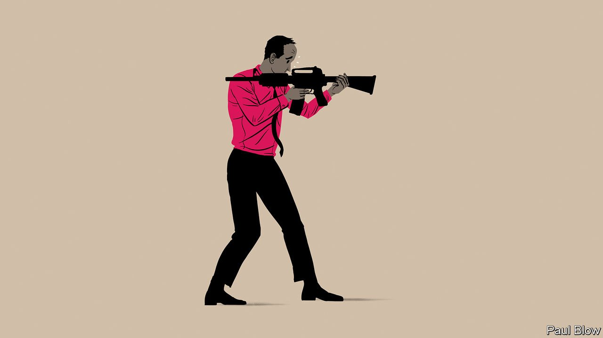

###### Bartleby

# The limits to the lessons of army leadership 

##### Life in uniform is very different from life in suits 

 

> Oct 30th 2021 

ONE OF THE all-time-great corporate emails was sent several years ago, by a manager at Shell to pep up a team of oil engineers on a project in the far east of Russia. "Personally, I, like most others, love winning," he raved. "I despise cowards and play to win all of the time."

The language was bizarre in other ways, too. "When everyone of you were kids, I am sure that you all admired the champion marble player" struck a chord with precisely no one in 2007. The anachronism was because the writer borrowed liberally from a stirring speech by General George Patton to American troops in 1944. Patton's "all real Americans love the sting and clash of battle" became "all real engineers love the sting and clash of challenge." And so on.


Copying from the army is seldom so cack-handed, but the idea that managers have lessons to learn from uniformed types persists. A cottage industry rests on the conceit that soldiers have insights into leadership that can be of use in the boardroom. Two new books based on the premise have come out this month—"Risk: A User's Guide" co-written by Stanley McChrystal, a retired four-star general in the US Army, and "The Habit of Excellence" by Lieutenant-Colonel Langley Sharp, a British officer.

General McChrystal's book is a pot-pourri of anecdotes and case studies on how to manage risk. The general's idea of creating "fusion cells" to bring together a network of intelligence teams in the fight against al-Qaeda has spread to other areas: the state of Missouri did something similar to connect different agencies to combat covid-19.

Lieutenant-Colonel Sharp has written the more distinctive book, a detailed account of how the British army goes about developing its leaders. Much of the thinking will be surprisingly familiar to managers. The army's concept of "mission command", in which the overall intent of a mission is set at the centre and the decision-making that brings it to fruition is delegated to people on the ground, is akin to the ethos of agile software development. "Serve to Lead", the motto of the army's academy at Sandhurst, came decades before the now-modish management theory of "servant-leadership".

Yet these echoes are only that. The differences between leading in the armed forces and leading a business come through more strongly from both books than the similarities. Most obviously, the use of lethal force tends not to be a big feature of corporate life. The stakes are much lower, and the calculus of risk is therefore just different.

Leaders in the armed forces can draw on deeper motivations among soldiers than bosses can with their employees. History offers a shared narrative to those in service. Patriotism provides a ready-made sense of purpose. And nationality operates like a permanent non-compete clause: soldiers do not change their allegiances to countries in the same way that workers can switch companies. "England expects that every man will do his duty," was the message that Admiral Nelson sent his sailors before the battle of Trafalgar in 1805. Swap in the name of your employer and see how it sounds.

The contrasts do not end there. Leaders in the armed forces play a much more familial role than the average boss. They will have been in the forces themselves for years. The people below them are often very young. Many live and work in close proximity.

The armed forces also emphasise intensive training in preparation for moments of extreme stress, when there is no time for senior figures to be consulted. When pivotal decisions need to be made at companies, the bigwigs schedule a meeting weeks in advance. The closest analogues of army leadership lie in elite sports rather than in firms.

It is interesting for civilians to read about army life, but largely because it is so alien. It may make sense to hire veterans, but as part of the mix rather than as a template. A research paper from 2014 found that bosses who had been in the armed forces were more conservative than those who had not donned uniform. They invested less; they were less likely to commit fraud; and their firms performed better in times of crisis.

Patton's speech in 1944 ended by imagining what his soldiers would say to their grandchildren after the war was long over: "Son, your Granddaddy rode with the Great Third Army and a Son-of-a-Goddamned-Bitch named Georgie Patton!” The Shell executive's missive finished thus: "Details of the team are summarised in the enclosed email." War and work are not the same.


