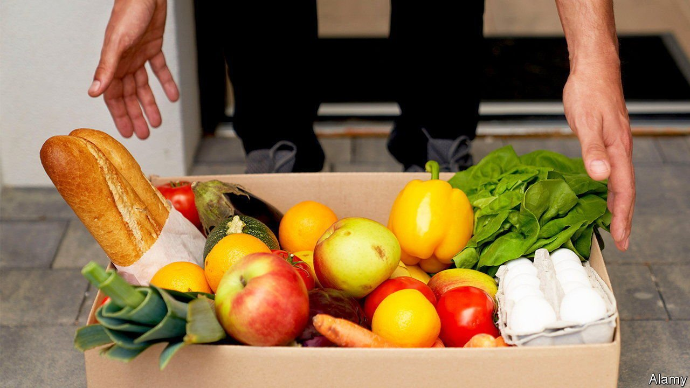

###### Thinking outside the box

# The rapid growth of retail subscription services could be coming to an end 

##### Box-sellers are trying to adapt 

 

> Oct 30th 2021 

TRADE COFFEE shifted under 1m bags of whole and ground beans between beginning operations in April 2018 and the start of the pandemic in March 2020. By the start of 2022 it will have sold another 4m or so, says its boss, Mike Lackman. It has benefited from a covid-era craze for subscriptions. Confined at home, consumers round the world hit “subscribe” on all manner of boxes delivered to their doorsteps, from drinks and meal kits to scented candles, razors and underwear. Sales in America surged by over 40% during 2020 to $23bn according to eMarketer, a research firm. But hanging on to those customers as lockdowns start to ease will be hard.

Investors like a business which offers recurring sales and oodles of data on customers. The Subscription Trade Association reckons global revenues grew at an average annual rate of 17% between 2014 and 2019. That encouraged venture-capital firms to invest close to $3bn worldwide in online subscription firms between 2018 and 2020, according to PitchBook Data. But finding customers is pricey and keeping them has proved hard, given high cancellation rates among those who find themselves tossing away unused products at the end of the month. Shipping costs nibble away at margins.


Competition has intensified, both from a fresh influx of startups and large established firms that have launched or acquired their own services. Early entrants such as Walmart, which introduced Beauty Box in 2014 featuring popular cosmetic brands, and Unilever, a British consumer-goods giant, which bought Dollar Shave Club for $1bnin 2016, have been joined by the likes of URBN, which owns fashion brands such as Urban Outfitters. In 2019 it launched Nuuly, a clothing-rental service.

More firms are fighting over a pie that will expand more slowly as customers return to physical shops. Companies such as Mr Lackman’s are trying to adapt. He is giving subscribers more flexibility over how often they receive coffee. Stitch Fix, an online clothing marketplace, has introduced one-off purchases.But acting more like a regular online retailer diminishes the advantages of selling subscriptions, and may not stop shoppers from clicking the “unsubscribe” button.

For more expert analysis of the biggest stories in economics, business and markets, , our weekly newsletter. 

