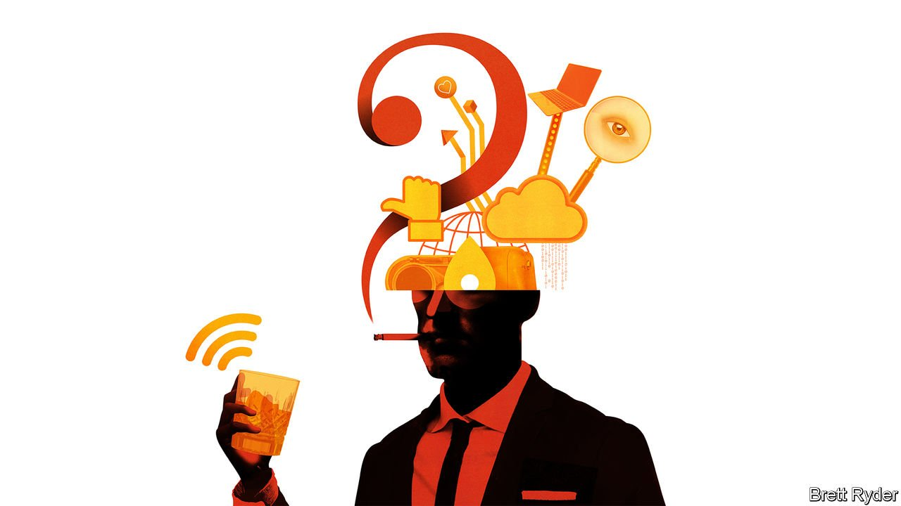

###### Schumpeter

# The three unknowns of the modern ad age 

##### For all its aura of precision, the digital-ad industry is as murky as ever 

 

> Oct 30th 2021 

AS WELL AS a louche mystique, there has always been something murky about advertising. From P.T. Barnum’s “Mammoth Fat Infant: only three years old and weighing 196 POUNDS” to three-martini lunches at the dawn of the TV era, it was never quite clear whether the adman was artist, scientist, strong-livered schmoozer or con man. For all the wit and wiliness on Madison Avenue, the economic cycle had a much more direct impact on ad spending. And it was a wonder companies embraced the medium at all. As far back as 1904, the Atlantic, an American magazine, wrote that an estimated 75% of advertisements did not pay; yet the other 25% paid so well “there is scarcely a businessman who is prepared to stand idly by.”

In the digital age the guesswork should have become a thing of the past. User IDs, device-tracking technology and electronic marketplaces handling billions of transactions a day have turned the targeting of individuals into a drone strike rather than a hit-or-miss barrage. Costs have come down, so millions of online businesses, instead of renting premises, have turned digital ads into the Yellow Pages on steroids. People are spending more time glued to screens, giving advertisers more scope to seduce them. The result has been stunning growth. MoffettNathanson, a research firm, says digital ads have grown from 27% of all dollars spent on advertising in America in 2015 to 52% (TV, the second-biggest category, has dropped from 42% to 33%). Until recently, the main question asked on Wall Street was not whether the feast would continue but how soon the digital share would reach 80%?


For the first time, the past week has dented those convictions. On October 21st Snap, a photo-sharing platform, revealed that it had been caught flat-footed in the third quarter by new privacy measures introduced by Apple to enable users of iPhones and its other devices to stop advertisers tracking them across the web. Though revenues of $1.07bn were only just shy of expectations, it lost a quarter of its value in a day. Facebook, a social-media giant, recorded $28.3bn in ad revenues, a third higher than the prior year, but that was lower than expected. It is having to increase spending next year partly to improve its targeting and measurement techniques to counteract Apple’s restrictions. Alphabet, which owns Google, bucked the trend, recording its highest sales growth in more than a decade in the third quarter; its search engine, source of almost all of its ad revenue, seems immune to Apple’s changes.

For all of them, the underlying digital-ad market still looked vibrant. But their divergent performances raise three big questions about the future of advertising. For all its aura of precision, it’s an industry still full of unknowns.

The first one concerns the correlation between advertising and economic growth. Sir Martin Sorrell, chairman of S4 Capital, an advertising agency, notes that digital ads easily outperformed their analogue counterparts during the pandemic, indicating a break in the age-old link with GDP because of a structural shift as the economy moves online. But whether that shift continues is a matter of faith, not fact. Economic factors may already be re-emerging. Both Facebook and Snap said tangled supply chains would diminish the incentives to advertise in the lucrative holiday period because of fewer goods on shelves. Moreover, even if the link with GDP has frayed, online ads appear to correlate closely with growth in e-commerce, which Facebook says is slowing as the pandemic fades. In America, there is growing evidence that consumer confidence is on the wane, which could affect one of the biggest factors believed to be fuelling the ad boom—the explosion of new businesses, many of them small-time online retailers.

The second unknown is the extent to which consumers will continue to tolerate advertisers stalking them. According to Flurry, an app-analytics firm, only about one in five app users have opted in to being tracked since Apple’s iOS 14.5 launch in April gave them the option to choose. That suggests a keen embrace of privacy, which vindicates Apple’s hunch. That said, Apple may be benefiting at its rivals’ expense. The opt-in only applies to third-party apps. Meanwhile Apple’s advertising business is booming, especially in relation to searches on its App Store, according to Bernstein, an investment firm. Moreover, its privacy push is provoking rivals, such as Facebook, to make counter-moves into virtual-reality headsets and 3D digital worlds it calls the metaverse, in order to create a parallel universe to that dominated by Apple. Bernstein’s Mark Shmulik calls such domains “walled gardens”. If consumers discover they are just a way of better bombarding them with ads, the gardens will soon feel more like prisons.

The third unknown is the firms paying for all the ads. The tech giants provide little detail about where they come from, what size of firms they are, and on what they are spending their money. The result is a lot of frustrating sleuthing and guesswork. Brian Wieser of GroupM, the world’s largest media buyer, estimates from Facebook’s billing-address data that Chinese manufacturers selling abroad account for approaching $10bn of advertising on the social network this year. He points to third-party data suggesting that more than 40% of Amazon’s marketplace sellers are from China, but Amazon does not disclose such information. There is scant reporting quantifying the number of small versus large advertisers, and whether they are paying for brand-related advertising or for direct sales. The industry remains as murky as ever.

From grey-flannel suits to just flannel

The platforms promise precision to their advertisers based on consumers’ data. But they fail to reveal anything like enough information to enable outsiders to gauge the robustness of the digital-ad craze. The result, shared by many in the industry, is blithe optimism that the market will continue to grow like Topsy. The past few days have provided a welcome opportunity to re-examine that thought. ■


