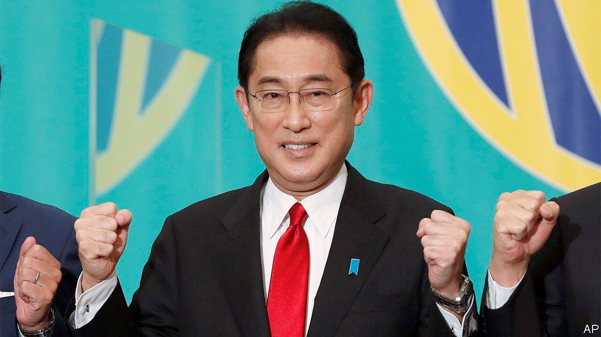

###### Poison-pill popping

# Will Japan’s new prime minister continue to reform corporate governance? 

##### A hostile takeover should provide some clues 

 

> Oct 30th 2021 

KISHIDA FUMIO, Japan’s new prime minister, has voiced no opposition to the corporate-governance reforms of Abe Shinzo. His predecessor’s efforts to make Japanese companies more focused on shareholder returns and less beholden to insider management were central to his economic reforms. But nor has Mr Kishida said much in their favour. Proposals for tax breaks for companies that increase wages have made it into the manifesto of his ruling Liberal Democratic Party, as have references to the importance of stakeholders over shareholders. That will worry those who think Japanese shareholder capitalism has not yet gone far enough.

A new test will provide more evidence of Mr Kishida’s attitude to changing the behaviour of Japan Inc. In September SBI Holdings, a financial conglomerate, made an unsolicited takeover offer which would raise its holding in Shinsei Bank, a regional lender, from around 20% to 48%. SBI has ambitions to create a Japanese megabank through alliances and acquisitions. The consolidation of the country’s multitudinous small banks is precisely the sort of change the corporate-governance reforms were implemented to facilitate. Shinsei Bank opposes the offer as it stands, making it a hostile bid, still an extremely rare event in Japan. It is willing to defend itself using a “poison pill” which would dilute SBI’s holding, subject to shareholder approval in a meeting on November 25th.


That puts the government in a tricky position. It holds around 22% of voting shares in Shinsei Bank through the Deposit Insurance Corporation of Japan and the Resolution and Collection Corporation. These institutions are involved as the result of a bail-out long ago of Shinsei’s former incarnation. The government cannot sell the stake because rules prevent making a loss on Japanese taxpayers’ investment, but it can vote on the poison pill.

Approval, rejection or an abstention would offer some fresh insight into the government’s appetite to press ahead with reforms that have brought a number of welcome changes. The prevalence of cross-shareholdings has declined. Among non-financial companies listed on the Topix 100 Index, the total number of shares held in this way dropped by around 20% between March 2013 and March 2020. The proportion of all listed firms adopting anti-takeover measures has also fallen from 19% in 2012 to 8% last year. Over the same period, the portion of companies without a single outside director went from 45% to 1%.It seems to have worked. Profits (measured by a common Japanese accounting standard) as a proportion of sales reached 6% shortly before the pandemic, the highest level since records began in 1950s.

There is still room for improvement says Nicholas Benes of the Board DirectorTraining Institute of Japan. He regards disclosure as a crucial area where a change of policy could yield significant results. In June the country’s corporate-governance code was revised to require listing the skills and experience of directors as well as broadening disclosure requirements for large listed firms in fields such as environmental policy. “This is a jungle of largely unreadable, sometimes encrypted [documents], written with a variety of different formats,” says Mr Benes. Standardising such publications and making them machine-readable would be a simple way of improving investors’ access to information.

Greater scrutiny can yield results. In June Toshiba’s chairman, Nagayama Osamu, was ousted by shareholders following a report that alleged that the firm’s management and the Ministry of Economy, Trade and Industry had colluded to put pressure on big investors to back management at an annual general meeting. (He expressed his regret at the “unacceptable events”.) But efforts at reform often get bogged down by Japan’s bureaucracy. The Ministry of Finance, the Financial Services Agency, the Tokyo Stock Exchange and Ministry of Justice all play a part in introducing and enforcing new regulations.

Clear leadership by Mr Kishida might help to set a path through the swamp. The outcome of the takeover attempt at Shinsei will show whether there is still enough momentum to improve corporate governance or whether old impulses run deep. ■


