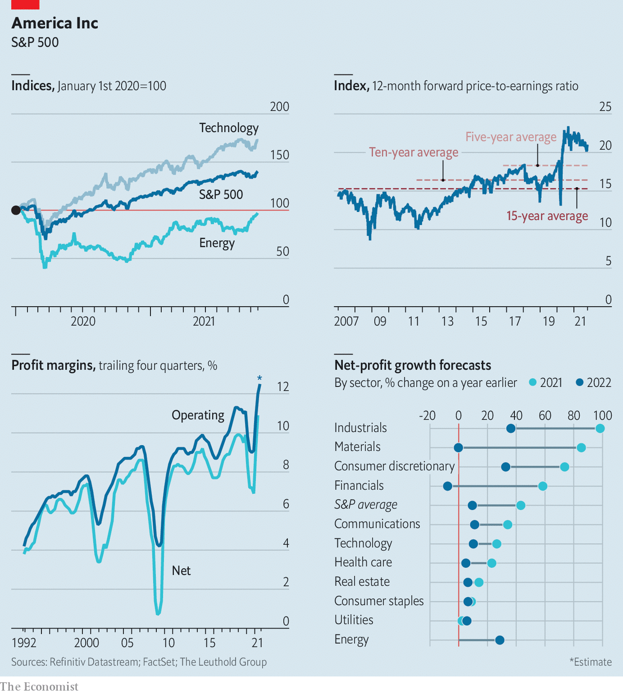

###### Trouble brewing

# Worries ahead for American firms 

#####  

 

> Oct 30th 2021 

 


THE PROFITS cranked out by American businesses make them look indestructible. Despite a pandemic and savage slump in 2020, the net income of large American firms for the third quarter of this year is expected to exceed $400bn. Yet as the earnings season gets into full swing three worries are circulating: supply-chain tangles, inflation and wages, and concerns that competition is intensifying in some industries.

