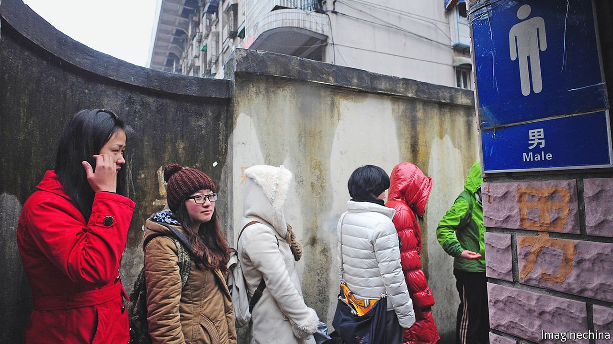

###### The long wait

# A row about toilets reveals a lot about women’s place in China 

##### Progress is possible, but activism is discouraged 

 

> Oct 30th 2021 

IN 2012 A GROUP of feminists protested against a shortage of public toilets for women by using men’s lavatories instead (see picture). State-security police responded by harassing and threatening them. But the government took up their cause. Cities started building more toilets for women. Last year, at the UN, China cited this as a big achievement of its efforts in the past five years to improve the lot of women. It did not mention the people who had pushed for such change.

Most of the toilet-reform activists have been forced to give up their campaigning. Some are subject to intense surveillance by the state. Several have become fitness fanatics, going to gyms to run and lift weights. “Many of us suffer from depression and anxiety,” says one. “Exercise is a way for us to prepare for whatever comes next, good or bad.”


Feminist causes are not dead. The country’s media are not allowed to report on the #MeToo movement, an online campaign against sexual harassment that took off globally in 2017. But the same grievances have bubbled up in China. A growing number of women are suing powerful men for sexual assault. #MeToo has fuelled an “unprecedented interest” in women’s rights, says Lu Pin, a Chinese feminist who went into self-exile in America in 2015.

Officials are making some effort to show they care. In 2019 China’s highest court added sexual harassment as grounds for filing a lawsuit. The Ministry of Education now works with universities and schools to curb it on campuses. An anti-sexual-harassment clause was included in China’s first civil code, which took effect this year. Darius Longarino of Yale Law School says the Communist Party often represses activists while trying to show that it is fixing the problems they raise.

But the party has used its control of the media and internet to turn #MeToo-related debate into something more suited to its own needs. Censors have suppressed use of the #MeToo hashtag and its Chinese equivalent, but have allowed selective discussion of a handful of cases that reflect badly on people or institutions that are in the party’s sights.

The entertainment industry and its celebrities are among the party’s targets. It fears that they are undermining moral rectitude in China by mimicking the worst excesses of Hollywood. In August police arrested Kris Wu, a pop star, after he was accused by a university student of pressing women to have sex with him. The government banned many online groups that drooled over him and other male celebrities. Some of these also happened to be forums for debate about women’s rights.

This year state media have also highlighted an alleged sexual crime involving a manager of Alibaba, a technology giant. The man was accused by a female employee of forcing her, while on a business trip, to drink until she blacked out, and then of raping her. The company fired the man, who then was cleared by police of any crime. The scandal happened to coincide with a sweeping regulatory clampdown on Alibaba and other large non-state tech companies, seemingly motivated in part by the party’s desire to curtail their enormous economic clout.

Despite its efforts to appear woke, the party is reluctant to up-end a patriarchal social order in which women are routinely treated as sex objects, subservient to men. The legal system still favours harassers. The burden of proof is very high for women who make accusations of sexual assault. An analysis of civil cases between 2018 and 2020 by scholars at Yale Law School found that more than 90% of those involving sexual harassment had been brought by alleged perpetrators against their accusers (for slandering them) or their employers (for disciplining them).

In September a court in Beijing rejected a woman’s petition for redress, which had become the country’s most famous case relating to sexual harassment. The plaintiff had accused a well-known television anchor of groping and forcibly kissing her when she was an intern. The judge said she had insufficient evidence. The plaintiff, known as Xianzi, plans to appeal. The verdict, she says, has made it “very easy for the public to assume I was lying”.

In contrast to the case involving Alibaba’s employee, journalists at state media were banned from reporting on Xianzi’s plea. In the week leading up to the verdict, anyone who posted information about the case had their social-media accounts frozen. Xianzi’s own such accounts were partially or fully blocked.

Such experiences are common among outspoken feminists in China. By shutting them out of social media, while tolerating the rantings of their critics, censors fan the flames of bigotry. Women who try to share their experiences of being sexually harassed in the office or being required to drink large quantities of alcohol at work banquets, are often “slut-shamed or labelled as anti-government or as hostile foreign forces”, says Xianzi.

Anti-feminist sentiment is fuelled by the party’s conservatism. Xi Jinping tries to project an aura of masculinity (his attacks on showbiz have also included a ban on effeminate men appearing on television). He is fawningly known in China as “Xi Dada”, literally meaning “Uncle Xi”. He promotes traditional Confucian values, which emphasise the role of women as obedient wives and mothers.

Online trolls who attack #MeToo use the same authoritarian, jingoistic language that the party delights in, notes Ms Lu, the feminist in America. They also engage in a kind of grassroots activism, with their numerous social-media accounts and independent websites that spice up the party’s message with extra dashes of anti-liberal vitriol. That is the only sort of advocacy allowed. ■

