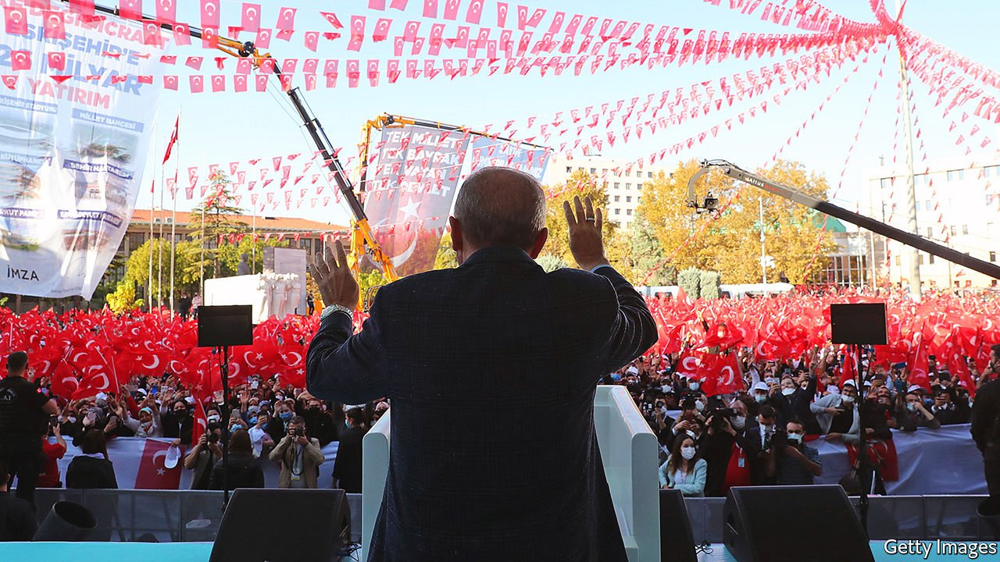

###### Autumn of the patriarch

# As the lira tanks, so does the stock of Turkey’s president 

##### But it is too soon to write off Recep Tayyip Erdogan 

 

> Oct 28th 2021 

A GOOD DUST-UP with one Western ally or another is something that Turkey’s president, Recep Tayyip Erdogan, always relishes. On October 23rd he took on ten of them at the same time, announcing that he had ordered the American, French, German, Dutch, Canadian, Swedish, Norwegian, Danish, Finnish, and New Zealand ambassadors to be declared personae non gratae, a prelude to having them kicked out of the country. Their offence was to have signed a letter urging Turkey to release Osman Kavala, a philanthropist locked up on farcical terror and coup charges. It took another couple of days, the exhortations of Turkish officials, who warned him of the dire potential consequences to the country’s economy, and a carefully crafted statement by the American embassy, in which the mission said it did not meddle in Turkey’s domestic affairs, before Mr Erdogan backed down. The envoys were allowed to remain in Ankara.

After nearly provoking, then averting, the biggest diplomatic crisis Turkey has seen in decades, Mr Erdogan proclaimed victory. The envoys “took a step back from the slander against our country”, he said. “They will be more careful now.”


The episode, and the gloating that followed, showed how badly Mr Erdogan needs something to celebrate. Turkey’s leader is having one of the worst slumps of his long career. An alliance of the two main opposition parties, the secular Republican People’s Party (CHP) and the nationalist Iyi (“Good”) party is polling ahead of Mr Erdogan’s governing coalition, composed of his own Justice and Development (AK) party and the Nationalist Movement Party. Were parliamentary elections to take place tomorrow (they are not due until 2023, together with the next presidential election), the ruling coalition would lose its majority. Mr Erdogan, meanwhile, trails behind each of the four most likely contenders for the presidency, in some cases by double digits in putative run-offs. The whispers are starting to grow louder: could the Erdogan era be drawing to a close?

 


The economy, hobbled by high prices and a plummeting currency, is the main reason. The lira has lost over 20% of its dollar value since the start of the year, more than any other major currency. The latest rout came on October 21st, when the central bank slashed the main interest rate by two full percentage points. Days earlier, Mr Erdogan had sacked three members of the bank’s monetary-policy committee. The surprise cut, the second in as many months, brought the rate to nearly four points below the rate of inflation, which reached 19.6% in September. Many governments have used negative real interest rates to revive growth, usually after undershooting their inflation targets. Turkey is overshooting its own target (5%) fourfold. Investors have run out of patience.

From Mr Erdogan’s vast palace in Ankara, things do not look so bad. The economy grew by a record 21.7% in annual terms in the three months to July, thanks to large base effects and booming exports. But inflation and devaluation are ravaging the wages of ordinary Turks. In dollar terms, GDP per person, which grew steadily until 2013, is back to where it was in 2009. During Mr Erdogan’s first decade in power (he first became prime minister in 2003) millions of Turks worked their way into the middle class. Over the past couple of years, according to the World Bank, 3.2m of them sank into poverty.

Mr Erdogan’s opponents smell blood, calling (in vain) for early elections, in the knowledge that they would have a genuine chance to unseat him. Kemal Kilicdaroglu, the head of the CHP, recently urged officials to stop following “illegal orders” from Mr Erdogan and warned that those who continued to do so would be held accountable when the opposition took power.

Since 2016, when an abortive coup rocked Turkey, the main opposition has deferred to Mr Erdogan on almost every national-security issue, from the country’s purchase of advanced weapons from Russia to its armed offensives in Syria and Libya. That changed on October 26th, when the CHP said it would oppose renewing the government’s mandate to deploy troops to Syria and Iraq. Businesspeople have also begun to speak up. Turkey’s largest business group, TUSIAD, recently called for a return to central-bank independence and the separation of powers.

Knives out?

There are even signs that officials and ruling-party backbenchers may be preparing for the end of the Erdogan era. Ankara is awash with allegations that a charity linked to one of the president’s sons placed hundreds of sympathisers in government jobs. Leaked documents suggest the charity was allocated a number of properties the government seized from the Gulen community, the group involved in the 2016 coup. Meanwhile, Sedat Peker, a fugitive mobster, continues to regale his 2m Twitter followers with stories implicating officials in crimes ranging from corruption to drug trafficking. Analysts believe at least some of the leaks are coming from disaffected AK types or bureaucrats eager to distance themselves from the government.

But it is far too early to write off Mr Erdogan. Turkey’s leader continues to tower over the country’s politics and to command the loyalty of tens of millions of people, the media and state institutions, including the courts and the police. More troublingly, he and his entourage may be capable of desperate measures to cling on to power. Mr Erdogan’s latest showdown with the West will not be his last. Another military offensive in Syria, and another wave of repression at home, may be around the corner as well. Mr Erdogan will surely not go quietly. ■

