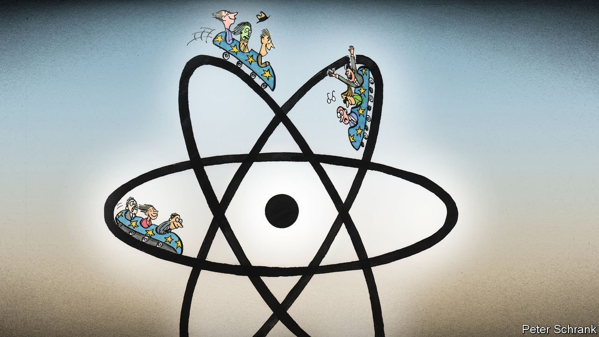

###### Charlemagne

# Nuclear energy united Europe. Now it is dividing the club 

##### France says it is green. Germany says it isn’t. France will win 

 

> Oct 28th 2021 

BEFORE THE euro, Schengen, “Ode to Joy”, butter mountains and the Maastricht treaty, there was the atom. “The peaceful atom”, wrote Jean Monnet, the cognac salesman turned founding father of the EU, was to be “the spearhead for the unification of Europe”. Europe was a nuclear project before it was much else. In 1957 the EU’s founding members signed the Treaty of Rome to form the European Economic Community, the club’s forebear. At the same time they put their names to a less well-known organisation: Euratom, which would oversee nuclear power on the continent. The idea of the common market was nebulous; the potential of nuclear energy was clear.

Where nuclear power was once a source of unity for Europe, today it is a source of discord. The common market morphed into the EU of today, while Euratom became a backwater. Of the EU’s 27 countries, only 13 produce nuclear power. Some ban it. France and Germany, the two countries that dominate EU policymaking, find themselves directly opposed. France generates over 70% of its power from nuclear reactors. Germany has pledged to close all its nuclear power plants by 2022. For France and its atomic allies, nuclear energy has a bright future. For Germany and its sceptic kin, the technology is an unhealthy past.


It is against this backdrop that the EU has to answer a question. Is nuclear power green (since it emits very little carbon dioxide) or not (because nuclear accidents, though extremely rare, are dangerous)? Green industries face a life of subsidies and cheap capital as governments tighten investment rules elsewhere. Their dirty counterparts face a tougher life. How the EU is managing the decision reveals a lot about the club.

Take the politics of it. With the Franco-German engine sputtering on nuclear policy, unlikely alliances have formed. France and the likes of Poland and the Czech Republic are usually sparring partners. French politicians generally see the region as an expensive appendage and a source of labour that undercuts French workers. Countries in eastern Europe see the French as protectionists who suck up to Russia. Yet when it comes to nuclear power the two are firm pals. It is tempting to carve the EU into simple blocs, whether Club Med or the Frugals. The reality of European politics is kaleidoscopic. Nuclear power is no exception.

In this debate, Germany is likely to be on the losing side. It gave up on nuclear power after the Fukushima disaster in 2011, when an earthquake and tsunami caused a meltdown in Japan. Angela Merkel vowed to ban it in barely a decade. Countries from Belgium to Bulgaria followed, scrapping plans to build nuclear power stations and pledging to switch others off. However, opinions have shifted. Germany knows it does not have the votes to stop nuclear power being rated as green. Austria and Luxembourg would probably join it on the barricades, but few others will. For a supposed hegemon, Germany is not especially hegemonic.

At the same time France is increasingly influential. Europe falling back in love with nuclear power is just one example of the many policy debates heading in a French direction. On everything from industrial policy, where the club is now enthusiastically dirigiste, to expansive rhetoric on foreign policy, the EU is speaking French. (Although France’s quest to get the club to make more use of the French language is failing.) Nuclear power is another debate in which Paris gets its way.

Whatever the topic, the EU is a dealmaking machine, with consensus forged via a mix of bribery, blackmail and back-scratching. Gas power is undergoing the same kinds of debate as nuclear power. While gas generates carbon emissions, it is cleaner than coal, argue its supporters. Some countries are pro-nuclear and anti-gas; others are the reverse. Some oppose both, while some demand both. Ostensibly the topics are separate. In reality, they are wedded in the minds of national governments and MEPs who have final approval. Overlapping interests are played off against each other in a compromise that will, at best, leave almost everyone equally unhappy.

If the politics are linked, so are the policy consequences. Take another neuralgic debate: reform of the EU’s spending rules. A likely compromise is that while stiff rules could remain for day-to-day spending, countries could be able to spend more freely in the name of the green transition. If nuclear power is labelled green in the private sector, it becomes harder to avoid a similar designation when it comes to public money. German voters may end up looking across the Rhine and seeing their French neighbours splashing cash on energy they see as dangerous.

Politics permeates every EU institution. On paper the European Commission, which makes the initial decision on how to treat nuclear power, is full of civil servants who offer technocratic answers. In practice, they know the question of nuclear power is political. They also know that life will be easier if they answer it quickly, preferably before a new German government containing a virulently anti-nuclear Green party is formed. Mrs Merkel can leave office with another compromise to her name; the incoming Greens can come to power and blame the previous government for a fait accompli. Machiavelli was a civil servant, after all.

Clean energy requires dirty deals

Nuclear policy is a reminder that fates in the EU are bound together, whether the topic is energy, the environment or the economy. As the EU’s energy market integrates, those countries that pride themselves on only using the cleanest energy will benefit from those that rely on more debatable sources. The EU is an increasingly homogenous beast, with fewer carve-outs for those who want to do things differently. Collective decisions have collective outcomes. “To approach our atomic future separately…would have been insane,” wrote Monnet. The EU will approach its atomic future together, whether some countries like it or not. ■

